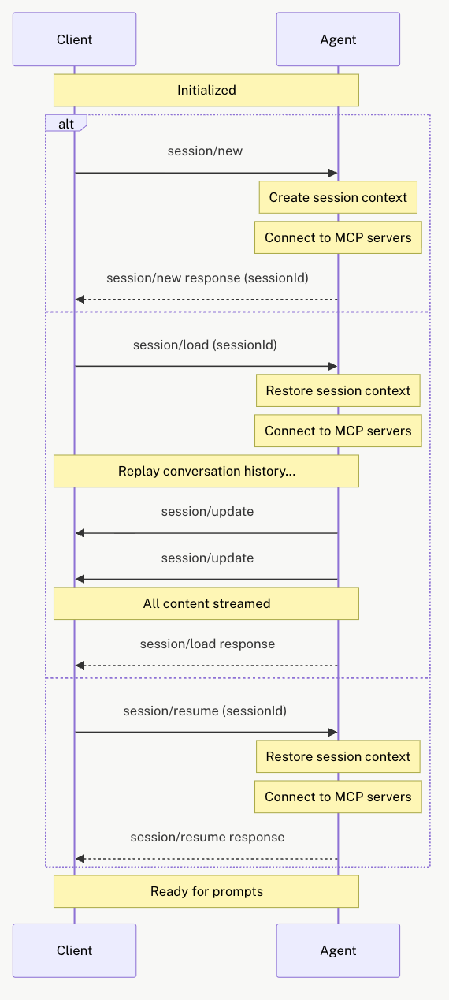
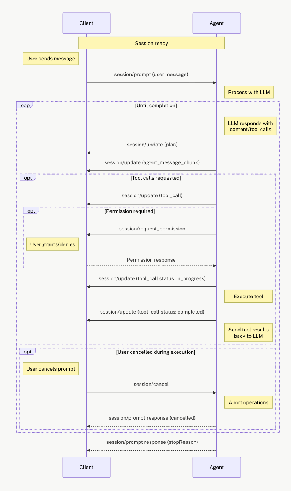

# ACP

## 什么是 ACP？
Agent Client Protocol，用于编辑器和 Agent 之间的协作。

## 为什么 ACP？
如果没有 ACP，每种编辑器只能支持自己实现对接的 Agent。如果 M 个编辑器要对接 N 个 Agent，那么就需要 M * N 种对接的实现。而如果一起对接共有的协议，则只需要 M + N 种对接的实现。

除了协议的标准化，ACP 还为 Client 定义了一些 Capability，使得不同的 Agent 可以用相似的方法获取到上下文。

## 协议内容

### Initialize
Initialize 主要是交换 Agent 和 Client 之间的原信息
- 认证方式
- Capability
  - Client 能力
    - 文件系统：读写文件
    - 终端：使用终端的能力
  - Agent 能力
    - Prompt 能力：支持的 prompt 资源类型，包括文字，图片，链接等
    - Session 能力：Agent 的 session 管理能力
    - MCP 能力：Agent 所支持的 MCP 协议

### Session
Session 是 Agent 和 Client 之间的一次会话，有聊天记录等状态

- Load: 向 Agent 发起 session load，Agent 需要通过 `session/update` 方法向 Client 重放这个 Session 的内容
- Resume：不重放 session，直接继续
- Close：取消当前 Session 中正在进行的工作
- List：列出所有 Session
- Update Meta：更新元信息

### Prompt Turn
Prompt Turn 是 Agent 和 Client 之间的一次对话，包括用户输入和 Agent 输出

### File System
FS 允许 Agent 读写 Client 文件系统中的内容，也包括未存储的内容。

### Terminal
Terminal 允许 Agent 使用 Client 的终端能力，包括输入和输出。

### Plan
Agent 可以通过 `session/update` 向 Client 发送计划。计划可以随着执行的过程而改变。每个计划包含了优先级，状态，描述等。