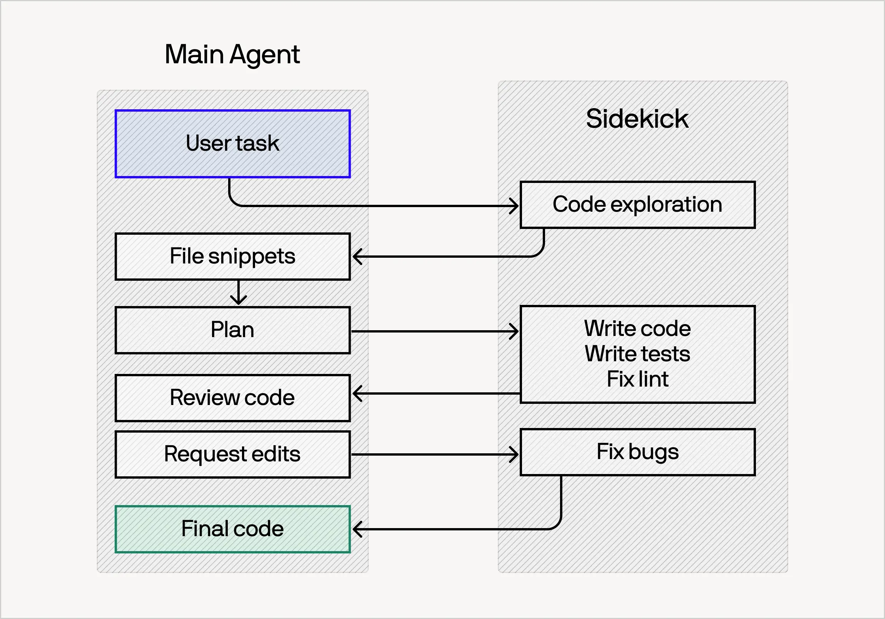
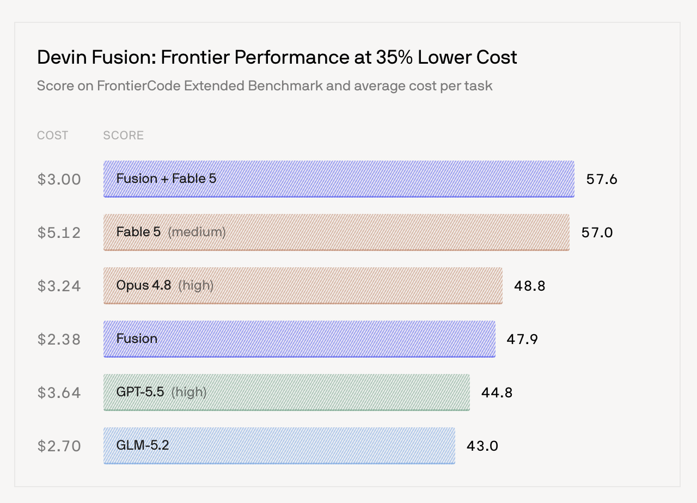

# Devin 的双 Agent 模式

## Agent 架构

架构如下

- 主 Agent 更注重规划，推理，评审，决策（任务代理）
- 子 Agent 更注重执行

## 优势

1. 更通用的多 Agent 范式。给每个任务指定一个模型的方式是不太可扩展的，比如同一个任务，follow-up 和 initial task 的复杂度可能差别很大。
2. 多 Agent（模型）切换的价格问题：直接将整个 Session 切换到另一个 Agent 会导致 Cache Miss，大幅增加开销。而这种模式下，两个 Agent 都有独立的 Cache，成本更低。
3. 随着 Frontier 模型能力的增强，这个模式的性能也可以提升：聪明的模型可以更智能地代理任务

## 一些独特的设计
1. 它用了一个轻量级的分类器，当识别到 Side Kick Agent 的任务对它来说太复杂的时候，会切换回主 Agent。
2. 模型切换技巧：任务的复杂度随时间变化，意味着切换模型是有收益的。只有在上下文压缩的时候才切换模型，避免 Cache Miss 带来的开销。

## 结果

这套模式使得 Fable 5 驱动 Agent 的情况下，便宜 35%，却有接近的性能。

