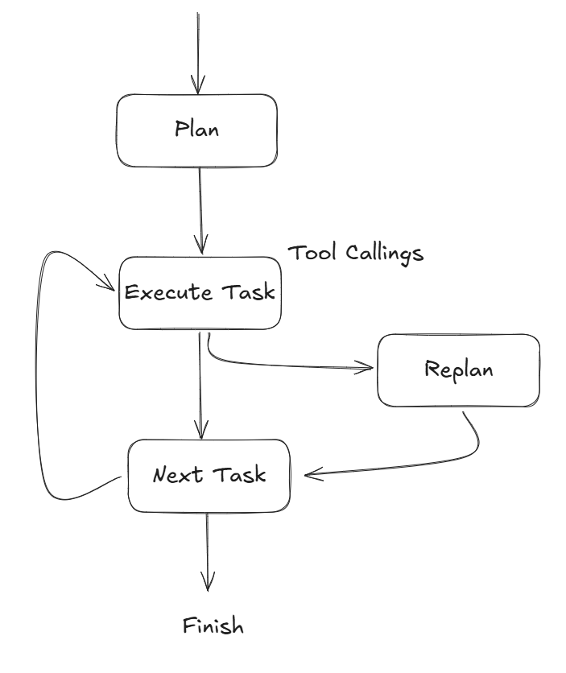
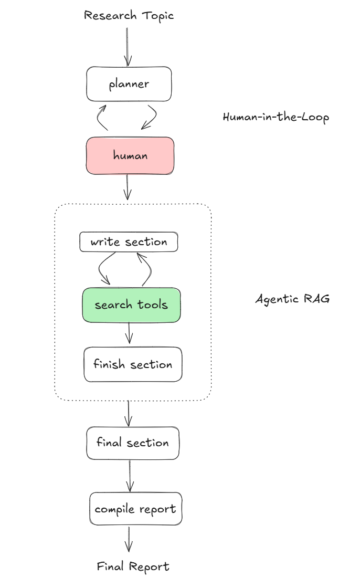
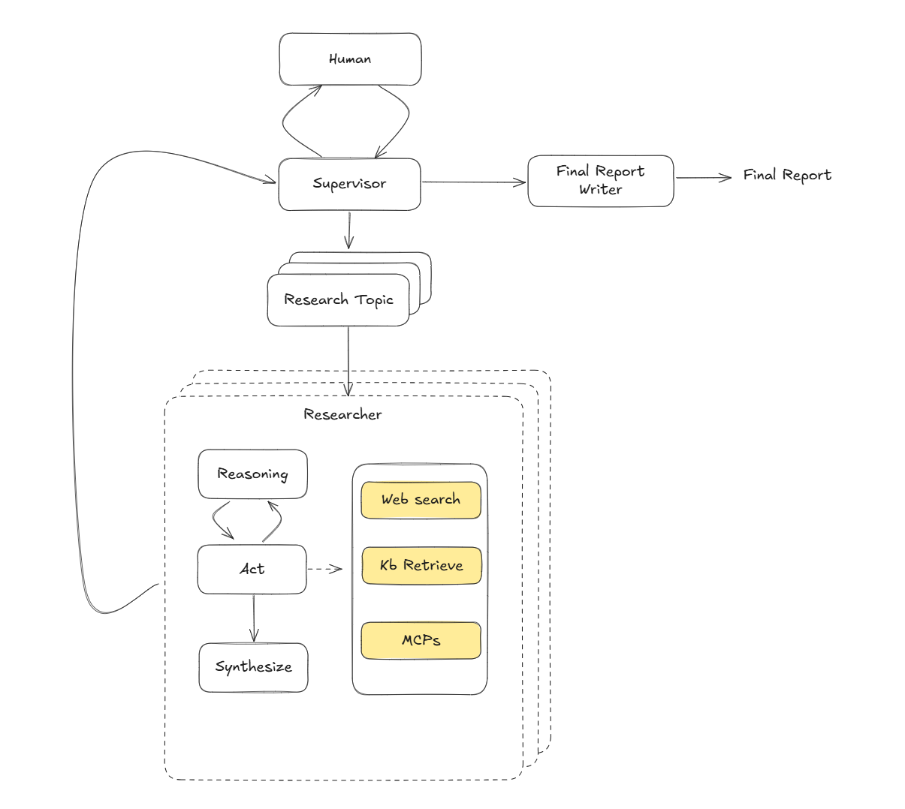

# Research Agent 演进
随着 AI Agent 开发工具的完善，以及人们在这方面的实践探索，在过去几个月中，AI 作为 Research Agent 的实现也出现了不同的模式。这些模式出现有先后，复杂度有所差异，但是不能说哪些模式一定全方位优于其他模式。

## Plan and Execute 模式

**Plan and Execute** 模式最早是在 Plan-and-Solve Prompting: Improving Zero-Shot Chain-of-Thought Reasoning by Large Language Models 中首次提出。他们发现通过在提示词中使用 “ Let’s first understand the problem and devise a plan to solve the problem. Then, let’s
 carry out the plan and solve the problem step by step.”， 可以让 LLM 在处理复杂的任务中，比零样本 CoT 生成更加优质的推理过程。LangChain 也有基于这种模式的官方示例。与简单的 Plan and Solve 提示词不同，Plan and Execute 模式的提示词中包含了计划和执行两个独立的阶段。得益于 Agent 工作流框架和 LLM Tool Calling 的成熟，Execute 的阶段变得更加强大，因为它可以借助工作流进行工程化，并调用工具来和外界交互，或者进行 Agentic 的 RAG。

### 变种1. Plan on the Go
传统的 Plan and Execute 模式中，计划总是在一开始就生成好的，这样的问题在于如果子执行过程中发现一些问题，无法通过观测当前状态来动态更新后面的任务。为了解决这个问题，我们可以调整工作流的逻辑，让 Agent 可以再每执行完一步后，根据当前状态和任务目标，动态调整后面的任务。

### 变种2. Human-in-the-Loop
在简单的 Plan and Execute 模式中，Agent 以全自动的方式进行步骤的规划和执行，这是有风险的，尤其是当 Agent 需要调用各种工具的时候。我们希望保证执行计划可以完全符合用户的预期，因此在 Planning 的阶段，我们通常会加入 Human-in-the-Loop 机制，让 Planner 不断迭代计划，直到用户满意。

当我们使用 Plan and Execute 来实现一个 Research Agent 时，它会呈现如下的形态

我们可以看到顶层有一个 Planner 进行人机交互，而执行的步骤作为一个子图，他其实是一个 ReAct 的 agent，在推理的过程中，产生一些获取外部信息的需求，并通过执行工具调用将这些知识补充道上下文。

Plan and execute 模式虽好，但是笔者做下来感觉它也存在一些问题。
1. 全局的计划不一定足够详细。将 Planner 和 Executor 分离，意味着 Planner 需要对任务有一个全面，深入的认知，才能保证计划的质量。在面临复杂任务时，这个可能是困难的，因为上下文的窗口是有限的。
2. Plan on the Go 比较复杂。

## Multi Agent 模式

与 Plan and Execute 不同，multi agent 模式侧重于让每个 agent 聚焦于自己的子任务，而不是让一个单独的 planner 聚焦于整个任务。在 LLM 上下文长度受限的情况下，对业务进行分割是一个不错的选择。

我们在开发 Java 后端服务时候，经常会聊到怎么划分我们的项目代码。我们可以对代码划分成 Controller，Service 层，也可以按照业务，将业务划分成一个个模块。Multi agent 就更像是按照模块划分的方式，每个模块（agent）都是内聚于一小块业务逻辑的。

如果用 Multi Agent 开发 Research Agent 通常会采用 Supervisor 模式，也就是一个 Supervisor Agent 带领若干个 Researcher Agent，分工协作。这种主从的架构，相对于点对点的架构要更加简单，并符合直觉。Supervisor Agent 会先和用户进行交互，确认研究课题的一些细节，然后将它拆分成若干个子课题，并分发给各个 Research Agent。每个 Research Agent 通过工具调用的方式，对课题进行扩展研究，总结，并将最终结果上报给 Supervisor。最后通过 Prompt 把这些研究报告整合成一篇。

### 一些挑战和启示
在使用 Multi Agent 的方式进行报告撰写的时候，笔者发现效果并不好。
*笔者使用 langchain 的 open-deep-research 项目配合 Qwen3 来使用*

1. 引用不够准确。在最终形成的报告中，引用文献经常给出一些无效的连接，或者是 `[Document1](www.example.com)` 这种无效的内容。笔者猜测，这种情况是因为 Researcher 和最终写报告的过程经过了两层总结，从而导致了信息量的损失。我们发现，在 Researcher 的 `<think>` 标签中的内容，有时候是比较好的，只是最后输出的报告质量不佳。针对这种情况，我们尝试将 RAG 返回的元信息全程保留，并且在最后生成报告的提示词中，强调引用文献的处理。另外，我们采用 inline 的引用文献，让 LLM 不用去纠结文末的 Reference List，而只需在该有的地方插入引用就足够了。
2. 报告的 AI 味道太重。众所周知，AI 经常产出没有深度，简单使用列表罗列的低劣文章。针对这种情况，我们对提示词进行了强调，使其注重前因后果，根据 RAG 召回的文本，举例分析。
3. 此外，我们尝试使用领域相关数据集对模型进行微调，发现微调过的 8B 模型在引用文献，语言风格等方面和 32B 的模型有过之而无不及。

# References
1. [Plan-and-Solve Prompting: Improving Zero-Shot Chain-of-Thought Reasoning by Large Language Models](https://arxiv.org/pdf/2305.04091)
2. [LangChain Plan and Execute](https://langchain-ai.github.io/langgraph/tutorials/plan-and-execute/plan-and-execute/)
3. [Open Deep Research](https://github.com/langchain-ai/open_deep_research)