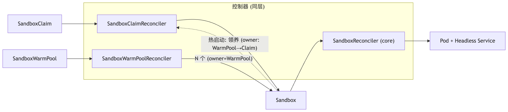
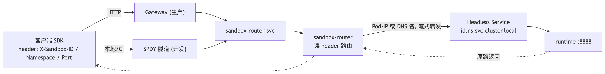

# Agent Sandbox

Agent Sandbox 是 K8s SIG 项目。
- Sandbox 生命周期管理
- 池化预热
- 轻量级

## 核心组件
- Runtime：运行在 Sandbox Pod 中，对外提供 execute 和 file 等服务
- Router：网关，通过请求 Sandbox ID 头来发现 Sandbox 并转发请求
- Controller：控制 Sandbox 生命周期

