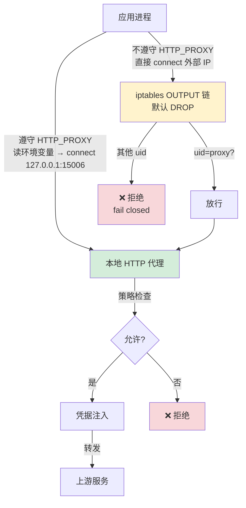
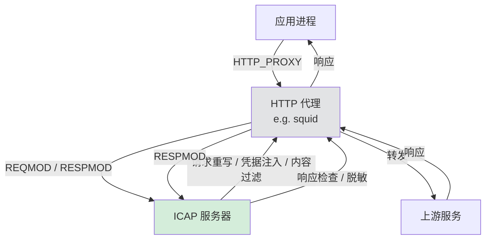
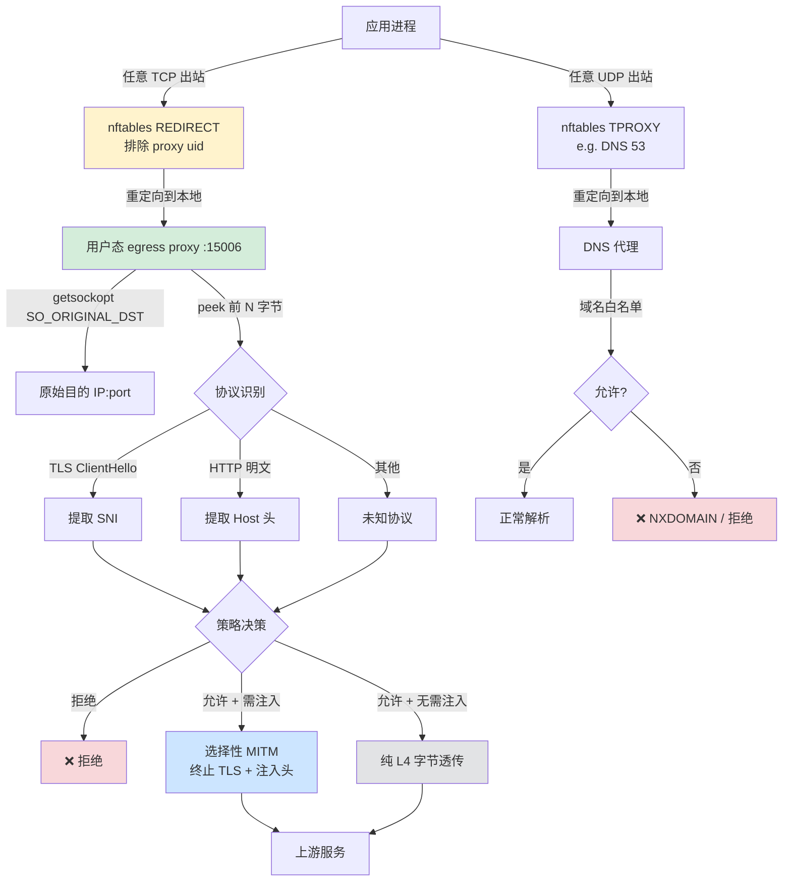

# Egress Proxy
Egress proxy 是一种出站代理，用于控制 agent 沙盒中进程对外部网络的访问。主要包括
1. 访问策略
2. 凭据注入
3. 审计监控

## 安全边界

在设计 egress proxy 时，最关键的问题是**信任边界放在哪里**。这决定了方案能否被绕过。

| 方案 | 信任边界 | 能否被应用绕过 | 兜底机制 |
|---|---|---|---|
| HTTP_PROXY | 应用层（协作式） | 能，应用不读环境变量即绕过 | 需要网络层 hardening |
| L4 重定向 | 内核层（强制式） | 不能，所有出站流量都被劫持 | 无需额外兜底 |

**核心原则**：任何依赖应用协作的机制（L7）都必须配合网络层 hardening 作为兜底，否则安全边界形同虚设。应用层机制提供"便利"（凭据注入、协议理解），网络层机制提供"保证"（不可绕过）。

### 网络层 hardening（HTTP_PROXY 的必备兜底）

即使采用 L7 方案，也必须配置 iptables/nftables 规则，确保不遵守 `HTTP_PROXY` 的应用**无法直接出站**：

```bash
# 默认拒绝所有出站
iptables -P OUTPUT DROP

# 放行回环
iptables -A OUTPUT -o lo -j ACCEPT

# 放行已建立连接
iptables -A OUTPUT -m state --state ESTABLISHED,RELATED -j ACCEPT

# 仅允许代理进程（uid=proxy）出站
iptables -A OUTPUT -m owner --uid-owner proxy -j ACCEPT

# 允许连接到本地代理端口
iptables -A OUTPUT -p tcp -d 127.0.0.1 --dport 15006 -j ACCEPT

# 其他一律拒绝（默认策略已 DROP，这里显式声明意图）
iptables -A OUTPUT -j DROP
```

这样不遵守 `HTTP_PROXY` 的应用会直接连接失败（fail closed），而不是绕过代理直连外网。

## L7 方案
L7 方案基于 HTTP 代理。

### HTTP_PROXY
在沙盒中，通过配置 HTTP_PROXY 到本地的代理端口。



**遵守 `HTTP_PROXY` 的应用**（如 `curl`、`requests`、`httpx`、Go `net/http` 默认）：
- 流量经过代理，策略、注入、审计全部生效。

**不遵守 `HTTP_PROXY` 的应用**（如硬编码 IP 的二进制、自带 DoH 的 SDK、某些 Java HTTP 客户端）：
- 尝试直连外部 → 被 iptables 拦截 → 连接失败。
- 不会绕过代理，但会**功能不可用**。这是安全优先的正确行为。

优势
1. 架构简单，直接在 L7 实现，没有额外的协议层。
2. 代理天然拿到完整 HTTP 请求，凭据注入直接。

劣势
1. 只能处理 HTTP/HTTPS 流量。
2. 应用不一定尊重 HTTP_PROXY 环境变量（需网络层 hardening 兜底，否则安全边界被绕过）。
3. 不遵守的应用会功能受损，而非透明降级。


### ICAP
[ICAP](https://datatracker.ietf.org/doc/html/rfc3507) (Internet Content Adaptation Protocol) 是一种应用层协议，用于在 HTTP 代理和 Web 服务器之间传递内容过滤信息。除此之外，它还能用于请求重写、内容修改等。

例如 squid 代理就支持 ICAP 协议。



ICAP 将"代理转发"和"内容适配"解耦：HTTP 代理只负责转发，ICAP 服务器负责策略、注入、过滤。这允许复用成熟的 HTTP 代理（squid、haproxy）而只实现 ICAP 侧逻辑。

> 注意：ICAP 仍然依赖 `HTTP_PROXY` 让流量进入代理，因此同样需要网络层 hardening 兜底。


## L4 方案

L4 方案一般会基于内核的能力，比如 iptables、nftables 等。



**所有应用**（无论是否遵守 `HTTP_PROXY`）：
- 流量在内核层被重定向，无法绕过。
- 策略、审计对所有流量生效。
- 凭据注入仅对需要注入的域名生效（选择性 MITM），其他流量纯透传零开销。

优势
1. 性能好，基于内核过滤。
2. 所有流量都能被拦截和控制，安全边界在内核层，不可绕过。
3. 无需应用协作，对任意进程透明生效。

劣势
1. 配置复杂。
2. 需要特权（CAP_NET_ADMIN）。
3. 如果想窥探应用层数据，需要解析数据包，比较复杂。
4. 凭据注入需要选择性 MITM（终止 TLS），只对需要注入的域名生效，否则纯 L4 无法改写加密载荷。
5. ECH (Encrypted ClientHello) 会加密 SNI，导致域名策略失效，需配合 DNS 劫持兜底。
6. **同容器内 session 凭据隔离/注入困难**。L4 透明代理对应用不可见，应用不会主动携带 `Proxy-Authorization` 头，代理也无法区分同一容器内不同进程/用户的 session。L7 方案天然支持 proxy authentication（如 `Proxy-Authorization: Basic/Bearer`），可按 session 注入不同凭据。L4 的折中方案：
   - **按 UID/进程区分**：nftables 规则可按 `--uid-owner` 匹配不同用户，为不同 UID 的流量打上不同 mark，代理侧按 mark 映射到不同凭据池。但要求应用以不同 UID 运行，容器内多租户场景不现实。
   - **SO_ORIGINAL_DST + 源端口启发**：理论上可按连接四元组做 session 映射，但缺乏应用层语义，无法可靠关联到逻辑 session。
   - **Envoy Istio AuthN 模式**：sidecar 在 L4 拦截后，由 Envoy 做 L7 认证（JWT mTLS 等），实质是 L4 拦截 + L7 策略的混合架构，已不是纯 L4。
