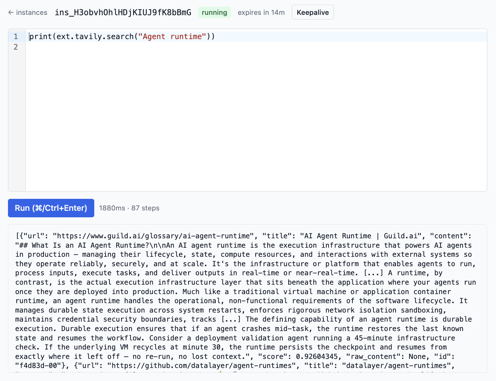
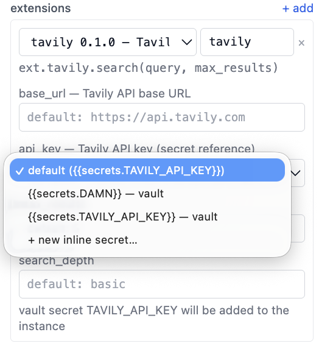
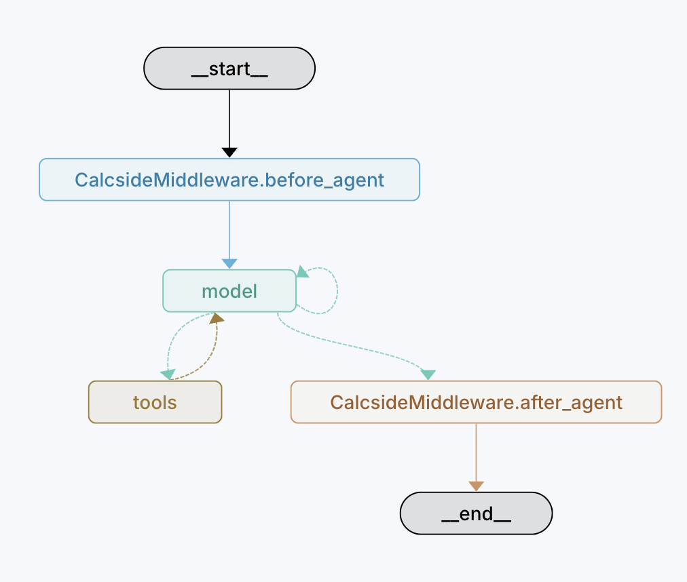
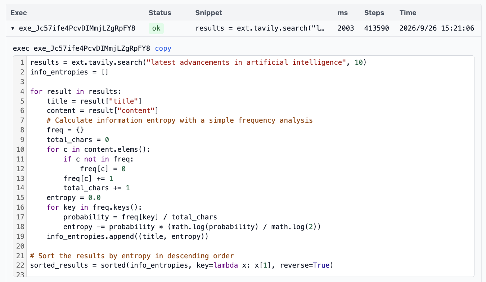

# 轻量级 Agent 运行环境
我们之前看了一个使用 `Scala` 的 capture detection 来将 Agent 运行时安全转换成类型安全的方案，以及一个简化版本，使用 `Starlark`在运行时层面定义 Agent 的安全边界。它在数学层面上和原文并不是一个东西，但是在工程层面上确实提供了一种可行的思路。

  现在的一些 Sandbox 通常会采用 `create`,`delete`,`pause`,`resume`,`execute` 的原语。同样，我们也可以用相同的原语来设计轻量级的运行时。

笔者花两天时间 vibe 了一个最简单的 PoC，称之为 `calcside`。这个名称的意思就是纯粹的计算加上副作用就能构建一个运行环境。

## Runtime Instance
每次 `create`都会创建一个 `Instance`，它可以绑定一次 agent session，也可以被多个 agent session 共享。每个`Instance` 会保存
1. 文件系统状态
2. 局部变量
3. 函数定义
4. capability
5. secrets / env

其中，共享局部变量带来一个非常好的性质，那就是 agent 在调试的过程中不用每次完整编出整段程序，而只需要重新定义要修改的函数和变量的，然后重新运行。类似 Jupyter Notebook 的用法。类比基于 Linux 沙箱的方案中，中间状态都保存在文件系统中，而这种方案，中间状态都在内存中。

## Capability
`Starlark`是完全无状态的，纯粹输入数据，输出数据。为了提供副作用，我们把一组基础的能力通过`globals`的方式传入到执行引擎中。最基本的能力包括 `io`,`net`,`fs`。

### Extended Capability
  基础的能力虽然已经够用，但是很多时候，我们希望封装一些可复用的模块，避免重复编码。这个时候，可以引入了 Extended Capability，简称 ext。每个 ext 会依赖某几个基础 cap，例如，一个调用 `tavily`联网搜索的 ext，需要依赖`net`。

每个 ext 由两部分组成
1. 清单：包含了这个 ext 所需要的密钥，配置，依赖
2. 实现：ext 的实现也是一个 `Starlark`文件，其安全边界和 agent 生成的代码是一致的。

如下是一份清单和对应的代码
```yaml
name: tavily
version: 0.1.0
description: Tavily web search
dependencies: [net]
ops:
  - name: search
    doc: Search the web; returns list of {title,url,content}
    params: [query, max_results]
config: # 实例级别的配置
  - name: base_url
    type: string
    doc: Tavily API base URL
    default: https://api.tavily.com
  - name: api_key
    type: secret
    doc: Tavily API key (secret reference)
    default: "{{secrets.TAVILY_API_KEY}}"
```

```py
def search(query, max_results=None):
    """POST {base_url}/search and return the results list."""
    if max_results == None:
        max_results = config["max_results"]
    body = json.encode({
        "query": query,
        "max_results": max_results,
        "search_depth": config["search_depth"],
    })
    r = net.post(
        url=config["base_url"] + "/search",
        body=body,
        headers={"Authorization": "Bearer " + config["api_key"]},
    )
    if r["status"] < 200 or r["status"] >= 300:
        fail("tavily search failed: status " + str(r["status"]))
    return json.decode(r["body"])["results"]
```

要调用 ext，只需要使用 `ext.provider.op`的方式，如下图


### Key Vault 和凭据注入
每个 `Instance` 都会关联一个 Key Vault，里面的内容对代码是不可见的。
下图是为 ext 选择密钥类型配置的交互。

在引入 ext 的时候，需要选择一个 secret，这个 secret 的引用就会被绑定到对应参数。

### Policy
在每次 Capability 执行的前后，都会有 OPA 策略进行检查，这允许业务方定义自己的准入准出规则。

## Langchain Binding
我们可以为 Langchain 写一个中间件来集成这套环境。中间件负责
1. 注入工具，也就是执行代码。
2. 注入提示词。因为 AI 可能不熟悉 `Starlark` 的局限性，以及这套运行时的 cap，需要将 `Instance` 作为单一事实来源，生成一段提示词注入进去。
3. 在 agent 运行前后启动和回收 `Instance`

这是这个 agent 的编排


我们尝试进行一些需要混合计算和 cap 调用的任务


如下是它实际执行任务的代码


# 结尾
本文呈现了一种超轻量级 Agent 运行环境的实现。每个实例都是内存级的资源消耗，并且边界存在于运行时里，这意味着它不需要复杂的内核和网络工程来进行防御。它通过引入运行时扩展 capability 的机制，弥补了内置 cap 过于底层，agent 需要反复编写大量代码的问题。
