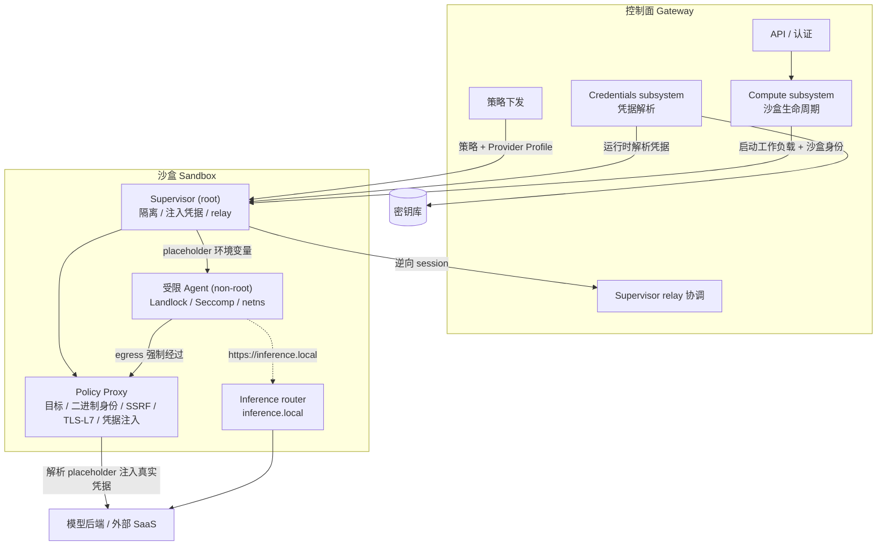

# Nvidia OpenShell

## 架构

- Gateway：控制面，负责认证、API、持久化、策略下发、凭据解析和 supervisor relay 协调。
- Compute subsystem: 沙盒生命周期管理（创建、删除、状态转换），编排由 compute driver 对接运行时。
- Credentials subsystem: 凭据逻辑解析，实际存储由 credentials driver 对接密钥库。
- Control plane identity: 控制面身份。
- Sandbox identity: 沙盒身份。
- Supervisor：沙盒本地安全边界，准备隔离、获取配置、注入凭据、运行 relay、启动 proxy 和受限 Agent。
- Policy Proxy: 强制出站路径，执行目标、二进制身份、SSRF、TLS/L7、凭据注入和推理拦截。
- Inference router: 沙盒内拦截 `https://inference.local` 转发至模型后端。

## OpenShell 安全模型

### 运行时模型
- Supervisor: root 启动，准备隔离，运行 proxy，获取配置，注入凭据，服务 relay socket，启动子进程
- Agent 子进程：非特权用户，文件系统、进程、网络均受限

### 启动过程
1. Compute Runtime 启动工作负载，注入沙盒身份、回调端点等
2. Supervisor 加载安全策略和运行时设置
3. 准备文件系统访问、进程限制、网络命名空间、凭据解析和推理路由
4. 启动 policy proxy 和本地 SSH server
5. 逆向建立 supervisor session 回到 gateway，用于 exec、log push、config poll 等
6. 以受限用户身份启动 agent

### 隔离层
- 文件系统层：Landlock 限制读写路径
- 进程层：non-root agent 进程，降权
- Seccomp：阻断危险系统调用（含绕过 proxy 的 raw socket 路径）
- 网络命名空间：agent egress 流量强制通过 CONNECT proxy
- Policy Proxy：评估目标、二进制身份、TLS/L7、SSRF 和推理拦截

### 凭据
1. 环境变量注入：凭据存在 Gateway，Supervisor 运行时获取。注入 Agent 和 SSH 子进程环境变量，环境变量值为 placeholder
2. placeholder：请求默认带 placeholder，例如 `Authorization: Bearer {{openshell:resolve:env:KEY_NAME}}`，由 proxy 在允许的目标端点上解析替换

### 二进制身份绑定与凭据注入限制

凭据注入并非对所有进程开放，而是绑定到具体的二进制身份。只有策略中显式声明的二进制发出的请求，才会在出站时被注入真实凭据。

**策略来源（Provider Profile）：**
- Provider Profile 的 `binaries` 字段（`BinaryProfile { path, harness }`）声明允许的二进制路径
- 导入时通过 `network_policy_rule` 转换为 `NetworkPolicyRule.binaries`（`NetworkBinary { path, harness }`），下发到沙盒

**运行时身份解析（Policy Proxy）：**
1. proxy 拦截 CONNECT 请求，根据连接的临时端口在 `/proc/<entrypoint_pid>/net/tcp` 中定位 socket inode
2. 扫描进程树找到持有该 socket 的 PID（fork/fd 传递可能多个，归属不一致则 fail-closed 拒绝）
3. 读取 `/proc/<pid>/exe` symlink 获取内核解析的规范二进制路径——**绝不使用 `/proc/<pid>/cmdline`（argv[0]）**，因为它可被任意进程伪造
4. 沿 `/proc/<pid>/status` 的 PPid 链收集祖先二进制路径（如 claude 派生 node）
5. 同时收集 cmdline 中的脚本路径（仅用于脚本检测，不作为授权信号）

**完整性校验（TOFU）：**
- `BinaryIdentityCache.verify_or_cache` 对二进制及其所有祖先计算 SHA256
- 首次使用缓存哈希（按 mtime + 文件大小指纹），后续比对
- 哈希变更即报 `Binary integrity violation`，防止运行后热替换二进制绕过策略

**策略匹配（OPA / Rego）：**
- `binary_allowed` 规则将解析出的 `exec.path` 及祖先与策略 `binaries[].path` 比对，支持精确路径、祖先精确路径、glob 通配
- `cmdline_paths` 被有意排除在授权之外（argv[0] 可伪造）
- 端点与二进制同时匹配（`network_policy_for_request`）才允许连接，L7 relay 随后解析 placeholder 注入真实凭据

**底层技术：**
- Linux procfs：`/proc/<pid>/exe`（二进制身份）、`/proc/<pid>/net/tcp`（socket-PID 绑定）、`/proc/<pid>/status`（祖先链）
- 网络命名空间：强制 egress 经过 proxy，使 socket 与进程身份可绑定
- SHA256 + TOFU 缓存：二进制完整性校验
- OPA/Rego（regorus）：策略评估引擎

### 自定义工具凭据注入示例

以 Tavily Search API 为例，展示如何将外部 SaaS API 集成到 OpenShell providers：

**关键对象：**

- **Provider Profile**：定义外部服务的配置，包括 API 端点、凭据结构、允许访问的二进制程序（如 curl、python3）
- **Provider Instance**：基于 Profile 创建的具体实例，绑定实际的 API key 或 OAuth token
- **网络策略**：Profile 中定义的允许访问的目标域名（如 api.tavily.com）
- **二进制限制**：Profile 的 `binaries` 字段列出允许的二进制路径（如 `/usr/bin/curl`），仅这些程序发出的请求会被注入凭据。机制详见上文「二进制身份绑定与凭据注入限制」

**工作流程：**

1. 定义 Provider Profile 配置文件
2. 导入 Profile 到 OpenShell
3. 使用真实凭据创建 Provider Instance
4. 沙盒挂载 Provider 时，OpenShell 自动注入 placeholder 环境变量
5. Policy Proxy 在出站请求中解析 placeholder 并注入真实凭据

该模式适用于任何使用 API key 或 OAuth token 的 SaaS 服务。