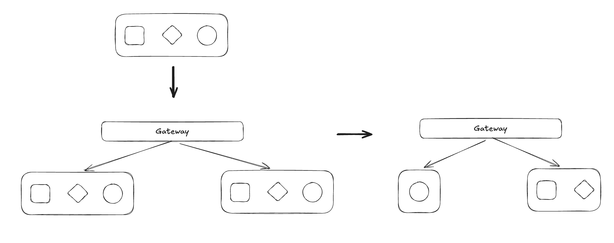

# 拆分

拆分软件项目时，可以基于组件（Component Based），或者基于战术分叉（Tactical Forking）。前者将软件拆分为高内聚松耦合的组件，而后者会将整个项目 Fork 若干份交给多个团队，然后每个团队根据自己的业务，删除没用的部分，最终形成多个独立的单元，如下图。

## 基于组件的拆分

基于组件的拆分有很多种模式，每种模式都用来解决拆分过程中的各种问题。一旦采用某种模式，就有对应的 fitness function 来保证后续实现符合该模式的要求。

|模式|一句话概括|适应度函数|
|---|---|---|
|Identify and Size Components|识别出已有组件，测算它们的大小，找出标准差。对于远高于标准差的组件，进行进一步拆分|（代码行/类/函数数量）标准差|
|Gather Common Domain Components|提炼出公共的域|1. 项目树叶子节点中存在的重复名称 2. 不同组件中的重复代码数|
|Flatten Components|只有根目录代表一个组件，这样组件之间都是平的，不存在嵌套的关系。如果组件中存在嵌套目录，则 1. 子目录都合并到父目录，形成一个大组件。 2. 父目录中新建一个 shared 目录作为新组件，存放原本共享的代码。|域的根目录不应该有代码，而只有子目录|
|Determine Component Dependencies|分析代码中组件的依赖关系，评估拆分难度。一些 shared 组件作为公共代码库而不是服务，因此可以排除在外。|限制依赖，例如某些包不应该依赖另一些|
|||