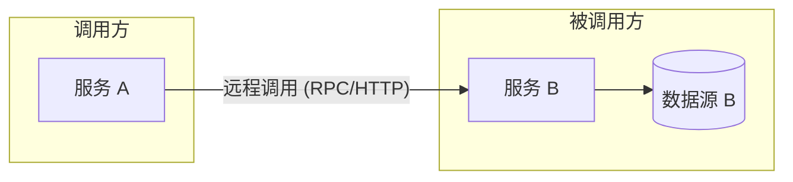
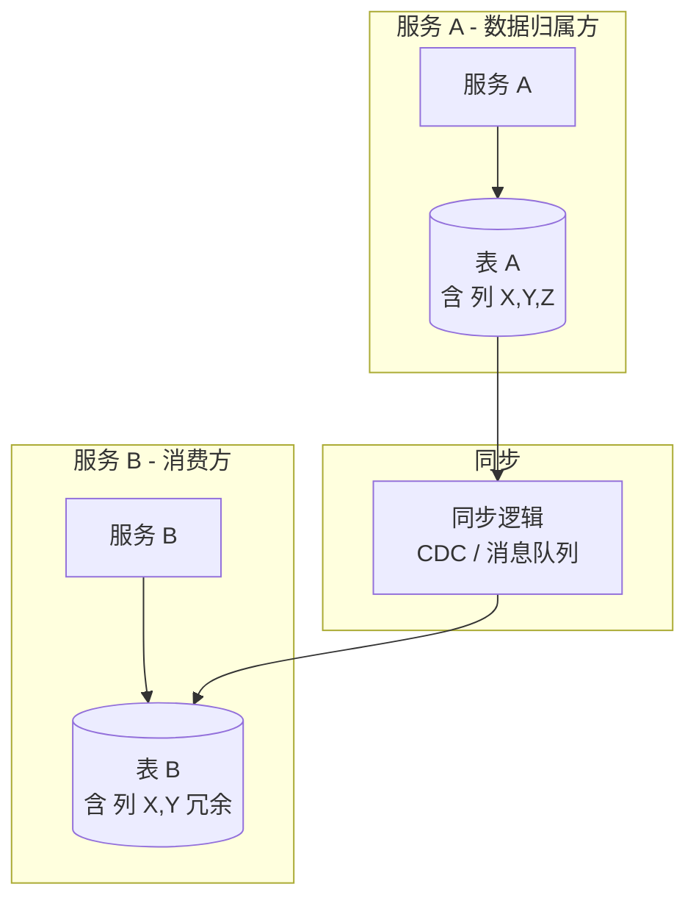
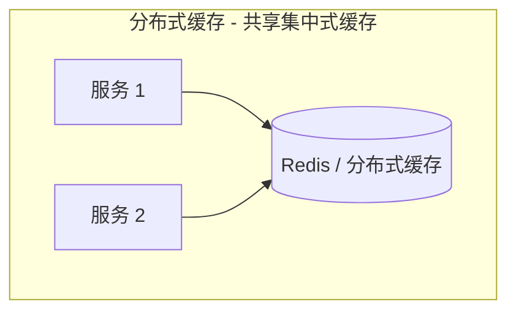
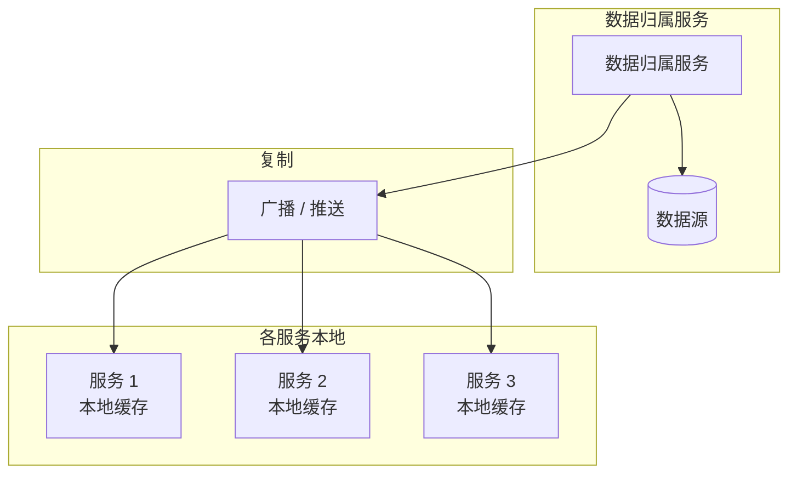
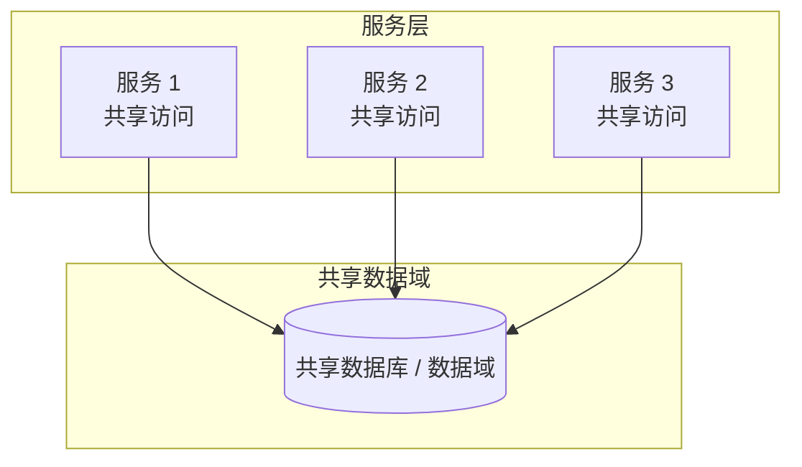

# 分布式数据访问

在单体服务中，可以自由访问数据源实现业务功能。在分布式架构下，业务按领域拆分后会产生**数据归属**问题，访问数据时需要加以治理，以保证数据安全与一致性。

分布式场景下常见的数据访问模式如下。

---

## 服务间调用（Interservice Communication）

当服务 A 需要用到服务 B 的数据时，通过**远程调用**（如 HTTP/gRPC）向服务 B 请求，由服务 B 访问其自有数据源后返回结果。

**优势**
- 架构简单，职责清晰

**劣势**
- 服务间耦合，接口变更影响面大
- 多一跳网络，延迟与吞吐不如本地访问
- 被调用方故障会直接影响调用方可用性
- 需约定并维护远程协议（序列化、版本、超时等）

---

## 列冗余（Column Schema Replication）

在各自归属的表中**重复存储部分列**，使各服务能本地查询所需字段，通过同步机制由数据归属方更新，其他方只读。

**优势**
- 本地读，性能好
- 无跨服务调用，扩展与可用性不受他方影响
- 服务间无运行时依赖

**劣势**
- 存在最终一致性窗口，需接受延迟与一致性策略
- 数据归属与冗余边界需明确治理
- 需实现并运维同步逻辑（CDC、双写、消息等）

---

## 缓存复制（Replicated Cache）

与「分布式缓存」不同，**复制式缓存**下每个服务在本地维护一份缓存副本，由数据归属服务将变更**广播**到各节点。

**优势**
- 本地读缓存，延迟低、吞吐高
- 单点缓存故障不拖垮全系统，容错较好
- 由归属方推送，一致性模型清晰
- 数据归属明确，便于审计与治理

**劣势**
- 拓扑与广播配置较复杂，云原生下更明显
- 不适合数据量极大或更新极频繁的场景
- 通常对服务启动顺序或缓存预热有要求

---

## 数据域（Data Domain）

多个服务通过**共享数据域**（共享库表或共享 SQL/模型）访问**共同拥有**的数据，在明确边界与权限的前提下共享同一套存储。

**优势**
- 本地或近端访问，性能较好
- 易做读写扩展与高可用
- 无服务间实时调用依赖
- 领域内数据完整、一致，事务边界清晰

**劣势**
- 限界上下文被放大，领域边界需严格定义
- 数据归属与权限需通过治理（权限、审计、变更流程）保障
- 共享存储带来更高的安全与合规要求