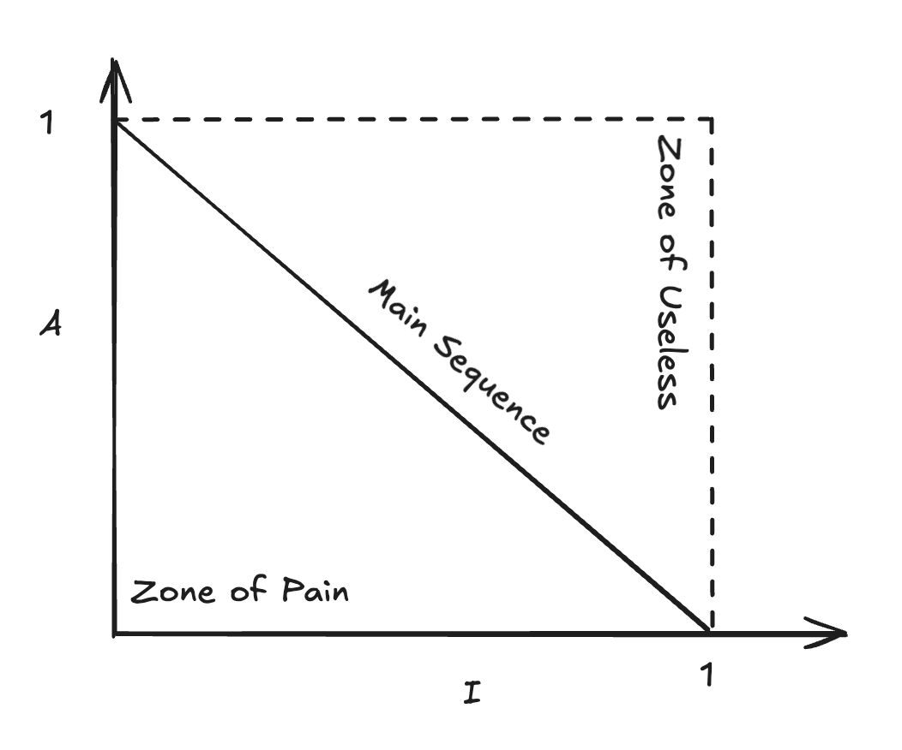

# 不稳定性和抽象度

组件化拆分时，需要衡量组件的易用性与可维护性。不稳定性（I）和抽象度（A）是两个常用指标。

**不稳定性**刻画组件受外部变化影响的程度：

$$
I = \frac{C^e}{C^e + C^a}
$$

$C^e$ 为向外依赖数（本组件依赖其他组件），$C^a$ 为向内依赖数（其他组件依赖本组件）。$C^e$ 越大，外部一变动本组件就容易跟着改，维护成本高。

**抽象度**表示组件中抽象（接口、抽象类）的占比，反映易用与可理解程度：

$$
A = \frac{\sum m^a}{\sum m^c + \sum m^a}
$$

综合看两个指标会得到两种极端：

- **Zone of Pain**：对外依赖多、抽象少 → 牵一发动全身，难以维护。
- **Zone of Uselessness**：抽象拉满、对外无依赖 → 多为孤立的接口定义，对业务贡献有限。

因此引入到主序列（Main Sequence）的距离 $D$，下图中即为到对角线的距离：

$$
D = |A + I - 1|
$$

组件落在对角线上（$D$ 小）时，抽象与依赖达到较好平衡。
