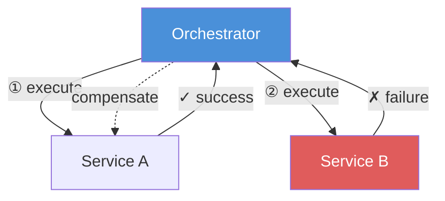
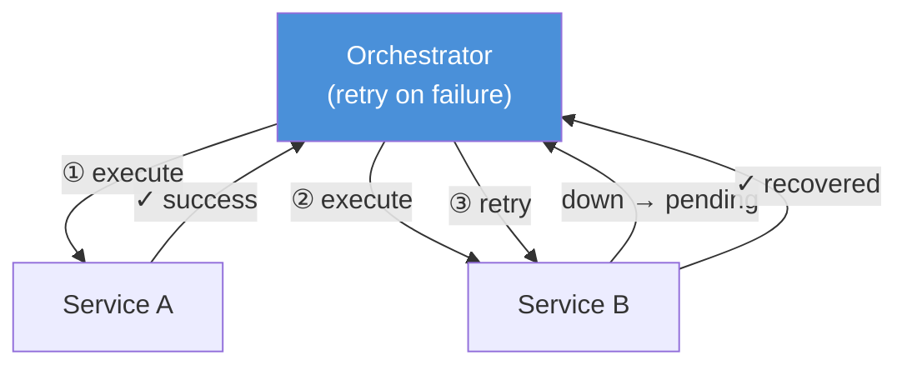
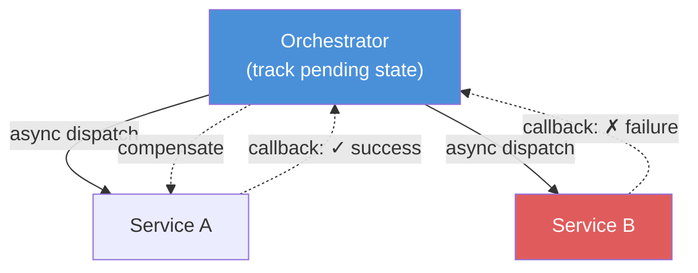
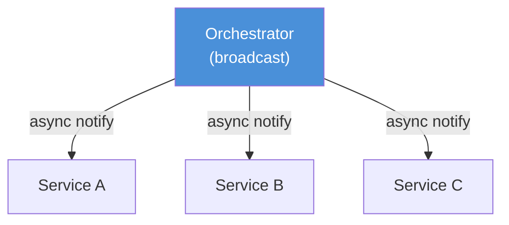

# Saga 模式

Saga 是处理分布式事务的经典模式。与 2PC 不同，Saga 强调 **Soft State** 与**补偿事务**，基于业务层编排，不依赖数据库的分布式事务能力。

## 模式概览

Saga 的各变体从三个维度划分：

| 维度 | 选项 |
|------|------|
| 通信方式 | 同步 / 异步 |
| 一致性 | 原子 / 最终一致 |
| 协调方式 | 编排（Orchestration）/ 编舞（Choreography）|

| 模式 | 通信 | 一致性 | 协调 |
|------|------|--------|------|
| Epic Saga | 同步 | 原子 | 编排 |
| Phone Tag Saga | 同步 | 原子 | 编舞 |
| Fairy Tale Saga | 同步 | 最终 | 编排 |
| Time Travel Saga | 同步 | 最终 | 编舞 |
| Fantasy Fiction Saga | 异步 | 原子 | 编排 |
| Horror Story | 异步 | 原子 | 编舞 |
| Parallel Saga | 异步 | 最终 | 编排 |
| Anthology Saga | 异步 | 最终 | 编舞 |

---

## Epic Saga（同步 · 原子 · 编排）

最经典的模式。协调者向各参与方同步发起事务，全部成功则提交；任一失败则对已完成方逐一发送补偿事务。**一致性高，但可用性低**——任意参与方宕机均会阻塞整个流程。



```python
def orchestrate(services, txn):
    completed = []
    for svc in services:
        if not svc.execute(txn):          # sync call
            for done in reversed(completed):
                done.compensate(txn)
            return FAIL
        completed.append(svc)
    return SUCCESS
```

---

## Phone Tag Saga（同步 · 原子 · 编舞）

去中心化的 Epic Saga。每个服务完成本地事务后**同步调用下一个服务**，链路末端响应结果，失败时补偿沿链路反向传播。通信开销分摊，无单点协调者，但各服务逻辑更复杂。


```python
# each service handles its step and delegates forward
def handle(txn):
    execute_local(txn)
    result = next_service.execute(txn)    # sync call
    if not result:
        self.compensate(txn)
        return FAIL
    return SUCCESS
```

---

## Fairy Tale Saga（同步 · 最终 · 编排）

Epic Saga 的最终一致版本。某参与方宕机时不立即回滚，待其恢复后继续完成挂起事务。协调者无需管理全局事务状态，扩展性和性能均有改善。同步编排通信简单直观，是**允许最终一致时的推荐选择**。



```python
def orchestrate(services, txn):
    for svc in services:
        while not svc.execute(txn):
            wait_and_retry()              # eventual consistency
    return SUCCESS
```

---

## Time Travel Saga（同步 · 最终 · 编舞）

Phone Tag Saga 的最终一致版本。每个服务对下游采用 **Fire-and-Forget**，不等待响应即返回。流程越简单越合适；业务逻辑复杂时建议选用 Fairy Tale Saga。


```python
def handle(txn):
    execute_local(txn)
    next_service.notify(txn)              # fire-and-forget, no await
    return SUCCESS
```

---

## Fantasy Fiction Saga（异步 · 原子 · 编排）

Epic Saga 的异步版本。Orchestrator 向各参与方**异步派发**事务请求，并维护 pending 状态表追踪完成情况；任一失败则触发补偿。异步带来一定性能提升，但 Orchestrator 需管理复杂的状态机，整体复杂度明显增加，需谨慎使用。



```python
def orchestrate_async(services, txn):
    pending = set(services)
    completed = []
    for svc in services:
        orchestrator.dispatch(svc, txn)   # async dispatch

    while pending:
        event = orchestrator.await_callback()
        if event.ok:
            completed.append(event.svc)
            pending.remove(event.svc)
        else:
            for done in completed:
                orchestrator.dispatch(done, compensate(txn))
            return FAIL
    return SUCCESS
```

---

## Horror Story（异步 · 原子 · 编舞）

Fantasy Fiction Saga 的编舞版本。异步 + 原子 + 编舞三重叠加，异常处理极其困难，补偿链路难以追踪。**强烈不推荐使用。**


---

## Parallel Saga（异步 · 最终 · 编排）

Fairy Tale Saga 的异步版本。Orchestrator **并行广播**事务，各参与方并发执行。最终一致性策略大幅降低了异步编排的复杂度——Orchestrator 只需广播通知，无需追踪事务状态。



```python
def orchestrate_parallel(services, txn):
    for svc in services:
        orchestrator.notify(svc, txn)     # broadcast, no rollback needed
```

---

## Anthology Saga（异步 · 最终 · 编舞）

Parallel Saga 的编舞版本，形成**链式异步事件流**。编舞增加了系统复杂性，对于复杂业务，优先选用 Parallel Saga。


```python
# each service subscribes to events and publishes the next
def on_event(event):
    execute_local(event)
    emit(next_event)                      # async chain
```
