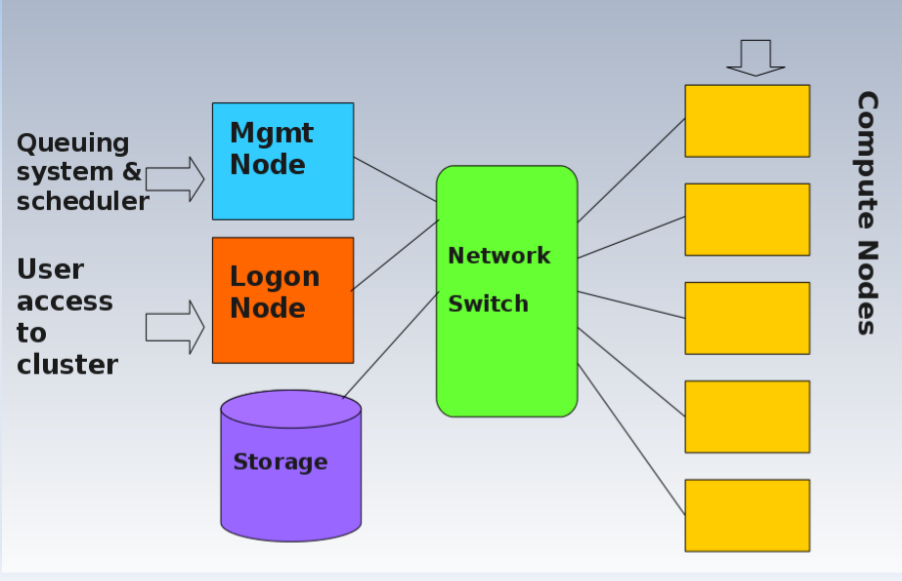
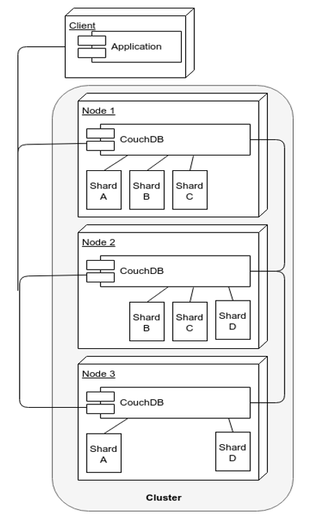
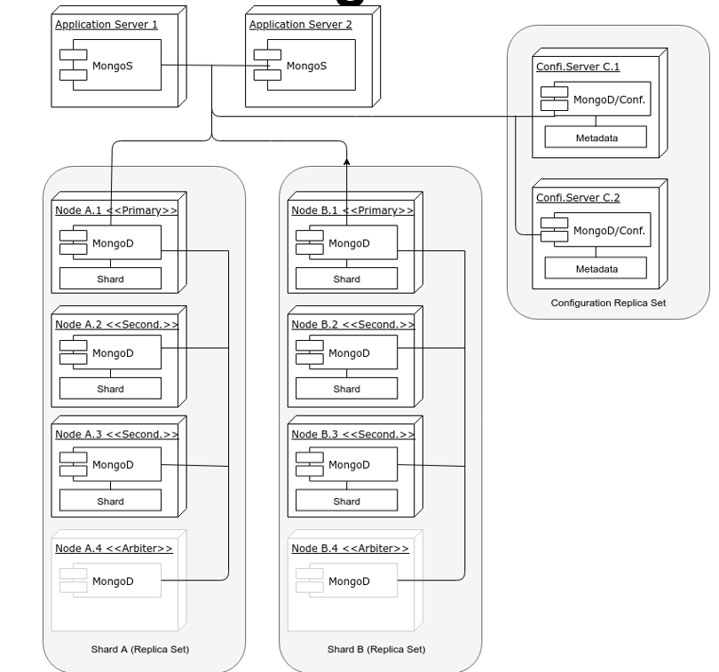

# Revision 

## History of Cloud Computing

- Internet
- Standards (Services, protocols, inter-operability, ...)
- More standards
  - Open distributed processing
  - less rigorous compliance demands
  - Distributed computing environments

- Mid 90s: focus on transparency and heterogeneity of computer-computer interaction
- 1993: Enter web era
- P2P processing
- Grid computing
  - Information systems (available resources like servers, CPU, memory, storage, queue, OS, ...)
  - Monitoring and discovery systems (Status of these resources)
  - Job scheduling/resource brokering
  - Virtual organization support

## Parallelization (L3)

### Computation Scaling Up
- **Single machine multiple cores**
- **Loosely coupled cluster**
  - Web services, Condor, Seto@home, Boinc
- **Tightly coupled cluster of machines**
  - HPC/HTC (SPARTAN, NCI, ...)
- **Widely distributed clusters of machines**
- **Hybrid combinations of above**

### Amdahl's Law

$T(1) = \sigma + \pi$

$T(N) = \sigma + \frac{\pi}{N}$

$S = \frac{T(1)}{T(N)} \approx \frac{1}{\alpha}$

This over simplifies the problem, because the overhead replicates in parallelization

### Gustafson-Barsis's Law
$T(1) = \sigma + N\pi$
$T(N) = \sigma + \pi$

where $\pi$ is fixed parallel time per process and $\alpha$ is fraction of running time sequential program spends on parallel part
$\frac{\pi}{\sigma} = \frac{1-\alpha}{\alpha}$

$S(N) = \alpha + N(1-\alpha) = N - \alpha(N-1)$

### Computer Architectures

- **Single Instruction, Single Data stream(SISD)**
  - Sequential computer
  - Single CPU fetch instruction, CPU generate appropriate control signals to direct single processing element to operate on single data stream
- **Single Instruction, Multiple Data stream (SIMD)**
  - multiple processing elements that perform the same operation on multiple data simultaneously
  - Focus on data level parallelism.
  - Many moder computers use SIMD instructions, e.g., to improve performance of multimedia use such as for image processing
- **Multiple Instruction, Single Data stream (MISD)**
  - Parallel computing arch. Many functional units perform different operations on same dataset
  - Fault tolerant computer architecture, running multiple error checking processes on same data stream
- **Multiple Instruction, Multiple Data stream**
  - Number of processors that function asynchronously and independently
  - At any time, different processors may be executing different instructions on different pieces of data
  - Machines can be shared memory or distributed memory categories
  - Most systems these days operate on MIMD

### Types of parallelisms
**Implicit parallelism** means
parallel languages and parallelizing compilers that take care of identifying parallelism, the scheduling of calculations and placement of data. This is quite hard to do though.

**Explicit parallelism** requires the programmer to take effort of parallelization, like mapping tasks to processors and inter-process communications. This approach assumes user is the best judge of how parallism can be exploited for a particular application.
 
### Hardware parallelism level
In hardware threading CPU, extra control units are added to allow more instructions to be processed per cycle. They usually share arithmetic units, so heavy use of one type of computation can tie up the available units of the CPU preventing other threads from using them.

Multi-core CPU can perform computational tasks in parallel in principle. The Control units have indenpendant arithmatic units but share cache.

Symmetric Multiprocessing means two or more identical processors connected to a single shared main memory, with full access to all I/O devices, controlled by a single OS that treats all processors equally. It's more complex to program since need to program both CPUs and inter-processor communications.

Non-Uniform Memory Access provides speed up by allowing a processor to access its local memory faster than non-local memory. As long as data are localized, performance is improved.

### Software Parallelism Approaches

Most languages support parallelization features like Threads, Pools, Lock, Semaphores. There are some key issues that need to be tackled. Deadlock (Process constantly wait for each other), Livelock (Processes involved in livelock constantly change with regard to one another, but none are progressing)

Message passing interface (MPI) is widely adoped approach for message passing in parallel system. Key MPI functions include MPI_Init, MPI_Finalize, MPI_COMM_SIZE, MPI_COMM_RANK, MPI_SEND, MPI_RECV, ... It supports both point to point and broadcast communications.

(HT)Condor It is a specialized workload management system for compute-intensive jobs. It offers job queueing mechanisms, scheduling policies, priority schemes, resource monitoring/management. Users submit jobs to Condor and it chooses when and where to run the job, monitors their progress and informs the user upon completion. There no need for shared file system across machines, data can be staged to machines as needed. 

### Facts about Distributed Systems
- Network is unreliable
- Latency
- Limited Bandwidth
- Network is insecure
- Topology changes
- Transport cost
- Heterogeneous networks
- Time is not synchronized

### How to design a parallel system?

- **Partitioning**: Decomposition of computational activities and data into smaller tasks.
- **Communication**: **Flow** of information and **coordination** among tasks that are created in the partitioning stage.
- **Agglomeration**: 
  - Tasks and communication structure created in the above stages are evaluated for performance and implement cost
  - Tasks may be grouped into larger tasks to improve comm
  - Individual comm can be bundled
- **Mapping**: Assigning tasks to processors such that job completion time is minimized and resource utilization is maximized.

In master-slave model, master decomposes the problem into small tasks and distributes to workers and gather partial results to produce final result.

### Shared memory parallelism (MP)
Multi-threading is one type of shared memory parallelism. A master forks a number of sub threads and diveide tasks between them. One implementation is OpenMP, which is limited to single instance.

### Distributed memory parallelism (MPI)
Programs are parallelized by sending messages between processes. Some functions in MPI are:
- **Bcast**: Broadcast same piece of data to all processes
- **Scatter**: Send a part of data from one process to all the processes (each process get different pieces of data)
- **Gather**: Gather data from all processes
- **Reduce**: Perform a reduce operation, return the result to root.

### Parallism Patterns
- **Master-Slave**: Master decomposes problem to smaller tasks, distribute them to workers and gather the results. Many ways to do it: Threading, Web service workflow ...
- **Single Process Multiple Data**: Each process executes same piece of code but on different parts of data. Data is splitted among available processors
- **Data Pipelining**: Includ multiple stages of execution, that typically operate on large number of dataset
- **Divide & Conquer**: Divide problem into sub-problems which can be independently solved. Master-worker is like divide & conquer with master doing split and join operation.
- **Look ahead execution**: C depends on P for some output value V,  then C predict V. If that's correct, there's a performance gain, otherwise restart the task with correct V.

## Cluster Computing (L4)

### Concepts
Supercomputer is a single computer system that has exceptiona; processing power for its time. One metric is the number of floating-point operation per second (FLOPS).

High-performance computing (HPC) is any computer system whose architecture allows for above average performance. 

Clustered computing is when two or more computers servce a single resource (improved performance and redundancy). A collection of smaller computers strapped together with a high-speed local network. 

Research computing is the software application used by research comminity to aod research. THis skill gap is a major problem and must be addresed because as datasets grow, the researchers will need to able to process the data.

### HPC

The HPC cluster architecture is like this

Queueing system and scheduler are placed at management node whiel user access are via logon node.

Supercomputers use Linux because:
- Powerful and efficient command-line interface
- Scalable
- Reliable
- Free and open source system and software
- Compile open source software

## Cloud (L5)

### Definition
Cloud computing is a model for enabling ubiqutous convenient, on demand network access to a pool of configurable computing resources that can be repidly provisioned and released with minimal management effort and provider interaction. Cloud computing has following characteristics:
- On-demand self-service
- Broad network access
- Resource pooling
- Rapid elasticity
- Measured service

### How to attach a volume
- Create mounting point in fs
- Format the volume (for nectar cloud, it's in /dev/vdb)
- Mount the volume to the mounting point

### Public cloud
Pros:
- Cost efficient
- Focus on core business
- Right sizing
- Democratisation of computing

Cons
- Security
- Loss of control
- Lock in
- Depends on cloud provider

### Private cloud
Pros:
- More control
- Secure
- Consolidation of resource
- Trust

Cons:
- Management & maintenance overhead
- Relevant to core business>?
- Hardware obsolescence
- Over/under utilization

### Hybrid Cloud

Pros:
- Cloud-bursting: Use private cloud but burst into public cloud when needed

Cons:
- How do you move data 
- Decide what data go to public

### Automation 
- Config & manage computers and make them reach a desired state
- Provide a record what you did
- Codifies knowledge about the system
- Make process repeatable
- Makes it programmable

## Web Service (L6)

### SOA (Service-Oriented Architecture) 

Design principles:
- **Standardized Service Contract**: Services adhere to a communication aggrement
- **Loose Coupling**: Minimized dependency; Only maintain an awareness of each other
- **Abstraction**: The information published is limited to what is required to effectively utilize the service.
- **Encapsulation**: Hidden inner work
- **Reusability**: Logic is divided into services for reuse
- **Autonomy**: Service cannot contain logics that depends on anything external.
- **Statelessness**: Separate services with their state data whenever possible. Data management delegated to separated service.
- **Discoverablility**: Communicative meta-data by which they can be discovered/interpreted
- **Composability**: Services are effective compisition participants, regardless size/complexity
- **Granularity**: Services are at right ganular level
- **Normalization**: Minimized redundancy (by decompising/consolidation)
- **Service Optimization**: Prefer high quality specific purpose services over low quality general purpose ones
- **Service Relevance**: At a ganular level such that it's meaningful to users

### SOAP vs ReST

| SOAP | ReST |
|------|------|
|Built upon RPC| About resources and the way they can be manipulated remotely|
|Stack of protocols that covers every aspect of using a remote service| A style of using HTTP|

### WSDL (Web service description language)
- XML based, machine readable
- Key components
  - **Definition**: what it does?
  - **Target Namespace**: context of naming
  - **Data Types**: Data structure of input/output
  - **Messages**: Messages & structures exchanged between client/server
  - **Port type**: Encapsulate input/output messages into one logical operation(abstract)
  - **Bindings**: bind operations to port types (Concrete operatiosn)
  - **Service**: Name of service

### ReST design best practice
- Short URI
- URI discovered by following links, instead of constructed by clients
- Use nouns instead of verbs
- Use links in response
- Minimize query string
- Use HTTP status code

### ReST principles
- Addressability
- Uniform interface
- Resources and representations instead of RPC
- HATEOAS

### Uniform interface
- All important resources are identified by one resource identifier mechanism
- Resource has different representations (application/json, text/html, ...)
- Requests contain headers describing how the content should be processed

### HATEOAS (Hyper Media As the Engine of App)
- Link to identify resources
- Navigate through resources
- Navigate instead of calling

### ReST 2.0
- Everything as a service
- Vast number of entities and services
- Link services to create workflows
- Extend API to web Apps
- API Hub to facilitate the sharing and usage of service among developers, users, ...

### Safe/Idempotent methods
A method is safe if does not change anything. (N calls == 0 call). A method is idempotent if (N calls = 0 call)

|Method|Safety|
|------|------|
|GET, OPTION, HEAD| Safe|
|PUT, DELETE|Idempotent|
|POST|Neither|

### Virtualization vs Containerization
Virtualization has advantages like containment and horizontal scalability, but requires more resources. Guest OS and binaries might be duplicated, wasting resources.

Containerization allows virtual instances to share a single host OS, binaries, drivers and libraries to reduce waste.

|Paraleter|VM|Container|
|---------|--|---------|
|Guest OS|Has their own kernel|Share same kernel| 
|Comm|Eth|Pipes, sockets| 
|Security|Depends on Hypervisor|Requires close scrutiny| 
|Performance|Small overhead when translating instructions|Near native| 
|Isolation|FS and lib not shared|Shared lib, fs can be shared| 
|Startup|Slow|Fast|
|Storage|Large|Small|

### Container Orchestration
Manage containers at scale

Features:
- Networking
- Scaling
- Service discovery and load balancing
- Health check and self-healing
- Security
- Rolling updates

Goals
- Simplify container management process
- Help manage availability and scaling

### Docker
It uses resource isolation features of Linux Kernel to allow independent containers to run within a single Linux instance. Can also be installed on Macos and windows, integrated with Hypervisor in maxOS and Hyper-V in windows.

Data can be persisted when container is deleted using docker volumes or bind mounts. Docker volumes are managed by docker, in `/var/lib/docker/volumes`, while bindmount is managed by user.

## Big Data (L7)
4 Vs
- **Volume**
- **Velocity**
- **Veracity**
- **Variety**

Why use document-oriented DBMS for big data?

Relational database model implied fine-grained data, which are less conductive to partition-tolerance than coarse-grained data.

### MongoDB vs CouchDB

CouchDB cluster is simpler, more available. Accepts HTTP requests. All the nodes accept requests. If data unavailable, it fetch from other node and return to user.

CouchDB cluster uses MVCC, while MongoDB uses a mix of two-phase commit for consistency and Paxos-like algorithm for leader election.

When a CouchDB cluster is partitioned and two nodes receive two different updates of the same document, two different revisions are added. However, only one of these is returned as the current version.

When partitioning happens in MongoDB which separate a primary into a partition with a minority of nodes, when primary detects that it can only see a minority of nodes, it steps down and a members in majority oartition holds election to become the new primary

MongoDB clusters are more complex, more consistent and less available. The sharding is on the replicaset level. Routers must be embedded in application servers. Only master node accept queries (depending on configurations) 

### CouchDB Views
- Definition of MapReduce jobs that are updated as new data comes in
- Grouped into design documetns
- Passed the level of aggregation
- May return only a subset of keys
- Computed once they're called. Update everytime document changed
- Persist on disk. Adding entire doc in view uses a lot of disk space
- Add type to docs to make it handier
- Not influenced by system state
- Ensures consistency of result

### CAP theorem
- **Consistency**: Every client receives the same answer from all nodes in the cluster.
- **Availability**: Every client receives an answer from any node in cluster
- **Partition-tolerance**: The cluster keeps on operating when one or more nodes cannot communicate with rest of the cluster.

Consistency and availability are at odds when a Partition happens. Traditional databasrs are not concerned with network partitions, since all data were supposed to be in a small co-located cluster of servers.

**Consistency and Availability: Two-phase commit**
It enforces consistency by:
- Lock data within transaction scope
- Perform transaction on write-ahead logs
- Commit only when all nodes have performed the transaction
- Abort when partition detected

Commit request phase:
- Coordinator sends a query to commit msg to all participants, wait until reply
- Participant execute the transaction up to the point where they will be asked to commit. They write an entry to undo log and redo log
- Each participant votes yes if success, or no if execution fail.

Commit phase:
The commit is success if all participants agree to commit. It fails if any of them vote "No".
- Coordinator sends commit/rollback to all participants
- The participants finish commit or undo it, then release lock.
- Participants send ACK to coordinator
- Coordinator complete-abort transaction after recving all ACKs

**Availability and Partition Tolerance: MVCC**
- Commit updates without locks 
- Transaction that completes last has larger revision number
- When partition is solved, same rev number may cause conflict
- Couchdb returns a list of current conflicts to be solved by application.

**Consistency and Partition Tolerance: Paxos**

Paxos ensures no matter what if data is written, it eventually propagate to all nodes. There will never be different nodes that think that some index contains different value.

Some assumptions:
- Message contents don't change after sent
- No bugs or hackers
- Storage persistant if system is down

Building blocks
- Leader election protocol
- Consensus on a single log entry (Synod) that preserves safety
- Protocol to manage the entire log

The alg orithm overview
- Continuously run leader election algorithm, making sure all nodes know who's in charge.
- When leader receives a request to add ITEM to log, it selects next empty log index, and initiate a consensus on adding data to log (Ballot)
- When consensus initiated, all nodes participate in it, eventually aggreeing that item was added to log as INDEX.

## Big data processing (L8)

Challenges of big data analysis:
- Need to read and write distributed datasets
- Preserve data in the presence of fail node\
- Execute map reduce tasks
- Fault-tolerant (nodes that fail computing only slow down the process instead of stop it)
- Coordinating task execution across a cluster

### Hadoop

Hadoop HDFS uses 128MB block for smaller metadata, higher network efficiency and reduce need for seek operation. It is quite efficient when most data of a block is processed.

Hadoop uses YARN (Yet Another Resource Negotiator). Resource Manger is located on master node while Node Managers are on slave nodes. Everytime a MR job is initiated, an Application Master is started to negotiate resource with Resource Manager and start containers on slave node.

YARN core components:

- **Resource Manage**
  - **Scheduler** allocates resource to running Apps, subject to constraints of capacities, queues. It does not monitor or track tasks, doesn't ensure restart failed tasks. The schedule is based on resource requirement. It has a pluggable policy plug in, which can be Capacitor Shceduler or Fair Scheduler
  - **Application Manager** accepting job submissions and negotiate first container from RM for app-specific App Master. It also manages running App Master in cluster and provide services for restarting.
- **Node Manager** takes care of individual nodes, jobs and workflows in a single node
- **Application Master** is unique for each application. It coordinate execution in the cluster and manage fault. It negotiate resources from RM, works with node manager to execute and monitor tasks and also send heart beat to RM to affirm its health and update its record of resource demand.
  
### Spark
Why Spark?
- Hadoop only performs simple tasks on large datasets
- Data need to be cached for comples operations
- Need fine grained control on executions
- Low latency
- Operate with hadoop architecture

Spark components
- Job: Data processing to be performed on a dataset
- Task: A single operation on dataset
- Executor: The process in which tasks are executed
- Cluster Manager: Process that assigning tasks to executors
- Driver Program: Main logic of the program
- Spark Application: Driver + Executor
- Spark Context: General configuration

Spark RDD (Resilient Distributed Dataset).
Resilient means Data is stored with redundancy. Failing node does not effect integrity. It has following properties

- Immutable: Once defined, not changed
- Transient: Used only once, then discarded
- Lazy-evaluated: Data process only happens when data cannot not be kept in RDD (Transormations don't evaluate RDD)

Some RDD Transformations:
- **distinct()**
- **uniun(rdd)**
- **intersect(rdd)**
- **substract(rdd)**
- **cartesian(rdd)**

Key-value Transormations
- **map(lambda)**
- **flatmap(lambda)**
- **reduceByKey(lambda)**
- **join(rdd)**: Merge key-value pairs

Actions (Evaluation happens)
- **collect()**: Return all elements in an RDD
- **count()**
- **reduce(lambda)** (different from reduce by key)
- **foreach(lambda)**: apply lambda to all elems 

## Virtualization (L9)

**VMM** or **Hypervisor** is a piece of software that provide the abstraction of a virtual machine. When looking at the virtual environment provided by VMM, there are three properties of interest:
- **Fidelity**: Programs running under VMM exhibit identical behavior to running on an equivalent physical machine.
- **Safety**: VMM is in complete control over virtual resources
- **Performance**: Dominant fraction of instructions must be executed without VMM intervention

Popek and Goldberg describe characteristics that ISA (Instruction Set Architecture) of physical machine must possess to run VMM with 3 properties above. There is a classification of instructions of an ISO into 3 different groups:

- **Privileged instructions**: Those that trap if the processor is in user mode and do not trap if it is in system mode
- **Control sensitive instructions**: Those that attempt to change the configuration of resource in the system
- **Behavior sensitive instructions**: Those whose behavior or result depends on the configuration of resources (the content of the relocation register or the processor's mode)

### Theorem
For any conventional third-gen computer, an effective VMM may be constructed if the set of sensitive instruction for that computer is a subset of the set of privileged instructions.

This indicates that in order to build a VMM it is sufficient that all instructions that could affect the correct functioning of the VMM always trap and pass control to the VMM. This guarantees the resource control property. None privileged instructions must instead be executed natively.

This theorem also provides a simple technique for implementing a VMM, called trap-and-emulate virtualization, more recently called classic virtualization: because all sensitive instructions behave nicely, all the VMM has to do is trap and emulate every one of them

### Virtual machine extensions
x86 is not originally virtualizable. VT-x (Intel) and SVM (AMD) are introduced to satisfy popek-goldberg theorem permit entering/exiting virtual execution mode where guestOS perceives itself as running with full privilege, but host OS remains protected.

VMM should support following features:

- **De-privilege**
  - VMM emulates the effect on system/hardware resources of privileged instructions whose execution traps into VMM (This is achieved by running GuestOS at lower priority level than VMM)
  - Problematic on some architectures where privileged instructions do not trap when executed at de-priveleged level.
- **Primary/Shadow structures**: VMM maintains shadow copy of critical structures whose primary versions are manipulated by GuestOS e.g. memory page table. Primary copies need to ensure correct versions are visible to Guest OS
- **Memory traces**: 
  - Control access to memory so that the shadow and primary structure remain coherent
  - The common strategy is write-protect primary copy so that updates which cause page fault can be caught, interpreted and addressed

### Full virtualization vs Para-virtualization
Full virtualization allow na unmodified guest OS to run in isolation by simulating full hardware. Guest OS has no idea it is virtualized.

With Para-virtualization, VMM exposes special interfaces to guest OS for better performance. It requires a modified/hypervisor aware Guest OS (Xen). This can optimise systems to use this interface since not all instructions need to be trapped/dealt with

### Software based virtualization vs Hardware assisted virtualization

In software based (CPU) virtualization, Guest application code runs directly on CPU. Privileged codes are translated to run on CPU. Translated codes are larger and slightly slower.

In hardware assisted virtualization, the processor provides hardware assistant for CPU virtualization. Guests can use a separated mode called Guest Mode (Both applications and privileged codes are running in guest mode). On certain events, the processor exit guest mode and enter root mode. Hypervisor executes in root mode, determing reason for exit and restart guest in guest mode. With hardware assist, system calls and trap intensive workloads run close to native performance. Tasks that lead to large number of exitting guest mode may affect the performance. 

## Openstack Services (L9.2)
- **Nova (Compute Service)**
  - Nova-api: Accepts end user API calls
  - Nova-compute: Create/terminate VMs through Hypervisor APIs
  - Nova-conductor: Interact between compute service and other components
- **Swift (Object Storage)**
  - Arbitrary unstructured data object storage via ReSTful APIs
  - Fault tolerant by replicating across a cluster
  - Can be used withou Nova
- **Clinder (Block Storage)**: Block storage to VM. Supports creation and management of block storage devices
  - Cinder-api: Route req to cinder-volume
  - Cinder-volume: Interact with block storage sercice and scheduler to read/write requests. Interact with multiple flavors of storage
  - Cinder-scheduler: Select optimal storage provider node to create volume
  - Cinder-backup: Privide backup to any types of volumes to backup storage provider
- **Glance (Image Service)**： Accepts request for disk/server image and their associated metadata. Retrieve and install.
- **Neutron (Network)**
  - Networking
  - APIs for defining, attaching networks (switches, routers)
  - Support multiple network venders
- **Horizon (Dashboard)**
  - Web-based portal
  - Based on Django
  - mod-wsgi
  - Requires Nova, Keystone, Glance and Neutron
- **Head (Orchestration)**
  - Template based
  - Can be integrated with automation tools like ansible

## Security (L12)

### Motivations and challenges
Why Security? Otherwise
- Large communities will not engage
- Expensive to repeat some experiments
- Legal and ethical issues
- Trust problem

Challenges of security
- Grids and clouds allow user to compile ecodes that do stuff to machines. Need more security facility. Need scalable tech to meet wide variety of application
- Generic security solutions, avoid organizations from re-inventing incompatible solutions
- Clouds allow scenarios that stretch inter-organizational security

Technical Challenges of Security
- **Authentication**
  - Propagate user identity in the system (Only check who is it)
- **Authorization**
  - Centraolized vs Decentralized
  - Group based (GBAC)
  - Role based (RBAC)
  - Identity based (IBAC)
  - Attribute based (ABAC)
- **Audit/accounting**
  - Logging, intrusion detection, auditing of security in external computer facilities
- **Confidentiality**
- **Privacy**
- **Fabric management**
- **Trust**

Single Sign-on

Certification Authority (CA) has following responsibilities:
- Policy and procedure
  - Howto, dos don'ts of using certificate
  - Process to follow
- Issuing certificates
  - Often need to delegate to local Registration Authority
- Revoking certificates
  - Certificate Revokation List for expired/compromised certificates
- Storing, archiving
  - Keep track of existing certificates

To issue a certificate
- User request certificate and generate a private key
- CA checks details of request with RA
- RA check with user
- Download and install certificate in browser
- Download and install CRL
- Export cert to various formats

## Exam Questions

### Erroneous assumptions made in designing large-scale distributed system

### Cloud computing do not solve many key challenges of large scale distributed systems