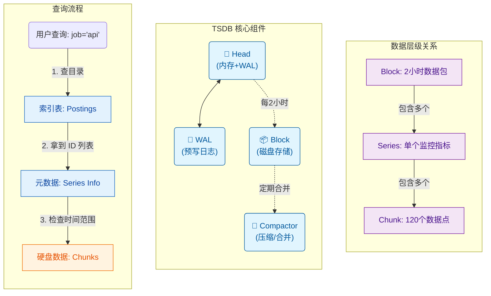

# 像查字典一样查数据：Prometheus 索引原理解析

你有没有好奇过，为什么在 Prometheus 里查 `up{job="api"}` 这种查询，哪怕系统里有几百万条时间序列，结果也能在几毫秒内弹出来？

其实，Prometheus 找数据的过程，和我们在图书馆找书，或者在字典里查单词的过程惊人地相似。它并不是笨笨地把所有数据都翻一遍，而是通过一套精心设计的**索引**机制，精准地“跳”到数据所在的位置。

今天我们就来聊聊这个过程底下的奥秘，以及支撑这一切的核心组件。

## 核心组件：TSDB 的“五脏六腑”

在深入索引原理之前，我们先搞清楚 TSDB 里几个核心概念的关系。它们就像是一个层级分明的档案管理系统：

1.  **Block（数据块）**：
    *   这是最高层级的容器，是**时间维度**的切分。
    *   Head 里的数据每攒够一段时间（通常是 2 小时），就会被打包成一个只读的 Block。
    *   每个 Block 都是一个独立的小宇宙，包含了这 2 小时内**所有**的数据、索引和元数据。

2.  **Series（时间序列）**：
    *   这是**纵向维度**的切分。
    *   一个 Series 代表了一条具体的监控指标，例如 `up{job="api", instance="01"}`。
    *   在一个 Block 内部，可能有几百万个 Series 并排躺着。

3.  **Chunk（数据切片）**：
    *   这是 Series 内部更细粒度的切分。
    *   一条 Series 在 2 小时内可能产生上千个数据点。我们不会把这上千个点散乱地放着，而是每 120 个点（大约）压缩成一个小包，叫 **Chunk**。
    *   Chunk 是数据读取的最小单位。

**它们的关系就像是：**
*   **Block** 是一本“2023年1月号”的杂志。
*   **Series** 是杂志里的一篇专栏文章（比如“API 监控”）。
*   **Chunk** 是这篇文章里的一个个段落。

除了这些数据层级，还有两个关键角色负责管理它们：

*   **Head（头部）**：
    *   最活跃的地方。所有新进来的数据，首先都会存放在这里。它完全在**内存**中（为了快），同时也会写一份 **WAL (Write Ahead Log)** 到磁盘防止断电丢数据。
    *   你可以把它想象成办公桌上的“收件篮”，处理完（满 2 小时）才会归档成 Block。

*   **Compactor（压缩器）**：
    *   负责整理 Block 的勤劳清洁工。它会把多个小的 Block 合并成更大的 Block（比如把几个 2 小时的块合并成一个 10 小时的块），以提高查询效率。

---

## 索引查询：四步走

了解了组件关系，我们再回来看查询。当你输入 `job="api"` 时，Prometheus 是怎么在 Block 里找到数据的？

### 第一步：倒排索引（查目录）

想象一下，你要找所有“关于历史”的书。你肯定不会从第一排书架走到最后一排，一本本看书名。你会先去查**分类目录**。

在 Prometheus 里，这个分类目录叫 **Postings（倒排索引）**。

数据库并不会去扫描实际的数据。相反，它去查了一个专门的表格（Postings Offset Table）。这个表格会告诉它：“嘿，所有打着 `job="api"` 标签的数据，它们的 ID 分别是 5、9、42...”。

这一步非常快，因为它只处理 ID，不涉及任何具体的数据内容。如果你的查询条件更多，比如 `job="api"` 且 `env="prod"`，Prometheus 就会分别拿到两组 ID，然后瞬间算出它们的**交集**。这就好比你先筛选出“历史类”的书，再从中筛选出“精装版”的，剩下的就是你真正要找的目标。

### 第二步：元数据定位（找书架号）

拿到这些 ID（比如 ID 500）之后，Prometheus 并不需要去搜索这个 ID 在哪。

这里有一个很巧妙的设计：**Series ID 本身就是地址**。

Prometheus 的设计约定，Series ID 对应着元数据文件中的物理偏移量。拿到 ID 500，数据库就知道：“噢，我直接跳到文件的第 8000 字节（500 * 16），那里一定写着这条序列的详细信息。”

这就像你知道了书的索书号，就能直接走到具体的书架前，而不需要再问管理员。

### 第三步：时间过滤（看目录选章节）

现在我们已经站在了具体某一条时间序列（Series）的面前。根据我们之前的层级关系，你知道 Series 里面包含了很多个 Chunk（段落）。

我们要读所有段落吗？通常不要。你的查询可能只是“过去 5 分钟”。

这时候，Prometheus 会先读一下这些 Chunk 的**元数据**。每个 Chunk 上都贴着标签，写着：“我包含从 10:00 到 12:00 的数据”。

*   Chunk A：10:00 - 12:00。你的查询是 13:00？**跳过，不读。**
*   Chunk B：12:00 - 14:00。**命中！**
*   Chunk C：14:00 - 16:00。**跳过。**

这个过程虽然是线性扫描，但因为一个 Series 内的 Chunk 数量很少，所以速度极快。这避免了大量的磁盘 IO 浪费。

### 第四步：读取数据（翻书阅读）

直到这最后一步，Prometheus 才会真正去接触硬盘上那些沉重的压缩数据文件。因为它已经通过前面的步骤，把范围缩小到了极致——只读那几个真正有用的 Chunk。

它把这些压缩的二进制流读出来，用专门的解压算法（Gorilla/XOR）还原成我们看到的数字和时间戳，最后呈现在你的屏幕上。

---

## 一图胜千言

如果把这个过程画下来，大概是这样的：

这就是为什么 Prometheus 如此之快：它极其吝啬地进行磁盘读取，**只在最后一刻，只读最必须的数据**。所有的前期工作，都是为了让这一次读取精准无误。
