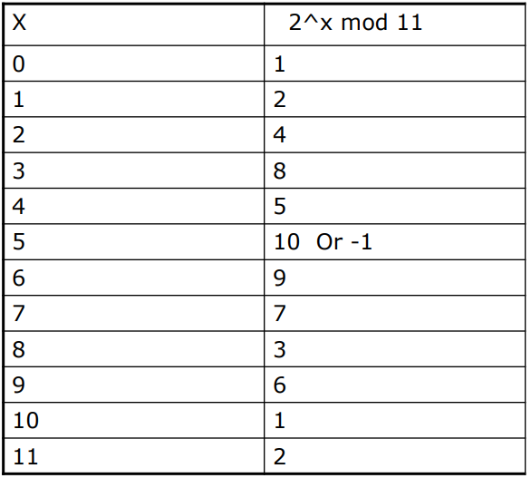
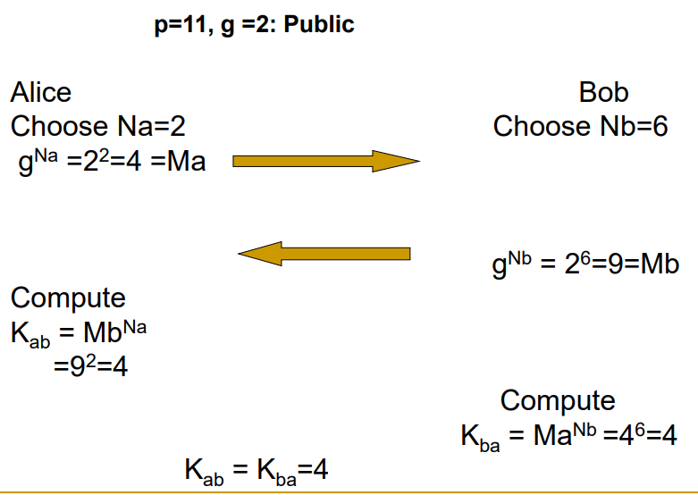

# Cryptography

## Diffie-Hellman Idea

The problem: Two users want to share a common secret over a public network, is it possible?

- We need a one way function which is easy to get $x \rightarrow y$ but very hard to get $x$ from $y$
- Alice and Bob exchange some public information then calculate the shared secret key.

### One way function
One example of one-way function is discrete logarithm problem. Let 'g' and 'h' be elements of group G, then discrete logarithm problem is the problem of finding x such that $g^x = h$

For example, we are calculating $2^x mod 11$, then we get this 

This process is quite hard to be reversed, esecially when we have a real big x.

### Exchanging the key

The exchange of key then becomes straightforward. Alice chooses a Na, and calculate Ma using one way function, then send it to Bob. Bob chooses a Nb and calculate Mb then send to Alice. We easily get $Mb^{Na} = Ma^{Nb}$, which can be used as shared key. Even if the attackers know Ma and Mb, they can hardly calculate the key.

The problem of DH key exchange is man-in-the-middle attack. Someone may pretent to be the peer in the middle to intfere the communication.

## RSA Idea

### RSA overview
RSA is one of the public key cryptography algorithm which allows encoding and decoding in both direction, that is, the message can either be encrypted with public key or private key. In RSA, the plain text and cipher text are integers between 0 to n-1, where n is 1024 typically. This integer is treated as one block.

The main idea of RSA is that given a message $M$, and a key $e$, the cipher text $M^e \mod n$ can be calculated given another key 
$d$ by $(M^e)^d \mod n$. This holds under the condition that $e$ and $d$ are inverse mod $\phi(n)$ where $\phi(n)$ is the Euler totient function which indicates the number of integers up to $n$ that are relatively prime to $n$. If $p$ and $q$ are prime, we have

$$\phi(pq) = (p-1)(q-1)$$

Before getting into that, we need some introduction on number theory.

### Euclid's Algorithm and Inverse Modulo
Euclid's algorithm is an important algorithm used to find GCD (Greatest Common Divisior). One of the most useful theorem is that given integers $a$, $b$, $q$ and $r$, we have
$$
GCD(a, b) = GCD(b, r)
$$
 where
$$
a = b q + r
$$

This theorem can be applied repeatedly until $r=0$, then the $GCD$ is b. This can be simply written into the form of linear system

$$
\begin{bmatrix}
a_r\\
a_{r+1}
\end{bmatrix} = \begin{bmatrix}
0 & 1 \\
1 & -q_r
\end{bmatrix} \begin{bmatrix}
a_{r-1}\\
a_r
\end{bmatrix} 
$$

where $q = a_{r-1} // a_r$, $a_0 = a$, $a_1 = b$. The matrix dot production is applied repeatedly until $a_{r+1} = 0$. The final form is 
$$
\begin{bmatrix}
a_n \\ 0 
\end{bmatrix} = 
\begin{bmatrix}
A_{00} & A_{01} \\
A_{10} & A_{11} \\
\end{bmatrix} 
\begin{bmatrix}
a\\
b
\end{bmatrix}  
$$
which is equivalent to
$$
GCD = X\times a + Y \times b
$$
where $X=A_{00}$ and $Y=A_{01}$

From this equation we can simply find inverse of $a$ mod $b$ by simply applying modulo on both side
$$
aX = 1 \mod b
$$

### Finding inverse by hand (example)
- Find inverse of 3 $\mod 40$
  - $40 = 13 * 3 + 1$
  - $40 - 13*3 = 1 \mod 40$
  - $-13*3 = 1 \mod 40$
  - Answer is $-13$

### RSA algorithm
- Choose two large prime numbers $p$ and $q$ randomly, $pq=n$
- Calculate $\phi(pq) = (p-1)(q-1)$
- Find two numbers $e$(public) and $d$(private) which are inverse mod $\phi(pq)$
- Encrypt message with $e$ with $M^e \mod n$ and decrypt with $C^d \mod n$
- Or generate signature with $M^d$
- Public key is <e, n>, private key is <d, n>

