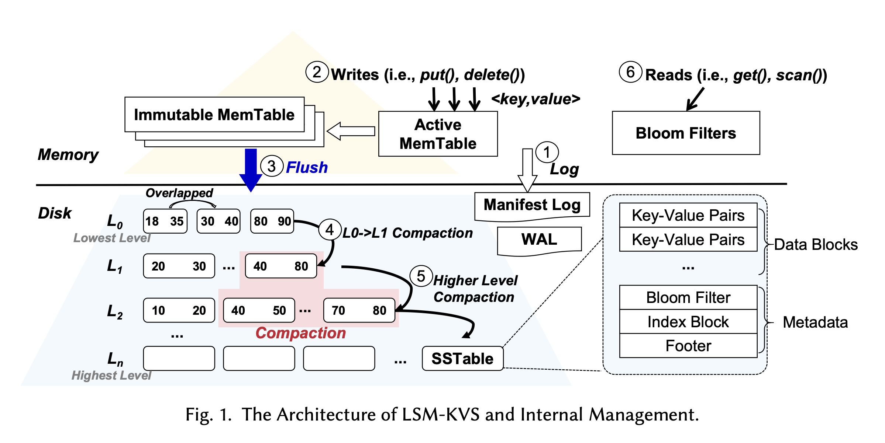

# KV 存储
KV 存储是现代数据库的基石，不论是索引，元数据，还是 KV 数据库本身，都会用到 KV 存储的数据结构。在编程语言中，往往会内置一些支持 KV 的数据结构，例如 Java 的 `Map<K, V>` 或者 Python 的 `dict`。而在数据库中，KV 还需要考虑到磁盘 IO 特点（我们总是希望顺序 IO），以及高可用等，往往需要更加复杂一些的处理。

# LSM-KVS
LSM-KVS 基于 LSM(Log Structured Merge Tree) 实现 KV 存储。这种设计由几个部分组成。

## Mem Table

Mem Table 就是内存中的 Hash 数据结构。LSM 一般会有一个 Mem Table 来进行实时的写入操作（相当于缓冲区），由于这些行为发生在内存中，所以速度非常快。当满足一定条件时（Mem Table 大小达到了阈值，或者到了一定时间），Mem Table 被 Flush 到磁盘上。从架构图可以看出，磁盘上的数据段是分层的，Flush 只会将 Mem Table 刷到最低层。

Flush 的行为可以是异步的，但是它对正在进行的写操作是有影响的，所以会导致吞吐量的下降。

## WAL
除了 Mem Table 最终会 Flush，还有一个要落盘的就是 WAL。WAL 在每次写入时候都会落盘，因为它是用来保证数据恢复的。但是为了性能，可能是需要对 WAL 进行批量操作，来减少磁盘 IO。

## SSTable（Sorted String Table）
SSTable 是 Mem Table 落盘后的形态，由若干数据段（Segment）组成。

### SSTable 结构

Segment 中包含了
- 稀疏索引：存放 Key 的子集，以及他们在磁盘文件中的偏移量。
- **顺序** KV 对。
- Bloom Filter：用于快速判断某个 Key 是否一定不在这个 Segment 中。
Segment 是按照时间来划分的，比如今天 12:00 - 13:00 存在 `seg-1.sst`, 13:00 - 14:00 存在 `seg-2.sst`，并且 Segment 之间是存在 Key 重合的，比如我在两个时间段写入了 `k=v1`, `k=v2`，那么这两组 KV 对会存在两个 Segment 中。

### 查询
在查询 SSTable 时，我们从最新的 Segment 开始
1. 查看 Bloom Filter
2. 查询稀疏索引，如果能查到，则直接通过 Offset 获取数据，否则返回一个区间
3. 在区间内顺序扫描 Key

### 合并
多个 SSTable 合并时，我们会舍弃旧 SSTable 中的 Key 而保留新的。

## 整理（Compaction）
当数据写入增多时，SSTable Segment 的数量就会增加，导致读放大（Read Amplification）。当我需要读取过去某个 Key 值的时候，系统需要扫描所有新增的 SSTable，会非常慢，因此需要引入一个 Compaction 的流程，对数据段进行合并。

### Low Level Compation
- L0 层内整理：有些系统会在 L0 内部进行数据整理，例如 OceanBase
- 当 L0 SSTable 数达到限制，会出发 L0 -> L1 的数据整理

### High Level Compation
高层的整理会涉及到合并多个层的 SSTable。相比于低层的整理，高层的往往也会消耗更多资源。

# 分布式 LSM-KVS
分布式的 LSM-KVS 系统架构如下

和很多分布式系统类似，它引入了
- Coordinator
- 分片（一致性哈希）
- 复制（Raft，Paxos 等等）

# 机遇和挑战
## 资源分配。
LSM 系统的一大挑战是数据整理阻塞写入。有一些尝试的方向
- 限流：控制系统写入的流量，防止 Compaction 引起的过载。然而，限流的方式有可能会使得积压越来越多的写请求。
- Latency 预测：通过预测磁盘 IO 的延迟，在可预测的时间窗口内阻塞写入请求。
- 多线程 Compaction：通过系统负载，动态调整 Compaction 的线程数量

## IO 调度
- 调度 Flush 和 Compaction 任务，减少它们和读请求之间的影响 （Vigil-KV）
- 利用 NVMe 硬件的 IO 延时可预测的特性进行优化
- 将上层 SSTable 和 WAL 日志放到空间更小，但是速度更快的硬盘上（SpanDB）

## 自动调优
LSM 系统有大量的参数，例如 Compaction 策略，磁盘文件 Layout，MemTable 大小等等。通过强化学习等技术来动态调整参数，也是一种方式（如 Dremel）

## Compaction 优化
- 何时触发？
- 整理那些 SSTable？
- Compaction 粒度？更小的力度会有更多 IO，但是单次停顿时间更短
- Data Layout：Leveling VS Tiering
- In-Storage Compaction：使用专有硬件（GPGPU，FPGA），直接在存储层进行数据整理，节省 CPU 的时间。

## KV 操作优化
TODO：