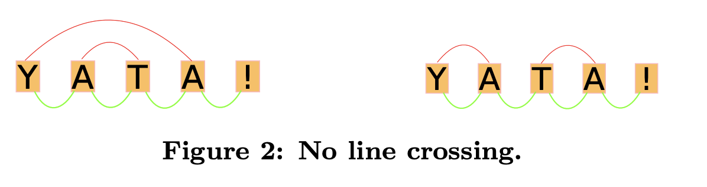

# YJS

YJS 是一种 CRDT 实现，可用于构建实时协作应用。

## YATA

### 术语
YATA 使用双链表表示线性数据。每个字符属于一个插入操作。没有删除操作，只有标记为删除的插入操作。

YATA 使用以下元组来表示一个操作：

$$
o_k(id_k, origin_k, left_k, right_k, isDeleted_k, content_k)
$$

- $id_k$: 操作的唯一标识符
- $origin_k$: 操作的发起操作时，它的前一个操作的 ID
- $left_k$: 操作的左邻居
- $right_k$: 操作的右邻居
- $isDeleted_k$: 操作是否被删除
- $content_k$: 操作的内容

例如，在 $o_i$, $o_j$ 之间插入一个字符 $c$，则会生成一个新的操作 $o_k$，其元组为 $(id_k, o_i, o_i, o_j, false, c)$。

- 定义：意图保留 - 插入的字符相对位置不会改变。
- 定义：插入冲突 - 在同样两个操作之间插入字符的操作是冲突的。例如， $left_{new}$,$c_1$, $c_2$, $c_3$, $right_{new}$, 那么 $o_{new}$ 和 $c_1$, $c_2$, $c_3$ 是冲突的。

解决冲突，需要全序关系 $\lt_{c}$.

规则 1: 插入和原点的连线不能相交。两次插入要么是嵌套的，要么是先后发生的。



规则 2: 传递性

规则 3: 两次插入原点相同，id 小的在左边

### 插入

插入是最基本的操作类型
```
// 在一串互相冲突的操作 ops 中，为新操作 i 定位
insert(i, ops):
    i.position = ops[0].position          // 先假设 i 站在冲突区最左边
    for o in ops:                         // 从左往右扫描每个已存在的冲突操作 o
        // 组1 = 规则 1（禁止 origin 红弧交叉）：o 与 i 的两条 origin 弧只能「并排」或「嵌套」
        //   o < i.origin        —— 并排/先后：o 整个在 i 的原点左边（弧不相交）
        //                          注：本算法里 ops 全在 i.origin 右边，此项恒假、永不触发，
        //                          仅为忠实照搬规则 1 的完整定义而保留
        //   i.origin <= o.origin —— 嵌套：o 的原点在 i 的原点右边(或相同)，arc(o) 套在 arc(i) 内
        // 组2 = 区分两种「谁在前」的判据：
        //   o.origin != i.origin —— 原点不同：由上面的位置（规则 1）决定
        //   o.creator < i.creator —— 原点相同：id 小的在前（规则 3）
        if (o < i.origin or i.origin <= o.origin) 
          and 
        (o.origin != i.origin or o.creator < i.creator):
            // o 应排在 i 前面 → i 往右让一格（规则 1 的嵌套支 / 规则 3）
            i.position = o.position + 1
        else:
            // 条件不成立：要么同原点但 o.creator 更大（不让、继续），
            // 要么 o.origin 在 i.origin 左边——此时再往右让红弧就会交叉，
            // 触发规则 1 的中断条件，停止扫描
            if i.origin > o.origin:
                // rule 1 broken：origin 连线将要交叉
                break

```

### 派生操作

#### List
头尾两个 delimiter 之间的一串有序插入，写就是按 YATA 规则在两邻居间插入，读就是按序拼接所有未删除的插入

#### 替换
YATA 没有替换原语，替换的问题会被转化为插入问题。往最左插，读的时候读最左。

#### Map
Map = 每个 key 挂一个 Replace Manager，于是每个 key 各自独立地"往最左插、读最左"，实现并发覆盖并收敛。