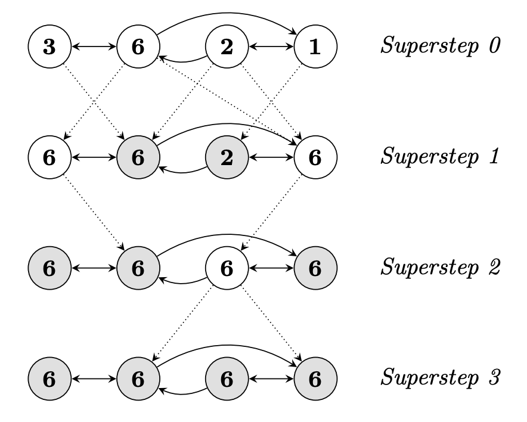

# Pregel

## What is pregel
Pregel is the underlying algorithm used by langgraph, it aims for processig large graphs efficiently. Pregel is inspired by Bulk Synchronous Parallel model. The execution of Pregel composes of multiple sequential supersteps. In each superstep S, a user-defined program is executed on each vertex V. V can read messages sent to it at step S - 1. Messages are sent along the outgoing edge.

## A vertex centric algorithm
Pregel is vertex centric, which basically means the user focus on a local action (on single vertices), and the system all things up to execute them on large datasets. Vertex is the first class citizen, where computation happens, while edges are not.

## Synchronization and execution model

Order of execution is trivial within superstep. Communication only happens from superstep S to S + 1. With each superstep, all vertices compute in parallel,  reading messages sent to it in the previous superstep, sending messages to other vertices, and modifying its state or that of its outgoing edges (Currently, we assume the topology remains unchanged).

The execution ends, if all vertices vote to halt. All vertices begins with an active state, and vote itself to halt if there's nothing else need to be done. Deactivated vertices can be re-actived by certain messages. Once re-activated, those vertices must vote again in order to be deactive. 

After the execution ends, the state of the system (outputs of all vertices) becomes the output.



This is an example of computing `max`.


## Logical Architecture

Logically, pregel composes of some computation primitives (or APIs).

### Compute
This is where the computation happens. Users provide their own implementation of the computation. During the computation, the vertex can get its own (mutable) value, which persists among supersteps. These values are per-vertex scoped, so there's no race condition.

### Message Passing
Vertices communicate by sending messages. There is no guarantee on order of messages received by one vertex during one superstep, but the consistency and uniqueness are ensured by the algorithm. 

### Combiners
Fragmentation of message can introduce overhead, this is where combiner comes into play. Combiner can combine multiple messages into single one. Combiner should only be enabled for cummutative and associative operations, such as `max`, `add`.

### Aggregators
Aggregator is used to manage global data. Each vertex can provide a value to aggregator at superstep S, which are then combined by the system with a reduce operation and made available to *all* vertices at step S + 1. Similar to combiner, aggregator can be something like `min`, `sum`, etc.

Aggregator can be used for global coordination. For example, with an `and` aggregator, the system is able to decide some computation to be executed until a global condition becomes true.

### Topology Mutation
Algorithms like clustering or (min/max) spanning tree requires mutation of graph structure. Mutation includes

- Adding vertices
- Removing vertices
- Adding edges
- Removing edges

Topology mutation can introduce conflicts, for example, two requests of adding vertex with different values. Here're some built-in conflict resolution strategies.

Pregel defines default order of performing mutations.

1. Edge removal
2. Vertex removal
3. Vertex addition
4. Edge addition

Note that removing a vertex implicitly removes its edges, so edge removal happens first in order to avoid "double deletion".

The remaining conflicts are handled by user-defines strategies. For example, user can decide which vertex to keep when two vertices are added with different value.

In pregel, mutations happen locally, which means vertices handle their own conflicts, mutate their own out edges, or delete themselves.


## Physical Architecture

### Graph partitioning
A Pregel graph is partitioned, each picked up by a machine. The partition algorithm soly depends on Vertex ID, so it's easy to know the partition of any given ID. The default partition strategy is hash(ID), and user can override it. In most cases, default strategy is sufficient, but usecases may require more complicated strategies for better data locality. Assigning vertices to worker machines is the only place that distribution is not transparent to Pregel.

### Execution model
- User program is copied across machines, one of which acts like the coordinator. Workers register themselves to master.
- The master handles partitioning. Workers are responsible for doing computations and manage their own states locally.
- The master assign a portion of user input to each worker, which are a set of records, containing vertex and edge states. If the record matches the vertex locally, it's immediately updated, otherwise, a message is sent to the worker holding that vertex.
- Master instructs workers to perform supersteps, just like what we introduces in the computation model above.
- After computation is finished, the master instruct workers to save their sates.

### Fault tolerance

Computation may fail, for example, due to network instability or power outage. Pregel's fault tolerance is realized by

1. Failure detection: Workers failures are detected by pinging. If worker does not receive ping from master, it ends the process. If the master does not get response, it marks the worker process as failed.
2. Checkpoint: The master re-assign the graph partitions to the available workers, and reload the state from most recent checkpoint, then the computation is recovered.
3. Message logging: Messages are logged. After recovered from the checkpoint, messages from healthy partitions are applied while those from lost partitions are recomputed. This approach may reduce computation of healthy partitions by introducing some IO overhead.

### Worker implementation

Worker machine maintains vertex states, including a list of out going edges, a queue of incoming messages, a flag of activity, and its own values. Note that messages are sent from S to S + 1, each vertex maintains two message queues and two active flags.
```
Vertex-1:
  active_s: true
  active_s+1: true
  value: 1
  messages_rsv_s: ["m1", "m2", ...]
  messages_rsv_s+1: ["m3"]
  messages_snd: []
  edges: ["e1", "e2", ..]

Vertex-2:
  active_s: false
  active_s+1: true
  value: 2
  messages_rsv_s: []
  messages_rsv_s+1: ["m5"]
  messages_snd: ["m5"]
  edges: ["e1", "e2", ..]
```

When sending messages, it can be directly updated in memory (if target vertex is on the same worker machine), or sent remotely (if the target vertex is owned by another machine).

If the user provides a combiner, it's applied when sent messages are enqueued or when messages are received (note that network traffic are not reduced).

### Master implementation
Master coordinates worker activities, manages failure recovery, and schedule executions. The master also collects statistics of the computation, so that user can monitor the execution.


### Aggregator
Aggregators operate at global scope. Each worker maintains a collection of aggregators. When a worker executes a superstep, the worker combines all values supplied to a aggregator into a single local value. The worker forms a tree, which aggregates value in a hierarchy manner, and eventually, these the aggregated values are finally delivered to master. At next superstep, the master broadcasts the global values to workers. The tree-based aggregation effectively parallelise the computation.
