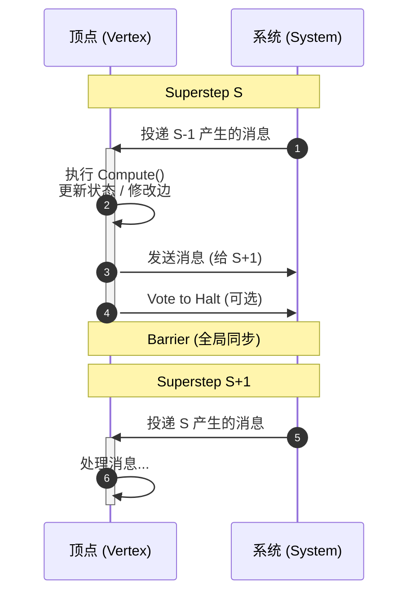
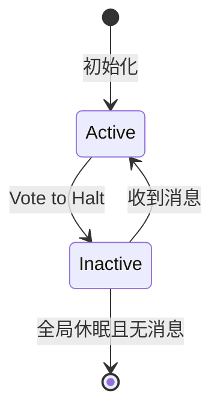
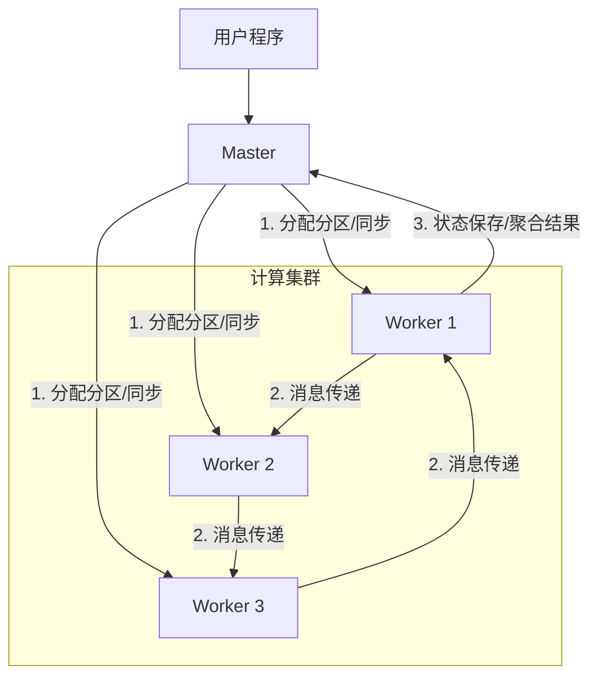

# 深入理解 Pregel 图计算模型

## 背景

在 Pregel 出现之前，处理 PageRank、最短路径等图算法通常使用 MapReduce。但 MapReduce 并不适合图计算：图算法通常需要多轮迭代，而 MapReduce 每一轮迭代都需要将状态写回磁盘，下一轮再读取，这带来了巨大的磁盘 I/O 和序列化开销。

Pregel 的核心目标就是解决这个问题。它是 Google 提出的**大规模图计算模型**，基于 **BSP (Bulk Synchronous Parallel)** 模型设计。它的特点是将计算常驻内存，通过网络消息传递进行通信，从而极大地提升了迭代效率。

注：现代的 AI Agent 编排框架（如 LangGraph）在处理循环工作流时，也借用了 Pregel 的设计思想。

## 核心设计：以顶点为中心 (Vertex-Centric)

Pregel 的核心理念是 **"Think like a vertex"（像顶点一样思考）**。

开发者不需要关注底层的分布式调度、锁或并发问题，只需要定义一个运行在**单个顶点**上的计算函数 (`Compute`)。系统会自动将这个函数并行应用到图中的所有顶点。

*   **顶点 (Vertex)**：一等公民，包含 ID、用户自定义值（状态）、以及出边。
*   **边 (Edge)**：包含目标顶点 ID 和边值。

## 执行模型 (Execution Model)

Pregel 的运行由一系列连续的迭代组成，称为 **Superstep**。

在每个 Superstep $S$ 中，顶点 $V$ 并行执行用户定义的 `Compute` 函数：

1.  **接收消息**：读取 Superstep $S-1$ 发送给 $V$ 的所有消息。
2.  **执行计算**：根据接收到的消息和当前状态进行处理，可以修改自身的值或出边的值。
3.  **发送消息**：沿着出边向目标顶点发送消息（将在 Superstep $S+1$ 被接收）。

所有顶点完成计算后，必须等待全局同步（Barrier），确认所有节点都完成后，才能进入下一个 Superstep。

### 状态机 (Active/Halt)

Pregel 通过状态机机制判断算法是否结束。顶点维护两个状态：**Active (活跃)** 和 **Inactive (休眠/Halt)**。

*   **初始状态**：所有顶点均为 Active。
*   **休眠**：如果顶点在当前 Superstep 没任务可做（例如计算已收敛），它调用 `VoteToHalt()` 进入 Inactive 状态。
*   **唤醒**：如果一个 Inactive 的顶点收到了消息，系统会自动将其重置为 Active，参与下一轮计算。
*   **终止**：当所有顶点都变为 Inactive 且网络中无传输消息时，算法结束。

*(上图示例：计算最大值。数值通过消息传播，直到所有顶点收敛到全局最大值)*

## 编程接口 (API)

Pregel 提供了几个核心原语来描述图算法：

### 1. Compute
用户实现的核心逻辑。每个顶点在每轮 Superstep 都会调用一次。由于每个顶点只操作自己的私有数据，因此**无须加锁**，不存在竞态条件。

### 2. Message Passing
顶点之间通过发送消息通信。Pregel 保证消息的完整性和不重复，但不保证同一轮次内消息的到达顺序。

### 3. Combiners (消息合并)
这是减少网络开销的关键优化。
当 Worker 向同一个目标顶点发送多条消息时（例如顶点 A 发送了 5 次 "1" 给 B），Combiner 可以在发送端将这些消息预聚合（例如求和为 "5"），只发送一条消息。
*   适用场景：满足结合律和交换律的操作（Sum, Max, Min 等）。

### 4. Aggregators (全局聚合)
用于处理全局信息（如统计图的顶点总数、计算全局误差）。
*   **流程**：每个顶点提供一个值 -> 系统进行归约 (Reduce) -> 结果在下一轮对所有顶点可见。
*   **用途**：全局统计或协调（例如通过 AND 操作判断所有顶点是否都满足某条件）。

### 5. Topology Mutation (修改图结构)
某些算法需要动态增删点或边。Pregel 定义了处理并发冲突的优先级：
**Edge Removal > Vertex Removal > Vertex Addition > Edge Addition**。
对于其他冲突（如不同源头请求添加同一个点但初始值不同），由用户定义的逻辑解决。

## 物理架构 (Physical Architecture)

系统采用 **Master-Worker** 架构。

### 执行流程
1.  **初始化**：Master 将图数据切分并分配给 Worker。
2.  **Superstep 循环**：Master 指挥 Worker 开始计算，Worker 之间异步交换消息。
3.  **同步**：Master 等待所有 Worker 完成当前步骤（Barrier），再开始下一步。
4.  **结束**：所有顶点 Halt 后，Master 指令 Worker 保存结果。

### 关键实现细节

#### 1. 图切分 (Partitioning)
为了分布式存储，图被切分为多个 **Partition**。
默认策略是 `hash(ID) mod N`。Worker 根据 ID 就能算出目标顶点属于哪台机器，从而决定是本地更新还是网络发送。

#### 2. 消息队列机制 (Message Queue Mechanism)
为了在同步模型中处理异步消息，Worker 为每个顶点维护两个消息队列：
*   **队列 S**：存储上一轮收到的消息（供当前轮读取）。
*   **队列 S+1**：存储当前轮收到的消息（供下一轮读取）。
这样实现了计算与通信的重叠，避免了读写冲突。

#### 3. 树状聚合 (Tree-based Aggregation)
Aggregator 的全局结果不是直接由 Worker 发给 Master，而是通过 Worker 构成的树状结构层层归约。
这种设计不仅**有效地将聚合计算并行化**，还避免了 Master 成为通信瓶颈。

#### 4. 容错 (Fault Tolerance)
*   **Checkpoint**：Master 周期性指令 Worker 将状态写入持久化存储（如 HDFS）。
*   **恢复**：当 Worker 宕机时，Master 将其负责的分区重新分配给其他 Worker，并从最近的 Checkpoint 回滚。通过消息日志（Message Logging），系统可以只重算丢失的分区（Confined Recovery），而无需全图回滚。

## 总结

Pregel 通过 **BSP 模型** 和 **Vertex-Centric** 抽象，屏蔽了分布式系统中的通信、同步和容错细节，解决了大规模图计算的并行化难题。这种设计思想是图计算领域的重要基石。
