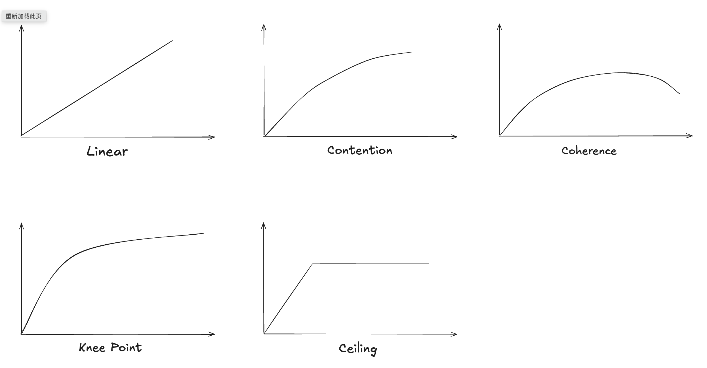

# 扩展性

怎么看软件系统是否可扩展？观察当增加更多资源的时候，系统性能的变化。当我们采集足够的样本，我们通常可以观察到一些模式。这些模式从计算资源（进程数量）/处理能力两个维度描绘了系统性能的曲线。
- 线性可扩展：系统性能随着资源线性增长。
- 竞争（Contention）：系统内存在资源竞争，随着计算资源的增加，扩展的效率会逐步降低。
- 一致（Coherence）：系统需要维护一致性，增加进程带来的一致性开销会大于其对计算任务的贡献，因此处理能力反而会下降。
- 拐点（Knee point）：达到某个阈值以后，再增加计算资源的收益比之前要降低。
- 扩展性上限（Scalability Ceiling）：达到某个阈值以后，增加计算资源不再能提高系统的处理能力。

### Amdahl's Law

$$
C(N) = N/(1 + \alpha(N-1))
$$
系统性能的增量随着规模减小

### Universal Scalability Law

$$
C(N) = N / (1 + \alpha(N-1) + \beta(N-1))
$$

类似，但是考虑了一致性的影响，系数为 $\beta$

# 队列系统
一些软件系统可以被建模为一个队列，使用这个模型我们可以预测系统在不同负载下的响应时间。磁盘就是一个非常经典的队列系统，我们通过监控磁盘的利用率，可以快速估算出是否磁盘 IO 成为了系统性能瓶颈。

队列理论是研究队列系统的数学方法。

### Little's Law

$$
L = \lambda W
$$

- $\lambda$: 到达率
- $W$: 平均响应时间（平均在队列中等待的时间）
- $L$：队列中的平均任务数

队列理论能研究很多问题，例如
- 如果负载加倍了，响应时间如何被影响
- 如果增加一个进程，响应时间如何被影响
- 如果负载加倍，系统还能维持 90th 在 100ms 内吗

### Kendall's notation

队列系统的行为归因于三个因素
- 到达过程（A）：用来描述任务到达的随机过程，例如 Poisson 过程，或者是固定频率
- 服务时间分布 (S)：描述进程处理任务的时间分布
- 进程数 (m)

简称 A/S/m

### M/D/1
- 到达时随机的（泊松）
- 服务时间是固定的
- 一个进程

$$
r = \frac{s(2-\rho)}{2(1-\rho)}
$$

- $s$: 服务时间
- $\rho$: 系统利用率

如果服务时间为 1ms，在系统利用率到达 60% 时，响应时间就会慢两倍。而达到 80% 时，会变成三倍。