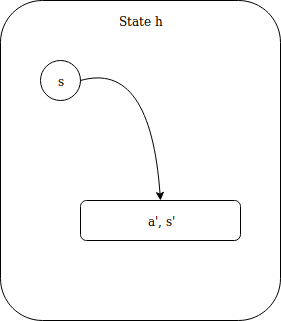
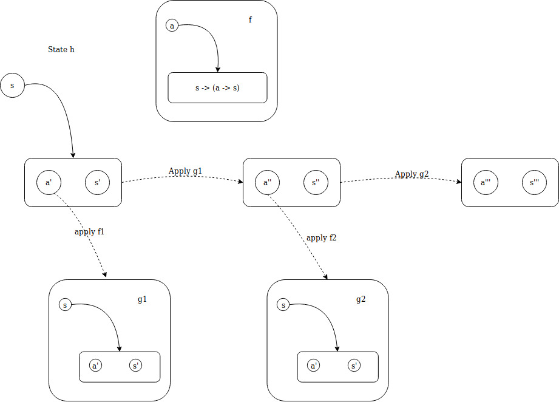

# Brief Intro to Haskell

If you wanna checkout the workshop, it's [Here](./workshop.md)

Note: Some codes in this article may not be legal haskell codes, they are only used to explain some facts.

This article is not originally written by me, I just read some Haskell articles online and put them together:

[Real World Haskell](http://book.realworldhaskell.org/)

[Learn You a Haskell for Great Good!](http://learnyouahaskell.com/chapters)

[Monday Morning Haskell](https://mmhaskell.com/)


Haskell is a declarative (functional) programming language. You know what is functional programming, how to use functions as first class values, writing recursive programs, doing function composition and currying/uncurrying, so I'll skip that part. This introduction will start with some basic stuff like data type.

## `type`, `data` and `newtype` 
At the beginning of this article, let's make sure we don't mess up some of the terminologies in Haskell in terms of data types. When we manipulate data types, there are three keywords that we might use, `type`, `data` and `newtype`.

The `type` keyword is nothing more than defining type synonyms for existing types, that is, you take a type, add a new name referring to it, then you can use the new name and original name interchangably.

```haskell
type IntList = [Int]
let a = [1,2,3] :: IntList
let b = [1,2,3] :: [Int]
a == b

> True
```

The `data` keyword is used to create you own data types, which is quite straightforward:
```haskell
type ID = Int
type Name = String
type DEAD = ()
data Person = Person ID Name
            | Dead
``` 

The `newtype` keyword is to wrap an existing type in a new defined type. The difference between `type` and `newtype` is that the `type` produces a synonym fro existing type, which means the new type is identical to original one, while `newtype` produces a new type. In fact, `newtype` is like a special kind of `data` which has only one constructor with only one field, but not exactly (There are differences in efficiency and lazyness).

### `newtype` efficiency and lazyness

`newtype` is more efficient than `data` in terms of wrapping types. With `data` keyword, you create a new data type, which brings overhead for wrapping and unwrapping operations. While with `newtype`, the Haskell knows the underlying type that you have wrapped, therefore the wrapped data can directly be referred to without extra overhead.

The `newtype` also has extra lazyness in it. Because Haskell has known the wrapped type and there is only one constructor with one fixed field, sometimes the construction is not necessarily evaluated in some cases (like pattern matching with wildcards). While using `data`, construction is evaluated everytime because there might be different constructors with unfixed fields, Haskell need to figure out which one to go with.

Now that we have understood some confusing terminologies, let's dive into one of most things in Haskell, which is Functor.

## Functors
Functor class in Haskell simply means something that can be mapped over with a function. Any instance of Functor must implement the `fmap` function
```haskell
fmap :: Functor f => (a -> b) -> f a -> f b
``` 
where f is a wrapper for some value of any type, `(a -> b)` is simple a function that takes value of type `a` as a parameter and return value of type `b`. The `fmap` function applies the function to the value which is wrapped by `f` and produces a new value wrapped in the exact same form.

Differnt instances of functor have their implementations for `fmap`, for example, `fmap` of List is simply `map`, therefore the following statements are identical
```haskell
fmap (1+) [1,2,3]
map (1+) [1,2,3]
```

### Why functor? 
When we use a programming language to interact with pieces of data to produce something that is useful, it's hard to make sure everything is in the same data structure. Data is organized in different ways in differnt scenarios in order to achieve higher runtime or development efficiency. In order to manipulate all these different types of data, we want the programming language to gerneralize well, that is, we can perform similar actions to different types with a unified interface (Like Abstract Class and  Interface in Java). 

Think about the following scenario, we have a datatype constructed from a `Tuple`

```haskell
data Student = Student {
    id :: Int,
    mark :: Int
}

buildFromTuple :: (Int, Int) -> Student
buildFromTuple (id, mark) = Student id mark
```

Then we want to create a list of `Student` type values from a list of tuples, we have

```haskell
map buildFromTuple [(1,20),(2,57)]
```
which is intuitive. But what if the tuples are stored in other data structures like `Vector`? With the help of functor, we can simply unify the interface with fmap.


### Type constructor being an instance of Functor
Type constructors can be functors. For instance, the `Maybe` type can be defined as 
```haskell
instance Functor Maybe where
    fmap _ Nothing = Nothing
    fmap f $ Just a = Just $ f a
```
Note that in the type definition of fmap, the wrapper `f` only takes one parameter as type parameter, therefore, the type constructor in implementations should take exact one parameter as well. Consider the `Either` type 
```haskell
instance Functor Either where
    fmap:: (a -> b) -> Either a -> Either b
```
This is incorrect, because the type constructor `Either` takes two parameters. In order to make it valid, simple partially apply the first parameter with a
```haskell
instance Functor Either a where
    fmap :: (b -> c) -> Either a b -> Either a c 
```

### Function as an instance of Functor
Function is first class citizen in Haskell so it makes sense for it to be an instance of some Class. The function as a functor has the form `(->) r`. This can be simply treat as application of a function that takes exact one parameter (or wrap the parameter with this function). According the previous definition, the function Functor can be defined as 
```haskell
instance Functor ((->) r) where
    fmap f g = (\x -> f (g x))
```
In another word, `fmap f g` returns a function which takes a value x, apply `g` to it and apply `f` to the result. In order to explain why does this happen, we need to go back to the original definition of `fmap` function 
```haskell
fmap :: Functor f => (a -> b) -> f a -> f b
```
Replace `f` with `(->) r` in this case, we have

```haskell
fmap :: (a -> b) -> ((->) r a) -> ((->) r b)
```
which is 
```haskell
fmap :: (a -> b) -> (r -> a) -> (r -> b)
```
It is obvious that the `fmap` function takes an function that takes `a` as parameter and return b, and a function takes `r` returns `a` and outputs a function takes `r` and returns `b`. So the second function is applied to `r` to get the result `a` then `a -> b` can be applied to `a` to get `b`.

Intuitively, this is function composition that we really love about in Haskell. So for function 
```haskell
fmap = (.)

-- The following equations are all equivalent
fmap a b
a . b
(.) a b
\x -> a $ b x
```

### Functor Laws
In the above sessions, we discussed about the "Instance of Functor" instead of functor directly. The reason is that in order for an instance of Functor to be a functor, it need to obey functor rules which ensures calling a functor only maps a function over it without doing anything more. Here are the two rules

- If we map id function over a functor, the functor we get back should be the exact same one.
- Composing two functions and then map it over a functor is same as mapping one over it and then mapping another

`Maybe` is a functor, let's see how it obeys the functor laws.
```haskell
-- Law 1
fmap id Nothing = Nothing -- trivial
fmap id (Just x) = Just (id x) = Just x

-- Law 2
fmap (f . g) Nothing = Nothing
fmap (f . g) (Just x) 
    = Just (f $ g x)
    = fmap f Just (g x)
    = fmap f (fmap g (Just x))
    = (fmap f) (fmap g (Just x))
``` 
There also examples that a type construct is an instance of a functor but isn't an actual functor. Consider a data type with a counter which increases by one everytime fmap is applied to it.

```haskell
data CtrMaybe a = CtrNothing
                | CtrJust Int a
                deriving (Show)

instance Functor CtrMaybe where 
    fmap _ CtrNothing = CtrNothing
    fmap f $ CtrJust ctr x = CtrJust $ ctr + 1 $ f x
```

In this case, everytime the `id` function is mapped over the structure, the counter has increased by 1, which is not identical to previous one anymore (side effect). Therefore, this is not a functor.

## Applicative Functors
In the cases we discussed above, we map a function that takes one paramter and produces one result over an instance of `Functor` to yield the exact same wrapper but with the value changed.

What if we have a function that accepts more than one parameter, for example `(+)` which takes two `Num` type values and add them together.

```haskell
fmap (+) (Just 3) = Just ( (+) 3 )
```
We have a partially applied function wrapped in `Just`~ Let's think about how we gonna use it. What everyone can simple see is that it is a functor, so one intuitive way of using it is to map a function over it. What can we do to a function with another function, well, simply apply the function in another function that takes a function as parameter.

```haskell
fmap (\f -> f 3) a
-- For value wrapped in a, apply it to value 3
```

This sounds like trivial, but it does have some fancy usages in Haskell with the `Applicative` class.

Suppose that we have two numbers wrapped by a functor, `Just 3` and `Just 5`, how do we add them together? As we previously discussed, we can use fmap with (+) to produce a functor wrapped function, then map over it with another value.

```haskell
a = fmap (+) (Just 3)
fmap (\f -> f 5) a
```
Well, that looks really bad. You are using two lines of codes and an anonymous function in order for a task as simple as adding two numbers! That's where `Applicative Functor` comes in.

In `Applicative Functor`, two new terms are introduced, which are `pure` and `<*>`. These two terms are not defined by default, the developer who defines the data type should implement them. The `Applicative` class can be defined as 

```haskell
class (Functor f) => Applicative f where
    pure :: a -> f a
    (<*>) :: f (a -> b) -> f a -> f b
```
It's quite obvious from the class definition is that in order to be an instanve of `Applicative`, a variable need to be `Functor` first. The `pure` function takes a value of any type as parameter and return an applicative functor with the value in it. (Put the value in some sort of default context -- a minimal context that still yields the value). The `(<*>)` extracts the function from the first functor and map over the second one.

For instance, the `Maybe` is a kind of `Applicative Functor`, which is defined as 
```haskell
instance Applicative Maybe where
    pure = Just
    Nothing <*> _ = Nothing
    Just f <*> something = f <$> something
```

With normal functor, you can only map a function over a functor without being able to get the result out of it or manipulate it. While `Applicative Functor` allows you to operate on several functors with a single function. Look at the following example:

```haskell
pure (+) <*> Just 3 <*> Just 5
Just (3 +) <*> Just 5
```
The first line can be aggregated to the second one by paritally apply the plus to `Just 3`. Thanks to the unwrapping capability of `<*>` function, the wrapped function is easily unwrapped and applied. The good thing is that the second line has almost identical structure with the first one: Partially applying a wrapped function still yields a wrapped function, that why we can easily cascade multiple `<*>` functions. 

If we generalize the usage of `Applicative Functor`, that becomes the following form

```haskell
pure f <*> x <*> y <*> ...
```
Again, the strength of `Applicative Functor` over normal `Functor` is that it support function with any number of inputs and is able to cascade values in a fairly elegant manner.

The `<*>` has the pre-condition that the function is wrapped, which is not always necessary, say, if we just want to apply a function to a couple of wrapped values, there is no need to wrap the function up explicitly, that's why the `Applicative` module introduces another function called `<$>`, which is exact same as `fmap` but has more elegant form when applied.

```haskell
(<$>) :: Functor f => (a -> b) -> f a -> f b
```

For instance, if we want to apply `(+)` to `Just 3` and `Just 5`, now we can simply write 
```haskell
(+) <$> Just 3 <*> Just 5
```
which is quite intuitive.

I think that's some basic knowledge a beginner should know about Haskell before he actually start doing codes. In the following sections, I'll talk about Haskell `IO`, datatypes, monads, something like that.

## I/O
Haskell strictly separate pure codes and non-pure ones, which may cause the world to change. Therefore, a complete isolation of side-effects is provided from the language level, which is a nice feature that helps improve program stability, because many bugs in programs are caused by unanticipated side-effects.

Haskell I/O is a subset of those actions that might have side effect. Here are some examples of I/O functions

### IO actions

```haskell
putStrLn :: String -> IO ()
-- This writes out a string to standard output which an end-of-line char

getLine :: IO String
-- This gets a string from the standard input
```

Anything with `IO Something` in it is an IO action, which can be stored in a variable and evaluated later (because they are functions). They can also be glued toghther to form a larger block of action using `do`, like this
```haskell
myblock = do
    putStrLn "Please type something"
    myStr <- getLine
```

Any IO action has an underlying data type bound to it, for example, the `getLine` function has a `IO String` in the type definition, which means it has a `String` value bound to it. Using `<-` when calling IO actions can get the underlying value and store it in a variable. The value of action block is the value of the last action in that block.

Some actions have `IO ()` in their type definitions, which means there is nothing (called 'unit') bound to it. The `()` is simply an empty tuple, indicating there is nothing (Like `void` in C++). Consider following code:
```haskell
let writefoo = putStrLn "foo"
writefoo

-- we get foo in console
```
We have "foo" printed in the console, but that's not the value of writefoo statement, instead, that's caused by the side effect of IO action, which write a string to the standard output handle.

So what the fuck is IO action? Here are the ideas
- It has the type of `IO t` where `t` is the data type of the value it yields
- It is first-class value and can be seamlessly fit into Haskell's type system
- It produces side effect when performed (called by something outside the IO context)
- Performaing IO action yields a value of type associalted to it.

### Handles, Standard Input, Output and Error
File I/O is another kind of IO in Haskell, which differs from standard IO in that File IO operates on file Handles which are get from opening a file.

```haskell
openFile :: filePath -> IOMode -> IO Handle
-- IOMode can be WriteMode, ReadMode, ReadWriteMode, AppendMode

hPutStr :: Handle -> String -> IO ()
```
In order to use it, we simple to the following operations
```haskell
myHandle <- openFile "a.txt" WriteMode
hPutStr myHandle "This is a string"
```
We may find that for each standard IO function, there is a File IO function associated to it, with a 'h' at the front of the function name, which is True. In fact, the non-h functions are just the result of partially applying the h functions to a pre-defined handle (Standard IO handles defined in `System.IO`). Which is, 

```haskell
import System.IO
getLine = hGetLine stdin
putStrLn = hPutStrLn stdout
...
```
Some operating systems let you redirect file handlers to come from or go to different places (files, devices or other programs). For example
```sh
echo John | runghc callingpure.hs
```
It doesn't read input from keyboard, instead, it receives the output from echo command.

### Lazy IO
We know that Haskell is lazy; Variables in Haskell are not evaluated until it is necessary to do so. IO actions also have lazyness to them, One typical example is `hGetContents`. This is an IO action which is used to read all the contents in a `Handle` in the form of `String`. It has type of 
```haskell
hGetContents :: Handle -> IO String
``` 

In some other languages, thing such as "reading everything into memory" can crash the program because the file is way too large. In Haskell, this is avoided because of lazy evaluation. Data in the file (`Char`s) is only read into memory when they are processed (Like converting to upper case). The data that is nolonger used is automatically collected by Haskell Garbage Collector. The good thing is that Haskell has shielded all these facts from programmers, so the result of `hGetContent` is just like a `String` from the developers' point of views. They can pass it to any pure function that takes String as parameter without eating up all the memory.

(If you do need to read the whole file into memory for later use, Haskell is not able to save you.)

## Associative Behavior, Monoid and Foldable
Some of the operations in programming languages has the property of "Associativity", that is, however you group a sequence of operations, the result remains the same. For example 

```haskell
a ++ (b ++ c)
(a ++ b) ++ c
-- they are the same
```

### Monoid
A monoid is when you have an associative binary funciton and a corresponding value which acts like an identity with respect to the function. The term "act like an identity with respect to the function" means, when this function is applied to this value and some other value, the result is always that "other value". That is

```haskell
myFunc identity other = other
```
For list, the binary function is `++` and the identity w.r.t it is `[]`, and for `Num`, the function can be `+` and the identity is `0`. So we can define the Monoid as following 
```haskell
class Monoid m where:
    mempty :: m
    mappend :: m -> m -> m
    mconcat :: [m] -> m
    mconcat = foldr mappend mempty

    -- mempty represent the identity value
    -- mappend is associative binary function
```
As we can see in the difinition, if something is an instance of `Monoid`, it must be a concrete type, because the `m` in the definition above does not accept any parameters. For example, it can be `[Int]` while `Maybe` is not valid.

The `mappend` function implies that we are append one value to another, but in fact, this is not necessarily true. For example, `*` is not appending two things, instead, it's the product of two Numbers.  `mconcat` has a default implementation so there is no need to worry about implementing that.

### Monoid Laws
Typically, `Monoid` obeys some laws which guarantees that the existance of `Monoid` makes sense. Designing the types by carefully checking these laws helps take the advantage of associative behavior of `Monoids`, but that's not compulsury(Haskell doesn't check that)

```haskell
mempty `mappend` x = x
x `mappend` mempty = x
(x `mappend` y) `mappend` z = 
    x `mappend` (y `mappend` z)
```

### Lists are Monoids
Intuitively, `List`s are Monoids. The definition is

```haskell
instance Monoid [a] where
    mempty = []
    mappend = (++)
```
If we need to use `mempty`, it is necessary to specify the type, for example 
```haskell
let a = mempty :: [Int]
```
otherwise the GHCi has no way to figure out which instance to use.

### Other Monoids
As we mentioned above, `+` and `*` both have associative behaviors which can potentially make `Monoid`, but both of operations work on `Num`... How do we make an instance of `Num` the instance of two `Monoid`s at the same time? Sounds wierd, but there is a way of doing this. We introduced `newtype` at the very beginning of this article, which wrap a existing type and produce a new type referring to it without suffering from performance loss due to wrapping and unwrapping operation. We can actually wrap a type multiple times to produce different types but with exact same underlying content.

Now we want to make two monoids which supports addition and product, respectively. First of all, we are going to wrap the instance of `Num` for two times
```haskell
newtype Product a = Product {getProduct :: a}
newtype Sum a = Sum {getSum :: a}

instance Num a => Monoid (Product a) where 
    mempty = Product 1
    mappend (Product x)  (Product y) = Product (x * y)

instance Num a => Monoid (Sum a) where
    mempty = Sum 0
    mappend (Sum x) (Sum y) = Sum (x + y)

-- The values wrapped by Product and Sum are extracted using pattern matching
-- Product and Sum are instances of Monoid as long as a belongs to type class Num
```

Maybe can be `Monoid` as well. There are multiples ways for `Maybe a` to be an isntance of `Monoid` as well. This is also done by type wrapping. 

One of the intuitive way is to assume the content in Maybe type is a `Monoid`, then we can extract the values, apply `mappend` to them and wrap them back.

```haskell
instance Monoid a => Monoid (Maybe a) where 
    mempty = Nothing
    Nothing `mappend` m = m
    m `mappend` Nothing = Nothing
    Just m1 `mappend` Just m2 = Just (m1 `mappend` m2)
```
However, in another cases, the value in Maybe type isn't necessarily a Monoid, or we have no idea what it is. In this case, there is no way we can rely on behaviors of underlying types. Another simple way of doing this is to discard one of the two params. For instance, we can take the first one if it is `Just something`.

```haskell
newtype First a = First {getFirst :: Maybe a}
    deriving (Show, Ord, Read, Eq)
instance Monoid (First a) where
    mempty = First Nothing
    First (Just x) `mappend` _ = First (Just a)
    First Nothing 
```

First can be used to check if any of the item is not `Nothing` when we have a bunch of `Maybe` items.

```haskell
getFirst . mconcat . map First $ [Nothing, Just 3, Just 4]
-- Map over the list to wrap everthing into First
-- Now we have a list of Monoids
-- Apply mconcat to perform aggregation
-- Unwrap the type
```

### Folding Data Structures with Monoid
Many data structures work with fold. For example, we can reduce a list with some function to produce a single value by fold it, or serialize a Tree by folding over it. Therefore in Haskell, Foldable is abstracted to a class that as long as we provide certain implementations, we can fold the data structure. Like `Functor` which represents things that can be mapped over, `Foldable` represents anything that can be folded up.  

```haskell
Foldable.foldr :: (Foldable.Foldable t) => (a -> b -> b) -> b -> t a -> b
```
In order to make a type a `Foldable`, we can either implement the `foldr` function directly or implement `foldMap` and get `foldr` for free. The latter approach is usually easier than the former one.

```haskell
foldMap :: (Monoid m, Foldable t) => (a -> m) -> t a -> m 
```
Let's explain the function. The first paramter is a function that converts a value to Monoid, which is not defined by us. It is passed to `foldMap` automatically as long as we decide where and how to join up things. The second argument is the `Foldable` with type `a`. The function behaves like this:

- It maps the function over `Foldable` structure to produce a `Foldable` of `Monoid`s
- The values are joined up with `mappend` of the `Monoid`s

We'll end the introduction of `Monoid` by doing a serialization of binary tree. Which is fiarly simple 
```haskell
import Data.Monoid
import Data.Foldable as F

-- Define a Tree
data Tree a = Empty
            | Node a (Tree a) (Tree a)
            deriving(Show, Read, Eq)

-- Create an instance for that Tree
a  = Node 3 (Node 4 (Node 5 Empty Empty) Empty) (Node 6 (Empty) (Node 8 (Empty)(Empty)))

{-
    Here we define three wrappers of Tree which indicate three
    traversal behaviors, Pre-order, Post-order and In-order
    They have exact same underlying data structure, but slightly 
    different in folding
-}
newtype PreOrderTree a = PreOrderTree {getPreOrderTree :: Tree a} deriving(Show, Read, Eq)
newtype PostOrderTree a = PostOrderTree {getPostOrderTree :: Tree a} deriving(Show, Read, Eq)
newtype InOrderTree a = InOrderTree {getInOrderTree :: Tree a} deriving(Show, Read, Eq)

preA = PreOrderTree a
postA = PostOrderTree a
inA = InOrderTree a
{-
    Simply define different Folding behaviors for three
    wrappers. (Different order in recursive traversal)
-}
instance F.Foldable PreOrderTree where 
    foldMap f (PreOrderTree Empty) = mempty
    foldMap f (PreOrderTree (Node x l r)) = 
        f x `mappend`
        F.foldMap f (PreOrderTree l) `mappend`
        F.foldMap f (PreOrderTree r)

instance F.Foldable PostOrderTree where 
    foldMap f (PostOrderTree Empty) = mempty
    foldMap f (PostOrderTree (Node x l r)) = 
        F.foldMap f (PostOrderTree l) `mappend`
        F.foldMap f (PostOrderTree r) `mappend`
        f x 
        
instance F.Foldable InOrderTree where
    foldMap f (InOrderTree Empty) = mempty
    foldMap f (InOrderTree (Node x l r)) = 
        F.foldMap f (InOrderTree r) `mappend`
        f x `mappend`
        F.foldMap f (InOrderTree l) 


{-
    Create an aggregation function that takes a string and 
    anything which is an instance of Show type class, and 
    we keep push the string version of it to the base string
    and return the result
-}
serializeApp :: Show a => String -> a  -> String
serializeApp cache val = 
    cache ++ (show val)

-- Do some tests
test = foldl serializeApp "" preA
test = foldl serializeApp "" postA
test = foldl serializeApp "" inA
```

Note that this is NOT an efficient way of doing Binary Tree serialization... You can see that we defined three types of wrapper and we implemented `foldMap` function for each of them, so we end up with 60 lines of code. This is just done to show you some simple usage of `Monoid` and `Foldable`

In the following section, I'll start discuss `Monad`. 

## Monad
Monad is a nature extension of `Applicative` in Haskell. Think about this question: If you have a value with context, how would you apply a function that takes a normal value and return a value with context to it? Monad has provided something like that. 

```haskell
>>= :: Monad m => m a -> (a -> m b) -> m b
```
but how would you feed the value into that function? It's quite eazy if we just have a normal value `a` and a function `a -> b`, but when a is wrapped, we need a little bit work around. This is the main question we always think about when we are dealing with `Monads`. `Monads` are simply `Applicatives` that support `>>=` operation. This seems to be abstract, let's start with some concrete types.

### Maybe is a Monad
`Maybe a` is a value of type `a` with potential possibility of failure. When we look at it as a `Functor`, what we do is simply mapping the function over the value if it's `Just sth`, otherwize, we get `Nothing`. As an `Applicative Functor`, pretty much the same story except the function is wrapped in context. 
`>>=` takes in a `Monad` value, a function that takes a normal value and give a `Monad` value, and return another `Monad` value, of which the underlying value is the result of applying the function on value in first parameter.
In the context of `Maybe`, the function is like
```haskell
f :: a -> Maybe b
```
and we apply this function to a `Maybe` value with `applyMaybe` function.
```haskell
applyMaybe :: Maybe a -> (a -> Maybe b) -> Maybe b
applyMaybe Nothing _ = Nothing
applyMaybe (Just a) f = f a
```
Fairly straightforward, if the first value is `Just something`, `f` is directly applied to that `something` using patter matching. Let's look at the definition of the class

```haskell
class Monad m where
    return :: a -> m a
    (>>=) :: m a -> (a -> m b) -> m b
    >> :: m a -> m b -> m b
    x >> y = x >>= \_ -> y
    fail :: String -> m a
    fail msg = error msg
```

We assume that all `Monads` are instances of `Applicative` even though there is no explicit requirement in the class definition. 

The `return` function is like `pure` we previously used in `Applicative`, which wraps a value in the minimum context. For example, `return` in IO is used to yield a value without doing anything else. Unlike other languages, return does not end the function, but in many cases, it is placed at the end of `do` block. 
`>>=` is like function application except that it takes `Monad` values. `>>` is merely implemented as it comes with a default implementation. `fail` is never used by us explicitly in programs. It's used by Haskell to enable failure in a special syntactic. 

Now let's look at `Monad` definition of `Maybe`

```haskell
instance Monad Maybe where 
    return x = Just x
    Nothing >>= f = Nothing
    Just x >>= f = f x
    fail _ = Nothing
```
 
```haskell
Just 9 >>= \x -> (Just x * 3)

> Just 27
```
We can see that after we apply some function to a `Just` value, it returns another `Just` value, which means we can apply more functions and chain them together with `>>=` function. Like
```haskell
prod2 :: Num a => a -> Just a
prod2 a = Just (2 * a)

Just 2 >>= prod2 >>= prod2 >>= prod2

> Just 16
```
Such feature frees us from writing disgusting nested pattern matchings when we are dealing with chained computations which may potentially produce `Nothing`.

### Lists as Monads
`List` is a great type for representing non-deterministic values. For example, a single integer, like 5, is a deterministic value, because it has a value and we know exactly what it is. While a `List`, say [1,2,3], has multiple values in it, but we can still view it as a single value that can be multiple values at the same time. Using `List` as `Applicative` showcases this non-deterministic nicely. For example
```haskell
(*) <$> [1,2,3] <*> [2,3,4]

> [2,3,4,4,6,8,6,9,12]
``` 

The context of non-deteministic translates to `Monad` nicely
```haskell
instance Mondd [] where
    return x = [x]
    xs >>= f = concat (map f xs)
```

`>>=` in the code above takes a `Monad` value and convert it to another `Monad` value with another underlying type, in this case is `List` because the output of `f` is the same `Monad` with first parameter. Therefore, we get a `List` of `List` after map, that's why a `concat` is applied to it. One concrete example is 
```haskell
[3,4,5] >>= (\x -> [x, -x])

> [3, -3, 4, -4, 5, -5]
``` 

### Monads are Monoids
Before we get into comparing `Monad` and `Monoid`, we have to take a look at Monad Laws which all the `Monad` instances have to obey.

```haskell
return a >>= f <=> f a -- Left identity law
m >>= return <=> m -- Right identity law
(m >>= f) >>= g <=> m >>= (\n -> f n >>= g)
```
The rules above looks quite confusing cuz it's nothing like identity and assiciative shit... But if we re-write the expressions above by introducing a new function `>=>`

```haskell
(>=>) :: Monad m => (a -> m b) => (b -> m c) -> a -> m c
(m >>= n) x = do
                y <- m x
                n y
```
The function `>=>` is a function that takes two functions which take a normal value and return a `Monad` and return another function which take a normal value and return a `Monad`. Then the laws become

```haskell
return >=> g <=> g -- Left identity law
f >=> return <=> f -- right identity law
(f >=> g) >=> h <=> f >=> (g >=> h) -- Associative law  
```

It can be easily seen that `return` is an identity with respect to the function `>=>` and the associative law has been satisfied, which means `Monad` is just a `Monoid` in the category of endofunctors. 

## More on monads

### Converting bind, then and do block

Before get into any further topics, it is necessary to make few things clear, which are then (`>>`) bind (`>>=`) and `do` block. 

The `>>` operator is quite straight forward. It is defined as 
```haskell
(>>) :: Monad m => m a -> m b -> m b
```
This works almost identically as do block as 
```haskell
do 
    action1
    action2
    action3
```
is equivalent to 
```haskell
action1 >> action2 >> action3
```
is also equivalent to 
```haskell
action1 >>
do {
    action2
    action3
}
```

### Where the fuck are we right now?

In previous sections we have mobbed with Monad, which provides a way of applying a function that takes a plain value and return wrapped value to a wrapped value with `>>=` operator. We have seen the `do` notation which helps us focusing on the value without worry about handling the context (Sequential IO operations). We have looked at how `Maybe Monad` models the behavior of possible computational failure and how `List Monad` provides an abstraction of non-determinism. In this section, we are going to explore a little bit more in `Monads` by looking at few more examples.

### State Monad

`State Monad` is useful for stateful computations which need to thread information throughtout the execution. it allows such information to be transparently passed around a computation, accessed and replaced when needed. It addresses the problem of stateful computation while keeping everything pure and simple.

A stateful computation is denoted as 
```haskell
h :: s -> (a, s)
```
where s is the type of state and a is the type of the result of this computation. `State` is defined such that 

```haskell
newtype State s a = State {runState :: s -> (a,s)}
```
The Monad definition is 

```haskell
instance Monad (State s) where
    return x = State $ \s -> (x, s)
    (State h) >>= f = State $ \s -> let (a, newState) = h s
                                        (State g) = f a
                                        in g newState
```

The `return` function simply provide a minimum context for the value `x`, which is a stateful computation which return `x` as a result without changing the state. 

`>>=`: The result of feeding a stateful computation to a function with `>>=` is a stateful computation with different underlying value (That's what `Monad` does). Let's look at those components in `>>=` defininition:

- What the fuck is `State h` ? `State h` is actually a `State` wrapper for h with `newtype` definition, where `h` is a stateful computation function with type
  ```haskell
  h :: s -> (a, s)
  ```
- What the fuck is `f` ? `f` is a function that takes a plain value `a` and returns a stateful computation wrapped by `State`.
  ```haskell
  f :: a -> State s a
  ```
- What the fuck happens? 
  
  

  Look at this fucking diagram. It is actually the visualization of the `Static h` in the definition above. The directed graph in the box is the stateful computation function which is wrapped. What it does in the definition is that the `h` is extrated using pattern matching and applied to the input state `s` to get a new state, which is `s'`  in the graph above. Then the `f` after `>>=` is applied to the value get from the output of `h` and end up with another stateful computation `g`, which is them applied to new state. Just like following diagram.

  

  This diagram shows 2 sequential applications of `>>=` for a state monad, which is like:

  ```haskell
  State h >>= f1 >>= f2
  ```
  It can be seen that no matter how many functions are applied to it, it's always in the form of taking a state and return a new state along with a value.


 


