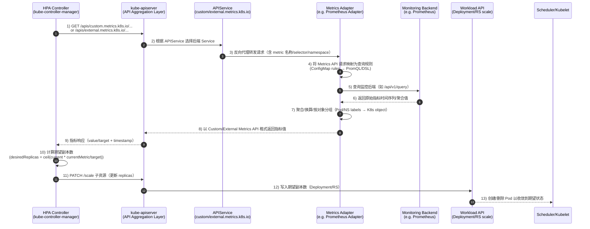

# 从资源到业务：Kubernetes HPA 智能伸缩的深度解析与实践

**作者：Manus AI**

**发布日期：2026年02月03日**

---

## 摘要

本文旨在为云原生架构师、平台工程师和应用开发者提供一份深度技术指南，全面阐述 Kubernetes Horizontal Pod Autoscaler (HPA) 如何通过 Custom Metrics 和 External Metrics 实现从传统的资源驱动伸缩到智能的业务驱动伸缩的演进。文章将深入剖析其底层核心机制，包括 Metrics API 家族、API 聚合层和指标适配器；系统性分析多 Adapter 共存带来的架构限制与解决方案；并从云基础设施供应商和应用供应商的视角，探讨 HPA 的集成与实践。最后，我们将详细解读进阶方案 KEDA 的架构优势，特别是其 “Scale to Zero” 机制及其在 HTTP 场景下面临的挑战与实现，并总结一系列最佳实践与未来展望。

---

### 1. 引言：从资源伸缩到业务伸缩的演进

在 Kubernetes 的世界里，自动伸缩是维持应用性能和成本效益的关键能力。长期以来，Horizontal Pod Autoscaler (HPA) 主要依赖 CPU 和内存等基础资源指标进行扩缩容决策。这种模式虽然简单直观，但在复杂的现代应用场景中，其局限性日益凸显。

传统的资源伸缩模型，其核心问题在于其固有的滞后性与被动性。CPU 和内存利用率通常是系统负载的结果，而非原因。当流量洪峰到来时，CPU/内存指标的攀升已经滞后于实际的用户请求增长，HPA 基于这些信号进行扩容，往往为时已晚，可能已经导致服务延迟甚至雪崩。更重要的是，对于许多应用，尤其是消息驱动或事件驱动的架构，CPU/内存利用率与真实的业务压力并非线性相关。例如，一个消息队列消费者可能在处理大批量小消息时 CPU 负载不高，但队列中积压的消息数量（`queue_depth`）才是衡量其工作负载和扩容需求的黄金指标。同样，对于一个 API 网关，每秒的 HTTP 请求速率（RPS）比 CPU 使用率更能直接地反映其服务压力。

为了解决这些问题，社区引入了 **Custom Metrics (自定义指标)** 和 **External Metrics (外部指标)** 的概念，标志着 Kubernetes 伸缩能力从“资源驱动”向“业务驱动”的根本性演进。这使得 HPA 能够基于任何可量化的、与业务逻辑紧密相关的指标进行决策，无论是消息队列的积压、HTTP 请求速率，还是数据库的连接数和业务交易量。通过利用这些业务指标，HPA 的伸缩决策变得更加主动、精准和智能，能够真正预测和匹配应用的实际需求，从而在保证服务质量的同时，最大限度地优化资源利用率。本文将深入探讨实现这一智能伸缩的底层技术栈、架构挑战与前沿实践。

### 2. 核心机制：Metrics API 与 API 聚合层

要理解 Custom Metrics 和 External Metrics 如何工作，我们必须首先深入了解 Kubernetes 的 Metrics API 体系及其背后的 API 聚合层 (API Aggregation Layer)。Kubernetes 设计了一套分层的 Metrics API，用于暴露不同类型的指标数据。这些 API 并非由 `kube-apiserver` 直接实现，而是通过 API 聚合层由专门的组件提供。

最基础的是 **Resource Metrics API (`metrics.k8s.io`)**，由我们熟知的 **Metrics Server** 组件实现，它提供关于 Pod 和 Node 的核心资源使用情况，主要是 CPU 和内存，构成了传统 HPA 工作的基础。更进一步，**Custom Metrics API (`custom.metrics.k8s.io`)** 用于暴露与 Kubernetes 集群内对象（如 Pod、Service、Ingress）相关联的任意自定义指标，例如一个 Pod 的“每秒处理请求数”或一个 Ingress 的“HTTP 延迟”，这些指标描述的是 Kubernetes 资源本身的业务状态。最后，**External Metrics API (`external.metrics.k8s.io`)** 用于暴露来自集群外部系统的指标，这些指标与 Kubernetes 内的任何特定对象都无直接关联，例如来自 AWS CloudWatch 的 SQS 队列长度、GCP Pub/Sub 的未确认消息数，或者一个外部数据库的活跃连接数。

这三者的适用场景泾渭分明：基础的资源驱动伸缩依赖 Resource Metrics；当需要根据与 K8s 对象直接相关的业务指标（如 Web 服务器的 RPS）进行伸缩时，Custom Metrics 是不二之选；而当应用的伸缩依赖于外部依赖项（如消息队列、云服务）的状态时，则需要借助 External Metrics。

这一切的背后，是 **API 聚合层 (API Aggregation Layer)** 在发挥作用。它是 Kubernetes API 扩展机制的核心，允许将额外的、非核心的 API “注册”到主 `kube-apiserver` 中，使其看起来就像原生的 Kubernetes API 一样 [1]。当一个指标适配器（如 Prometheus Adapter）部署到集群中时，它会创建一个 `APIService` 对象，向 `kube-apiserver` “声明”它将为某个 API Group（如 `custom.metrics.k8s.io`）提供服务。一旦注册成功，当 `kube-apiserver` 收到一个发往该 API Group 的请求时，它不会自己处理，而是会作为一个反向代理，将请求转发到 `APIService` 对象中指定的 `Service`，也就是指标适配器的服务地址。

一个完整的请求流程是这样的：HPA Controller 定期向 `kube-apiserver` 查询指标，请求被 API 聚合层拦截，并代理转发到相应的 Metrics Adapter Pod。Adapter 接收到请求后，查询其后端的监控系统（如 Prometheus），将获取的数据转换成 Kubernetes API 所需的格式，并返回给 `kube-apiserver`，最终交到 HPA Controller 手中。HPA Controller 根据获取的指标值和目标值，计算出期望的副本数，并更新工作负载。这个机制的精妙之处在于，它将指标的提供方（Adapter）与消费方（HPA）完全解耦，`kube-apiserver` 充当了一个统一的、可扩展的 API 网关。

而**指标适配器 (Metrics Adapters)** 正是连接监控系统和 Kubernetes Metrics API 的桥梁。以 **Prometheus Adapter** 为例，它通过一个 ConfigMap 中定义的一系列规则 (rules)，将 Prometheus 中的查询 (PromQL) 映射到 Custom/External Metrics API。例如，下面的配置将一个名为 `http_requests_total` 的 Prometheus 指标暴露为名为 `http_requests_per_second` 的 Custom Metric：

```yaml
apiVersion: v1
kind: ConfigMap
metadata:
  name: prometheus-adapter
  namespace: monitoring
data:
  config.yaml: |
    rules:
    - seriesQuery: 'http_requests_total{namespace!="", pod!=""}'
      resources:
        overrides:
          namespace: {resource: "namespace"}
          pod: {resource: "pod"}
      name:
        matches: "^(.*)_total$"
        as: "${1}_per_second"
      metricsQuery: 'sum(rate(<<.Series>>{<<.LabelMatchers>>}[2m])) by (<<.GroupBy>>)'
```

通过这套机制，HPA 就可以像使用原生 CPU/内存指标一样，无缝地使用来自任何监控系统的、任意复杂的业务指标，从而做出更智能的伸缩决策。

#### 2.1 Metric Adapter 工作原理（Mermaid 时序图）

下面用一个时序图，把 **HPA Controller 如何“通过 Metrics API 间接调用 Metric Adapter”，再由 Adapter 去查询后端监控系统** 的闭环串起来（以 Prometheus Adapter 为例；云厂商 Adapter/Datadog Adapter 等流程同理，只是后端数据源不同）。



要点小结：

- **Adapter 的核心职责**：把“Metrics API 的查询语义”（指标名 + label selector + 资源维度）**翻译**成后端系统的查询（如 PromQL），并把结果**再翻译**回 K8s Metrics API 的响应格式。
- **为什么必须走 kube-apiserver**：HPA 只认 Kubernetes API；API 聚合层让 Adapter 看起来像“原生 API”，从而实现 **指标提供方与 HPA 解耦**。
- **常见影响因素**：监控采集间隔 + Adapter 查询/缓存 + HPA sync period 共同决定端到端延迟；延迟越大，伸缩越“滞后”，需要更保守的阈值与稳定窗口。

### 3. 架构限制：多 Adapter 冲突与共存挑战

尽管 API 聚合层提供了强大的扩展能力，但其设计本身也带来了一个关键的架构限制：一个集群中，对于同一个 API Group（如 `custom.metrics.k8s.io` 或 `external.metrics.k8s.io`），默认只能注册一个 `APIService` 对象。这导致了所谓的“多 Adapter 冲突”问题，是平台工程师在构建统一可观测性平台时必须面对的挑战 [2]。这个限制的根源在于 `APIService` 对象的唯一性约束。`kube-apiserver` 在进行 API 路由时，需要一个明确、无歧义的规则来决定将请求转发到哪里。如果允许多个 `APIService` 对象同时声明为同一个 API Group 提供服务，`kube-apiserver` 将无法判断哪个是权威的后端服务，从而导致路由混乱。

想象一个场景，一个团队希望使用 **Prometheus Adapter** 来暴露应用内部的自定义指标，而另一个团队则希望部署 **Datadog Adapter** 来利用 Datadog 监控平台提供的外部指标。当这两个 Adapter 同时部署时，它们都会尝试创建名为 `v1beta1.external.metrics.k8s.io` 的 `APIService` 对象。后部署的 Adapter 在尝试创建该对象时会失败，因为它已经存在，或者它会覆盖前一个 Adapter 的配置，导致前一个 Adapter 失效。最终结果是，只有一个 Adapter 能够成功提供服务，另一个则完全无法工作。这个问题在社区的讨论中被反复提及，它严重阻碍了在一个统一的 Kubernetes 平台上集成来自不同监控生态系统的指标源 [3]。

为了解决这一挑战，社区和业界探索出了多种解决方案。最常见也是最直接的解决方案是采用**统一的 Metrics Adapter（指标聚合器）**。其核心思想是，只部署一个“主” Metrics Adapter，通常是 **Prometheus Adapter**，并将其作为整个集群唯一的指标入口。其他来源的指标（如 Datadog, CloudWatch）不直接通过各自的 Adapter 暴露给 Kubernetes API，而是先被 Prometheus 采集，然后由 Prometheus Adapter 统一暴露。这种方式架构清晰，单一入口，易于管理，但缺点是引入了额外的 Exporter 和配置，增加了数据链路的延迟和复杂性。

另一种更优雅的架构来自 **KEDA (Kubernetes Event-driven Autoscaling)**。KEDA 本身也扮演着一个指标适配器的角色，但它并不直接与其他适配器竞争注册 `external.metrics.k8s.io`。相反，KEDA 引入了自己的 `ScaledObject` CRD，KEDA Operator 会监控 `ScaledObject`，并根据其定义的事件源（Scaler）动态地创建 HPA 对象。KEDA 的 Metrics Server 会向 HPA 提供所需的指标，但它通过一种内部机制与其他适配器协调，或者在某些配置下，它可以作为所有外部指标的中心枢纽，从而避免了直接的 `APIService` 冲突 [4]。我们将在后续章节详细探讨 KEDA。

此外，社区也在探索**指标命名空间隔离**的方案，例如，如果 Kubernetes 未来的版本支持按命名空间注册 `APIService`，那么不同的团队就可以在各自的命名空间内部署自己的 Metrics Adapter。然而，目前 `APIService` 是集群级别的资源，因此这种方案在当前版本的 Kubernetes 中并不可行。社区正在朝着支持多个指标服务器的方向努力，但这需要对 Kubernetes 核心进行更改 [5]。

### 4. 供应商视角：集成 HPA 的深度实践

从云基础设施供应商（Cloud Provider）和独立软件供应商（ISV）的角度来看，与 HPA 的集成是其产品在云原生生态中取得成功的关键。他们通过不同的方式，将自身的监控能力和应用特性与 Kubernetes 的原生伸缩机制深度融合。

主流的云厂商（如 AWS, GCP, Azure）都提供了将自家监控服务与 Kubernetes HPA 对接的解决方案，旨在为用户提供无缝的、开箱即用的体验。其核心策略是提供一个“指标桥梁”（Metrics Bridge）或“托管适配器”（Managed Adapter），将它们强大的云监控系统（如 AWS CloudWatch, Google Cloud Monitoring, Azure Monitor）中的海量指标引入到 Kubernetes 集群中。例如，**AWS** 提供了 **CloudWatch Metrics Adapter** [6]，**GCP** 提供了 **Custom Metrics Stackdriver Adapter** [7]，而 **Azure** 则提供了 **Azure Kubernetes Metrics Adapter** [8]。这些适配器允许 HPA 直接使用任何云厂商提供的指标（如 SQS 队列长度、DynamoDB 的吞吐量）来进行扩缩容。对于在多云或混合云环境中运行应用的企业，这种集成能力尤为重要。通过将来自不同云平台的关键业务指标汇集到一个统一的监控平台，然后通过一个适配器暴露给 HPA，可以实现基于全局业务视图的统一伸缩决策。

对于构建和销售软件的应用供应商（ISV）来说，让自己的应用在 Kubernetes 上具备“天生可伸缩”的能力，是提升产品竞争力的关键。现代云原生应用设计的最佳实践是，在应用内部直接暴露符合 Prometheus 格式的指标，即所谓的**可观测性内置 (Observability-in-a-Box)**。通过在应用中内嵌一个轻量级的 HTTP 端点（通常是 `/metrics`），将关键的业务指标以标准格式暴露出来，使得任何 Prometheus 兼容的监控系统都能轻松采集这些指标，并通过 Prometheus Adapter 将其用于 HPA。此外，ISV 在交付其应用时，不应仅仅交付容器镜像，而应交付一套完整的、经过验证的部署与运维方案，即**伸缩策略模板化**。这包括提供一个基于其暴露的关键业务指标的、推荐的 HPA 配置，并清晰地说明哪些指标是关键的，以及如何根据不同的负载场景调整 HPA 的目标值。对于需要与外部系统交互的应用，最佳实践是利用 **External Metrics** 来实现伸缩逻辑与应用逻辑的解耦。应用本身不需要关心伸缩的触发条件，它只需要处理自己的核心业务。伸缩的责任完全交给了监控系统和 HPA，这种设计使得应用更加纯粹和可移植。

### 5. 进阶方案：KEDA (Kubernetes Event-driven Autoscaling)

在寻求更简单、更强大的事件驱动伸缩能力时，**KEDA (Kubernetes Event-driven Autoscaling)** 成为了社区的事实标准。KEDA 是一个 CNCF 的孵化项目，它极大地简化了基于事件源的自动伸缩，并从根本上解决了传统 Metrics Adapter 架构的一些核心痛点。

KEDA 引入了 **`Scaler`** 和 **`ScaledObject`** 两个核心概念，将复杂的指标配置抽象为简单的声明式定义。`Scaler` 是一个内置的或可插拔的组件，它知道如何连接到一个特定的事件源（如 Kafka, RabbitMQ, Prometheus, AWS SQS 等）并获取指标。而 `ScaledObject` 是一个自定义资源 (CRD)，它将一个工作负载（如 Deployment）与一个或多个 `Scaler` 关联起来，并定义了伸缩的策略。开发人员不再需要手动配置 Prometheus Adapter 的复杂规则，也不需要关心 `APIService` 的注册细节，他们只需要创建一个 `ScaledObject` 资源，在其中声明他们想要伸缩的目标工作负载以及触发伸缩的事件源和相关参数。KEDA Operator 会自动接管剩下的工作：它会监控事件源，并在需要时**动态地创建和管理一个原生的 HPA 对象**。当没有事件时，它会删除 HPA 并将工作负载缩容到零。

KEDA 的设计使其在架构上具备显著优势。它通过动态创建 HPA 来工作，规避了 `APIService` 冲突。它拥有一个庞大且不断增长的 Scaler 库，涵盖了几乎所有主流的事件源，真正实现了“开箱即用”。而其最具吸引力的功能之一，便是**零伸缩到一 (Scale to Zero)**。对于那些非持续性工作负载（如批处理任务、低流量的 API 服务），KEDA 可以在没有事件时将其完全缩容到零，从而极大地节省了计算资源和成本。当第一个事件到来时，KEDA 会负责将其从 0 “唤醒”到 1。

“Scale to Zero” 不仅仅是一项技术特性，它为应用供应商提供了一种全新的、更具经济效益的交付和商业模式。要正确利用 Scale to Zero，必须理解 KEDA 和 HPA 在此过程中的明确分工 [9]。**激活阶段 (0 ↔ 1)** 完全由 **KEDA Operator** 负责，它直接监控事件源，当检测到第一个事件并超过激活阈值时，KEDA 会将 Deployment 的副本数从 0 修改为 1。一旦 KEDA 将副本数拉起至 1，它的主要任务就转变为向一个动态创建的 HPA 对象提供指标，此时，实际的**伸缩阶段 (1 ↔ N)** 由**标准的 HPA Controller** 接管。为了让应用能够良好地支持 Scale to Zero，应用供应商在设计时需要考虑冷启动优化、合理的就绪探针、激活阈值与冷却周期的权衡，并交付可伸缩的应用模板。

对于消息队列等异步场景，Scale to Zero 的实现相对直接。但对于同步的 HTTP 请求，一个核心的挑战出现了：**当服务副本数为 0 时，谁来接收第一个 HTTP 请求？** 为了解决这个“网关挑战”，必须引入一个始终在线的**“拦截器” (Interceptor)** 或 **“代理” (Proxy)** 组件。它位于请求路径上，负责在服务缩容到零时“兜底”，缓冲请求，触发激活，并在新 Pod 就绪后转发流量。业界的主流实现方案包括 **KEDA HTTP Add-on** [10] 和 **Knative Serving** 的 `Activator` 组件 [11]。当 ISV 提供的应用需要支持 HTTP Scale to Zero 时，必须声明对这类网关的依赖，并确保应用的无状态设计和合理的超时配置。

### 6. 最佳实践与注意事项

实现高效、稳定的业务驱动伸缩，不仅需要理解其工作原理，还需要遵循一系列工程最佳实践。首先，在**指标选择与设计**上，选择的指标必须能最直接地反映应用的负载或性能瓶颈，一个好的指标应该在负载增加时线性增长，并且是驱动资源消耗的原因，而不是结果。同时，应避免选择波动性极大的“毛刺”指标，这可能导致 HPA 频繁地进行扩缩容，造成系统抖动，因此使用移动平均等函数对指标进行平滑处理至关重要。指标的采集粒度和端到端的延迟同样关键，过高的延迟会削弱自动伸缩的有效性。

其次，**监控与告警**是保障系统稳定运行的基石。我们不仅需要对 HPA 本身的行为进行监控，了解其当前的副本数、期望的副本数以及上一次扩缩容的时间，还应该为用于伸缩的关键业务指标设置告警。例如，如果消息队列的积压持续超过某个危险阈值，即使 HPA 正在扩容，也应立即通知开发人员，因为这可能预示着更深层次的问题。为 HPA 的扩缩容事件本身创建告警，也能帮助我们了解伸缩行为是否符合预期。

在**性能与扩展性**方面，Metrics Adapter 本身也可能成为瓶颈，需要监控其自身的资源使用情况和响应延迟。在拥有大量 HPA 对象的集群中，需要关注 `kube-apiserver` 的负载。合理配置冷却时间（`cooldownPeriod`）可以防止在负载快速波动时 HPA 过于激进地缩容，从而避免“抖动”。而 `minReplicas` 和 `maxReplicas` 的设置则分别是应用基本可用性的保障和成本控制的最后一道防线。

最后，**安全性**不容忽视。必须遵循最小权限原则，为 Metrics Adapter 和 KEDA Operator 的 ServiceAccount 配置精确的 RBAC 规则。同时，需要注意暴露的自定义指标可能包含业务敏感信息，确保 Metrics API 的访问是受控的，并且指标本身不应泄露客户数据或其他机密信息。

### 7. 总结与未来展望

Kubernetes 的自动伸缩能力，已经从最初简单的基于 CPU/内存的资源伸缩，演进到了一个由 Custom Metrics, External Metrics 和 KEDA 共同驱动的、高度智能化的业务驱动伸缩生态。这一演进使得应用能够更精准、更主动地响应真实世界的需求，从而在保证极致性能和用户体验的同时，实现了前所未有的资源效率。回顾整个技术路径，我们从作为 Kubernetes API 扩展基石的 API 聚合层出发，理解了 Metrics Adapter 如何充当监控系统与 Kubernetes 之间的桥梁，也认识到其单点注册的架构限制所带来的多 Adapter 冲突挑战。最终，我们看到了 KEDA 如何通过其创新的 Operator 和 Scaler 设计，不仅极大地简化了事件驱动伸缩的配置，还通过动态创建 HPA 和 Scale to Zero 的能力，从根本上解决了传统方案的诸多痛点，尤其是在 HTTP 场景下通过引入拦截器/代理，优雅地应对了服务实例为零时的“网关挑战”。

这一系列的技术演进为企业提供了清晰的智能伸缩路径选择。对于简单的、与 K8s 对象直接相关的业务指标，且已有 Prometheus 监控体系的场景，使用 Prometheus Adapter 是一个直接有效的选择。对于已经深度集成云厂商生态的应用，直接使用云厂商提供的托管 Metrics Adapter 可以获得最无缝的集成体验。而对于依赖多种外部事件源的应用，或者希望实现 Scale to Zero 以极致优化成本的场景，KEDA 无疑是当前功能最全面的解决方案。

展望未来，智能伸缩将朝着更加自动化、预测性和多维度的方向发展。由 AI/ML 驱动的预测性伸缩，将不仅仅基于当前的指标值，而是会融合历史数据和机器学习模型，预测即将到来的负载高峰并提前进行“预扩容”。随着 Kubernetes 社区对多指标服务器支持的推进，未来可能实现更灵活的、基于命名空间或应用的指标策略，彻底解决多 Adapter 冲突问题。同时，随着应用向多云和边缘环境的扩展，未来的自动伸缩系统需要具备全局视图和协调能力，能够跨越不同的基础设施，进行统一的、策略驱动的资源调度与伸缩。

---

### 8. 参考文献

[1] Kubernetes Documentation. (2025). *Kubernetes API Aggregation Layer*. [https://kubernetes.io/docs/concepts/extend-kubernetes/api-extension/apiserver-aggregation/](https://kubernetes.io/docs/concepts/extend-kubernetes/api-extension/apiserver-aggregation/)

[2] GitHub. (2019). *KEDA might break existing deployment on cluster which already has another External Metrics Adapter installed*. [https://github.com/kedacore/keda/issues/470](https://github.com/kedacore/keda/issues/470)

[3] GitHub. (2020). *Proposal: Support multiple custom/external metrics servers in the cluster*. [https://github.com/kubernetes-sigs/custom-metrics-apiserver/issues/70](https://github.com/kubernetes-sigs/custom-metrics-apiserver/issues/70)

[4] KEDA Documentation. (n.d.). *KEDA Concepts*. [https://keda.sh/docs/2.18/concepts/](https://keda.sh/docs/2.18/concepts/)

[5] Kubernetes Enhancements. (2024). *KEP-4262: Support multiple metric servers*. [https://github.com/kubernetes/enhancements/pull/4262](https://github.com/kubernetes/enhancements/pull/4262)

[6] AWS Blogs. (2019). *Scaling Kubernetes Deployments with Amazon CloudWatch Metrics*. [https://aws.amazon.com/blogs/compute/scaling-kubernetes-deployments-with-amazon-cloudwatch-metrics/](https://aws.amazon.com/blogs/compute/scaling-kubernetes-deployments-with-amazon-cloudwatch-metrics/)

[7] Google Cloud. (n.d.). *Optimize Pod autoscaling based on metrics*. [https://docs.cloud.google.com/kubernetes-engine/docs/tutorials/autoscaling-metrics](https://docs.cloud.google.com/kubernetes-engine/docs/tutorials/autoscaling-metrics)

[8] GitHub. (2021). *Azure/azure-k8s-metrics-adapter*. [https://github.com/Azure/azure-k8s-metrics-adapter](https://github.com/Azure/azure-k8s-metrics-adapter)

[9] KEDA Documentation. (n.d.). *Scaling Deployments, StatefulSets & Custom Resources*. [https://keda.sh/docs/2.18/concepts/scaling-deployments/](https://keda.sh/docs/2.18/concepts/scaling-deployments/)

[10] KEDA HTTP Add-On Documentation. (n.d.). *The Design of HTTP Add-on*. [https://kedacore.github.io/http-add-on/design.html](https://kedacore.github.io/http-add-on/design.html)

[11] Knative Blog. (n.d.). *Demystifying Activator on the data path*. [https://knative.dev/blog/articles/demystifying-activator-on-path/](https://knative.dev/blog/articles/demystifying-activator-on-path/)

[12] Kubernetes Documentation. (2026). *Horizontal Pod Autoscaling*. [https://kubernetes.io/docs/concepts/workloads/autoscaling/horizontal-pod-autoscale/](https://kubernetes.io/docs/concepts/workloads/autoscaling/horizontal-pod-autoscale/)
