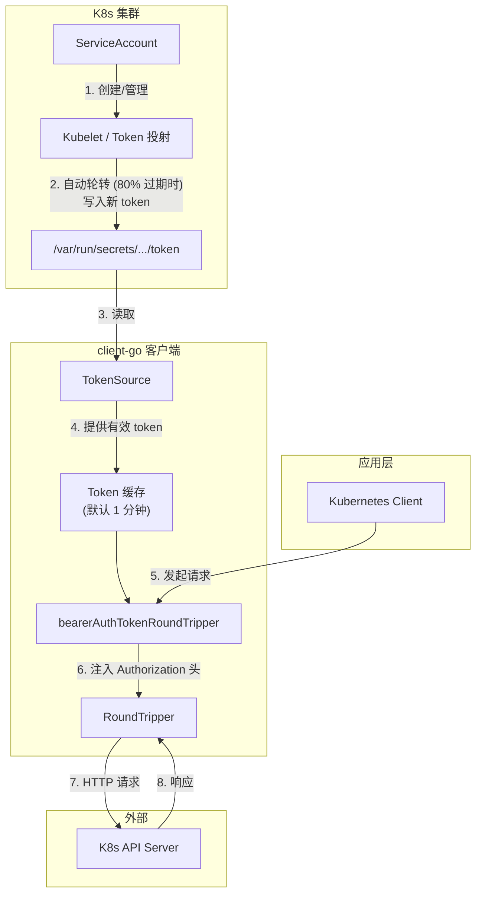

# 你的 k8s token 为啥不会过期

最近在做一些跨集群的工作负载管理，于是就考虑到了 token 轮转的问题。一些客户可能每次只会提供数十分钟有效期的 Token，并且不希望服务频繁重启。这个是如何做到的呢？

当使用 ServiceAccount 的方式来自动挂载 token 时，K8s 会进行自动的轮转。当 token 即将过期时（80%），K8s 会自动轮转 token。应用侧应该负责监听 token 文件的变更，并即时刷新。由于轮转一般是提前的，因此以 5 分钟为间隔轮转 token 一般就足够了。

## Client Go

幸运的是，在 K8s 客户端，例如 `client-go` 中，我们不需要重新创建整个 client 来实现 token 的刷新，而只需要通过包装 `RoundTripper` 来实现。

`client-go` 内置了 `bearerAuthTokenRoundTripper`，它会调用 `TokenSource` 来获取新的 token，注入请求头。而 `TokenSource` 负责保证返回的 token 是最新有效的。

要使用 `client-go` 自带的 token 热更新，我们需要
1. 使用 InCluster 配置，也就是使用 k8s 自动挂载的 `/var/run/secrets/kubernetes.io/serviceaccount/token` 文件作为 token 来源。
2. 使用 kubeconfig 文件，并且在认证信息中使用 `TokenFile` 来指定 token 文件。

默认的实现中，token 会被缓存一分钟，因此当你发现 token 失效了，即时马上换新的 token，可能也得等一分钟才能成功发送请求。




## 如果我只能用 kubeconfig + token 怎么办？

当然没问题，我们自己来实现 `RoundTripper`

```go
type myRoundTripper struct {
    cachedToken string
    delegate    http.RoundTripper
}

func (r *myRoundTripper) RoundTrip(req *http.Request) (*http.Response, error) {
    req.Header.Set("Authorization", "Bearer "+r.cachedToken)
    ret, err := r.delegate.RoundTrip(req)
    if err != nil {
        return nil, err
    }
    if ret.StatusCode == 401 {
        // refresh 负责重新加载 token
        refresh()
    }
    return ret, nil
}
```

并且在创建 client 时，使用 `Wrap` 方法来包装默认的 `RoundTripper`

```go
config, err := clientcmd.BuildConfigFromFlags("", path)
if err != nil {
    return nil, err
}
if isTokenBased(config) {
    config.Wrap(
        func(rt http.RoundTripper) http.RoundTripper {
            return &myRoundTripper{
                cachedToken: "",
                delegate:    rt,
            }
        },
    )
}
```

以上的实现方式会在出现 401 Unauthorized 的时候重新加载 token，本次请求会失败，但后续请求会成功。如果不希望出现请求失败，则需要对 request body 进行 buffer，并且进行重试。

虽然装饰器的模式挺优雅的，但是在编写 WrapFunc 时，有时候还是得 debug 看一下 `client-go` 库内部实现的。例如 `bearerAuthTokenRoundTripper` 会先检查请求头中是否存在 `Authorization` 头，如果存在，则直接使用现成的头，因此我们可以通过 `SetHeader` 的方式来注入自定义的 token 加载逻辑。

## 总结

我们简单看了下用内置方法创建客户端所支持的 token 轮转方式，并实现了一个自定义的 `RoundTripper` 来处理 kubeconfig + token 场景下的支持。