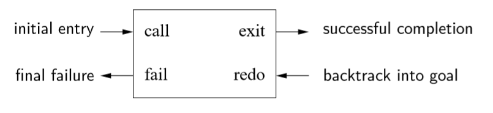

# Prolog Taolu

The workshop sample solutions are available [here](./ws.md)

## What is Prolog?
Prolog is shit.

## Why Prolog is shit?

### The Closed World Assumption
Prolog assumes all true things can be derived from the program. This is called the closed world assumtion. So use negation carefully when the predicates are not complete (The query might give False Positive results).

### Negation as failure
Prolog executes `\+ G` by first try to prove `G`. If it fails, then `\+ G` succeeds; If it succeeds then `\+ G` fails. This is called negation as failure. In prolog, failing goals never bind variables, so any variable bindings made in solving G are thrown away when `\+ G` fails. Therefore, `\+ G` cannot solve for any variables and gols such as these cannot work properly.

### Terms
In Prolog, all data structures are terms, which can be atomic or compound. Atomic terms include integer, float, and atoms. An atom begins with lower case letter or quoted with single quote, for example both `prolog_shit` and `'Prolog Shit\n'` are atoms. 

A compound term is a functor followed by zero or more arguments. Functors are Prolog's equivalent of data constructor, and have the same syntax as atoms, for example 
```prolog
node(leaf, 1, node(leaf, 2, leaf))
```
represents a tree.

A variable is a single unknown term. Variable names begin with uppercase letters or underscores.、

### Ground terms, Substitution, Unification

A term is  ground if it contains no variables. A ground term has only one instance, while a non-ground term has an infinite number of instances.

A substitution is a mapping from variables to terms. Applying a substitution to a term means consistently replacing all occurrences of each variable in the map with the term it is mapped to. Substitution only replaces variables.

A substitution unifies two terms if the terms are identical after the substitution.

### Prolog debugger, Infinite backtracing loop

Prolog has a shitty debugger. There's something called Byrd box, like following:



Unlike conventional languages which have only one way to enter and one way to exit, Prolog has two of each. 
