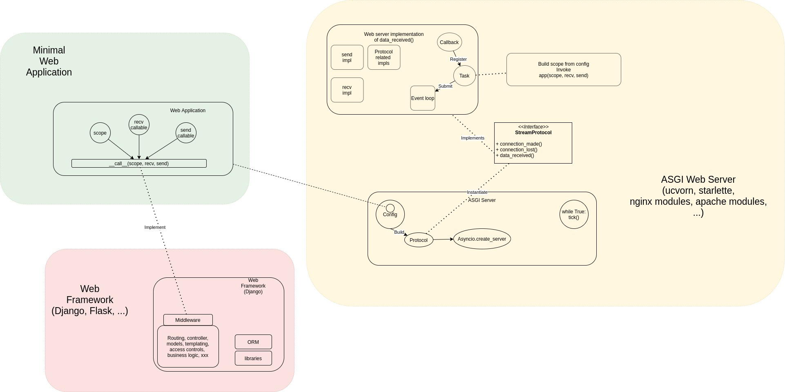

# How does ASGI work?

This article is a very short introduction of `ASGI`, speficifcally, what is `ASGI`, how does it work and how can we use it.

## What is ASGI and Why?

`ASGI` is the abbrevation of Asynchronous Server Gateway Interface, which is pretty much similar to `WSGI`, but in an async context. The reason that we need `ASGI` is very simple, we want to go async. `WSGI` was designed in such way that your python application can handle one request and send one response at one time. If you want keep-alive connection, just do long polling. If you need concurrent request handling, add more threads or use something like `gevent`. This works but they are not nativly shipped with python asyncio feature, in another word, in order to make async happen, you are making your web app heavier.

With `ASGI`, you can develop your app in fully async manner.

## How to write a web service with ASGI?
The answer is simple, write code like this:
```py
async def application(scope, receive, send):
    event = await receive()
    # Your business logics
    await send({"type": "websocket.send", ...})
```

And serve it with your favorite web server.


## What does ASGI web server do?

Let's take a very simple look at `uvcorn`'s source code.

First, a protocol is initialized. The protocol class is based on configurations
```py

create_protocol = functools.partial(
            config.http_protocol_class,
             config=config,
             server_state=self.server_state
        )
```

The protocol is used to create service with python's `asyncio` library by invoking 

```py
loop.create_server()
```
This will create a server that listens on a port. the first argument of this method is a `protocol factory`, which is a callable returning a protocol implementation.

Check [this](https://docs.python.org/3/library/asyncio-protocol.html#asyncio.Protocol.data_received) out for details of protocol interfaces.

The most important method here is `data_received(data)`. This is the callback when some data is received. The main logic of web server.

```py
 def data_received(self, data):
    self._unset_keepalive_if_required()
    self.conn.receive_data(data)
    self.handle_events()
```

It handles event when some data is received, let's look at how the events are handled.

First of all, it build up a scope. Remember out simplest server? This scope is exactly same as that one. It includes necessary data to process a http request.
```py
self.scope = {
    "type": "http",
    "asgi": {
        "version": self.config.asgi_version,
        "spec_version": "2.1",
    },
    "http_version": event.http_version.decode("ascii"),
    "server": self.server,
    "client": self.client,
    "scheme": self.scheme,
    "method": event.method.decode("ascii"),
    "root_path": self.root_path,
    "path": unquote(raw_path.decode("ascii")),
    "raw_path": raw_path,
    "query_string": query_string,
    "headers": self.headers,
}
```

Then it starts a task which invokes the ASGI function

```python
task = self.loop.create_task(self.cycle.run_asgi(app))
task.add_done_callback(self.tasks.discard)
                self.tasks.add(task)
```

Inside the `run_asgi` method, it does this

```python
async def run_asgi(self, app):
    try:
        result = await app(self.scope, self.receive, self.send)
```

Note that web server is responsible for implementing `receive()` and `send()` so that web application can focus on application layer protocols, i.e., `HTTP` or `Web Socket`


This Figure is a simplified demonstration of each roles in python's web application stack.
