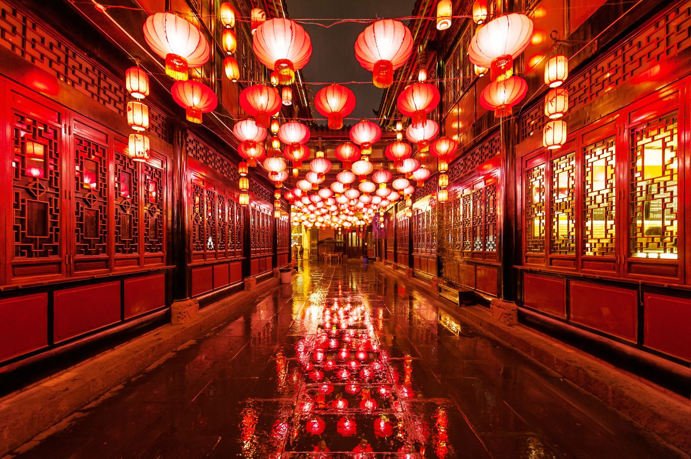
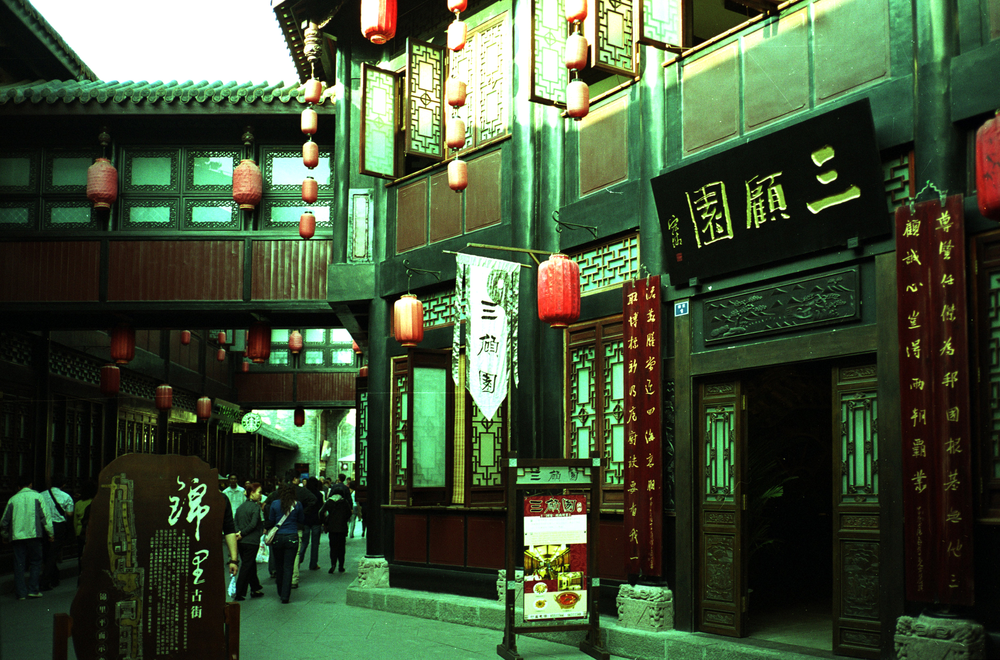
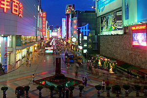
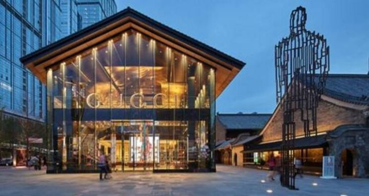
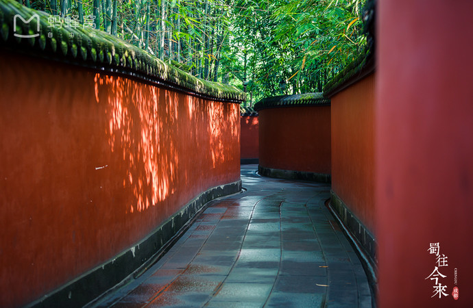

# 成都

## 计划

### 候选地区（图片来自网络）

- **锦里**：美食，老街，晚上灯火
  - 凉糕
  - 叶儿粑
  - 伤心凉粉
  - 
  - 
- **宽窄巷子**：平行，青黛砖瓦
  - 麻辣兔头
  - 糖油果子
  - 军屯锅盔
  - 
- **春熙路**：市中心
  - 钟水饺
  - 赖汤圆
  - 
- **太古里**
  - 
- **武侯祠**
  - 
-----------------------------
- **大熊猫基地**：emmmm
  - 
- **东郊记忆**：拍照，复古，厂旧址
  - 
-----------------------------
- **都江堰**：就是都江堰
- **青城山**：道教发源地
- **香香巷**：地道美食
  - 豆花甜品

## 路线

##
