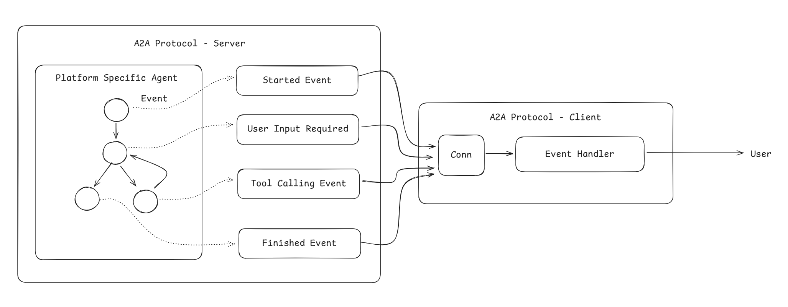

# A2A

## Why A2A

When implementing AI agents, it is crucial to have a channel for agents to communicate. For instance, when using LangGraph, agents can be implemented as sub-graphs, tools or just ordinary functions. For subgraphs, the communication is via shared states. For tools or functions, the communication is via message passing, depending on the implementation of tools. For ordinary tools, the message is sent by passing arguments, while for MCP, the message is sent through stdio or TCP connections. This seems fairly straightforward. However, when it comes to interoperability, the complexity occurs. Think about having multiple agents implemented using different frameworks or event programming languages, communicating via shared memory becomes difficult, while MCP tool are limited to simple blocking calls, that's where A2A comes in. 

## What is A2A
A2A (Agent to Agent) is a protocol that defines the communication protocol between agents, trying to solve the interoperability between agents implemented using different frameworks. The A2A supports not only blocking messages, but also streamed ones. When an agent performs a task, it emits key events through the channel, so that the invoker can trace the progress.

## How A2A works

A2A has several key components:

- **Client**: A client agent is an agent who dispatches a task, which can be a supervisor or an agent in a peer-to-peer relationship.
- **Server**: Server agent is an agent who provide service and execute a task. A server agent can also be a client when it needs to collaborate with other agents.
- **Agent Card**: Each agent is identified using a agent card. The card includes metadata such as
  - Name
  - Description
  - Skills (What kind of tasks the agent can perform)
  - Capabilities (How does the agent perform the task, synchronously, or streamed)
  - Authentication requirements
- **Task** is something that can be executed by server agent. Each task has lifecycles  such as `submitted`, `working`, `completed`, `failed`. 
- **Message** is a single turn of communication, it can be either user message or agent message.
- **Part** is a unit of message or artifact, can be text, file or JSON object. 
- **Artifact** is some result from the agent, for example, the output file.

## Communications
For long running tasks, A2A provides three mechanisms
- Polling: The client schedules periodical poll requests to track the task status. The need of sending request may introduce overheads.
- SSE: The server pus events to the client via SSE connection. This mechanism requires a connection to be maintained between two parties.
- Push Notifications: If keep-alive connection is not available (maybe because the network is unreliable), the client can provide a webhook, so the server can push notifications to it.

## Agent discovery
Just like tools, agents can be discovered by their skills. The client fetch agent cards to determine if any of the agents is suitable for certain tasks. The agent cards can be registered to a centralized registry, or can be statically configured for each client, depending on the use case.

## What does it look like

Here in server side, we have a platform specific agent, and A2A implementation wraps aroud it, encapsulating its event as Message parts. On the client side, a event handler checks the type of each event, and interact with external systems or users if necessary.

# Conclusion
In this blog, we introduces A2A protocol, why A2A, what is it and what it looks like in reality. Plz get hands dirty and try to implement one to get a better unstanding.