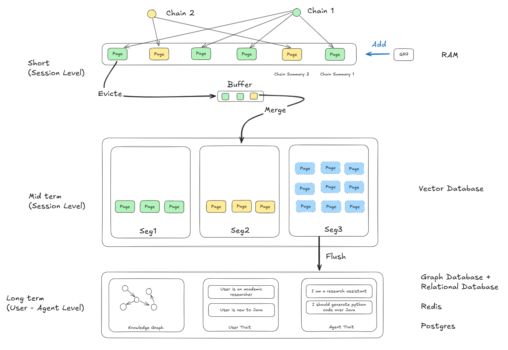
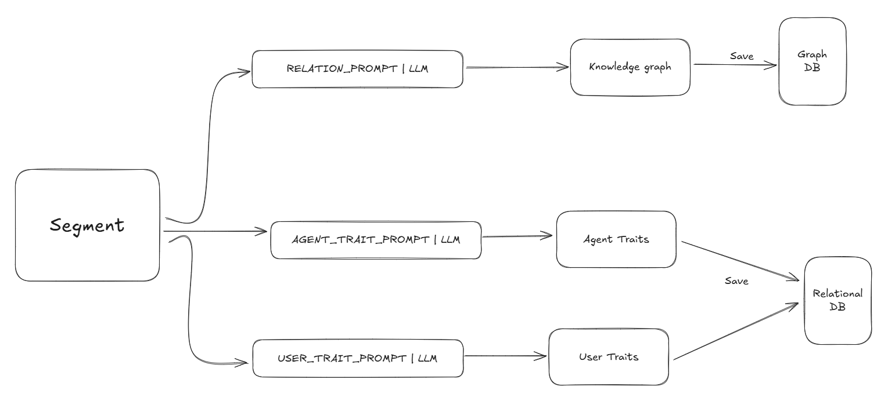

# Agent 记忆工程实现, 技术选型

# Agent 记忆功能实现：基于 Memory OS 的多层记忆架构设计

## 1. 引言：Agent 记忆的重要性

在人工智能快速发展的今天，大型语言模型（LLM）已经展现出了令人瞩目的能力，从文本生成到复杂推理，几乎无所不能。然而，当我们尝试构建真正智能的AI Agent时，却发现了一个根本性的限制：**记忆**。

### 传统 LLM 的上下文窗口限制问题

传统的大型语言模型受制于固定长度的上下文窗口，这一限制严重阻碍了它们在需要长期记忆的任务中的表现。

想象一下，如果人类每次对话都只能记住最近几句话，或者每次阅读文档都只能看到几页内容，我们的认知能力将会多么受限。这正是当前LLM面临的困境：

- **对话连续性断裂**：在长时间对话中，模型无法记住早期的重要信息，导致上下文丢失
- **文档理解局限**：处理超出上下文窗口的长文档时，模型无法建立全局理解
- **个性化服务缺失**：无法跨会话记住用户偏好和历史交互，每次都像初次见面
- **成本与性能矛盾**：扩大上下文窗口虽然能缓解问题，但会显著增加计算成本和处理延迟

### 人类认知记忆系统对 AI Agent 设计的启发

人类的记忆系统经过数百万年的进化，形成了高度精密和高效的架构。认知科学研究表明，人类记忆并非单一的存储系统，而是由多个相互协作的子系统组成。这一发现为AI Agent的记忆设计提供了宝贵的启发。

**分层存储架构**：人脑采用分层的记忆存储方式，从感觉记忆到短期记忆，再到长期记忆，每一层都有其特定的功能和容量限制。这种设计既保证了即时响应的效率，又实现了长期知识的积累。

**选择性注意机制**：人类不会记住所有经历的细节，而是通过注意机制筛选重要信息进行存储。这种选择性记忆避免了信息过载，确保了记忆系统的高效运行。

**关联性组织**：人类记忆通过复杂的关联网络组织信息，使得相关概念和经验能够相互激活和强化。这种组织方式支持了创造性思维和类比推理。

**遗忘与更新**：适度的遗忘实际上是记忆系统的一个重要特性，它帮助我们摆脱过时信息的干扰，为新知识腾出空间。

## 多层记忆架构

### 短期记忆

短期记忆是当前对话的上下文，保留了完整的最近对话的内容。数据结构为一个 Page 构成的 FIFO 队列。每个 Page 包含了用户的 Query 以及模型的响应。当 FIFO 队列满的时候，最老的页面会被移除，并加入到中期记忆。

短期记忆需要维持对话片段的时序性，同时也需要保证记忆的连贯性。例如，在对话中岔开一个话题，然后又回到主题。如果不考虑连贯性的问题，对记忆的总结可能会陷入混乱。因此，短期记忆中的页面也会形成多条链，并且通过总结模型来总结每一条链的内容。例如

- 今天天气怎么样？天气还可以 （Chain 1）
- 那你有什么计划吗？我想去看电影 （Chain 2）
- 你想去看什么电影？我想看《黑客帝国》 （Chain 2）
- 黑客帝国是什么电影？它是一个90年代的科幻片，讲述了一个 dystopian 未来，其中机器人、人工智能和人类的交互成为可能。它的主题是 技术的进步和人类社会的命运。（Chain 2）
- 好想要下雨了，你没带伞吗？我没带，要不改天？（Chain 1）

于是我们就看到了图上的结构。

#### 技术选型
短期记忆由于结构简单，数据量小，一个内存中的数组 + 链表数据结构就可以实现。

### 中期记忆
中期记忆和短期记忆类似，但是会保留更长的记忆时间。由于记忆的数量增加，模型的上下文无法覆盖整个中期记忆，因此，在召回记忆时，会采用相关性搜索，只召回记忆和当前对话最相关的部分。因此，中期记忆会进行向量化的存储。

在 Memory OS 的设计中，中期记忆被设计为 Segment，每个 Segment 由一组语义相近的 Page，及其包含 Page 的总结组成。在一个 Page 被加到中期记忆时，会先筛选出f_score 大于阈值的所有 Segment（如果没有，则新建一个 Segment），然后将页面加进去进行总结，并更新 Segment。其中 f_score 为 jaccard 相似度和 cosine 相似度之和。

每段中期记忆都有一个热度，活跃度的公式大家可以去看论文，总的来说就是，一个记忆段如果
- 被召回次数越多
- 和当前时间越近
- 包含的记忆页面越多
则越活越。这个设计参考了人类记忆的衰减，以及 “熟能生巧” 等机制，可谓是比较聪明的。

当中期记忆的热度足够高时，它就会被转移到长期记忆。就好比，我最近几天都在写 Java，我每天一觉醒来，都感觉自己的 Java 技术得到了提升，可以自然而然写出更优雅的代码。这个就是“熟能生巧”，或者说是长期记忆对人的影响。对于 Agent 来说，也是类似。

在召回中期记忆时，可以使用向量搜索来召回 K 个最相关的 Segment，召回后，对其热度进行更新。

#### 技术选型

中期记忆是一个 Session 级别的记忆，并且对向量检索有需求。因此可以考虑使用内存向量库来实现。当然，外部的向量库也是可以考虑的，只是数据的更新、清理会比较频繁。

在存储时，每个 Segment 是一个向量。它的热度，以及关联的页面，则作为元数据进行存储。在选用向量库时，需要考虑其是否支持元数据，元数据的长度是否有限制等。

### 长期记忆
长期记忆包含了知识图谱，用户特征，以及 Agent 特征等。知识图谱用来表达绘画过程中，生成的实体之间的关系。例如，分析 A 需要 实验 B 的输出作为输入，那么 “分析 A” 依赖 “实验 B” 就是知识图谱中的一组关系。

例如，用户比较偏好学术性的语言表达风格，Agent 总是需要生成 Python 代码，而不是 Java，等等。

在召回长期记忆时，我们可以召回所有的用户偏好。因为这些偏好都是经过精炼的，因此不会对上下文造成过大的压力。对于知识图谱类型的长期记忆，我们可以通过一系列的工具让模型访问。
#### 技术选型

长期记忆是用户级别的。准确地说，是用户 - Agent 级别的，也就是说，用户可以定 N 个 Agent，并且美国个都能随着对话产生不同的风格。因此，长期记忆需要外部的数据库来做持久化存储。
- 对于知识图谱，可以使用图数据库
- 对于用户偏好等，可以使用关系数据库。例如我们可以创建 users 表，agent 表，user_traits 表，agent_traits 表，并且用外键关系进行关联。

---

# 参考
[Memory OS](https://arxiv.org/abs/2506.06326)
[Open Deep Research](https://github.com/langchain-ai/open_deep_research)
[MemGPT: Towards LLMs as Operating Systems](https://arxiv.org/abs/2310.08560)
[Cognitive Architectures for Language Agents (CoALA)](https://www.ibm.com/think/topics/ai-agent-memory)
[KG Agent](https://arxiv.org/abs/2402.11163)
