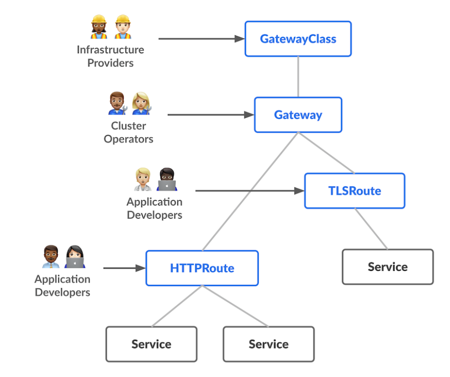

# 迁移到 Gateway API


## Ingress
Ingress是Kubernetes中用于定义服务外部访问规则的核心资源对象，其核心功能是通过声明式配置描述流量路由规则（如URL路径、主机名、后端服务等），本质上扮演“服务入口路由器”的角色 1 。例如，通过Ingress可以指定 /api 路径的请求路由到 api-service ， /web 路径的请求路由到 web-service ，从而实现多服务的统一入口管理。但需注意，Ingress本身仅定义规则，实际流量转发依赖 Ingress Controller （如Nginx Ingress Controller）——后者通过监听Ingress资源变化，动态配置负载均衡器（如Nginx）以生效规则 。
### Kubernetes服务暴露的需求驱动
在Kubernetes早期，服务暴露主要依赖 Service 资源（如NodePort、LoadBalancer类型），但这两种方式存在明显局限：NodePort占用节点端口且扩展性差，LoadBalancer依赖云厂商支持且无法灵活定义路由规则。随着容器化应用复杂度提升（如多服务共存、精细化流量控制），Kubernetes社区需要一种更灵活的服务暴露机制，Ingress应运而生。它通过解耦“规则定义”（Ingress资源）与“规则执行”（Ingress Controller），提供了标准化的外部流量管理方案。

### 功能局限与衍生问题
尽管Ingress解决了基础路由需求，但其设计在云原生复杂化场景下逐渐显现不足：

1. 功能扩展性弱 ：Ingress原生仅支持基础的路径/主机名匹配，对于灰度发布（如95%流量到旧服务、5%到新服务）、A/B测试（基于请求头或查询参数路由）、流量镜像等高级功能难以支持。 
2. Annotations 配置复杂性 ：Ingress资源的 annotations 字段用于传递额外配置信息，如自定义负载均衡器配置、SSL证书等，但这一机制存在以下问题：
   - 配置粒度问题：annotation 作为存在于 ingress 层级，而不是路由规则层级，无法针对特定路由规则进行精细配置，这不仅反直觉，更降低了配置的灵活性。
   - 格式不统一：不同控制器对 annotations 的解析方式不一致，增加了迁移成本
3. 多租户与跨命名空间支持不足 ：Ingress规则默认仅作用于单个命名空间，难以支持多租户共享负载均衡器的场景；跨命名空间路由需额外配置，复杂度较高

这些局限推动了Kubernetes社区对新一代网络规范的探索，最终催生了更灵活、可扩展的 Gateway API ，旨在通过标准化资源（如GatewayClass、HTTPRoute）解决Ingress的历史问题。

## Gateway API

### 核心对象关系
Gateway API 定义了以下核心资源对象，它们之间的关系如下：
- GatewayClass：定义了网关的类型、配置和行为。一般用于定义云厂商提供的网关实例。一种 GatewayClass 由一个控制器来管理，但是一个控制器可以管理多个 GatewayClass。
- Gateway：代表实际的网关实例，与GatewayClass关联，负责实际的流量路由。一般由集群管理员创建。
- HTTPRoute：定义了HTTP流量的路由规则，包括匹配条件和后端服务。一般由开发者创建。



### HTTPRoute 路由规则
HTTPRoute资源的`rules`字段定义了具体的流量路由逻辑，支持多维度匹配条件与灵活的后端服务分配策略，以下是常见场景的示例说明：

#### 1. 路径匹配（Path Matching）
支持精确匹配、前缀匹配、正则匹配等多种模式，例如：
```yaml
rules:
  - matches:
      - path:
          type: PathPrefix
          value: /api
    backendRefs:
      - name: api-service
        port: 80
```
此规则表示所有以`/api`开头的请求（如`/api/v1/users`）将被路由到`api-service`服务。

#### 2. 头部匹配（Header Matching）
可基于请求头（Header）的键值对进行条件过滤，例如实现A/B测试：
```yaml
rules:
  - matches:
      - headers:
          - name: x-feature-flag
            value: canary
    backendRefs:
      - name: new-service
        port: 80
  - matches:
      - headers:
          - name: x-feature-flag
            value: stable
    backendRefs:
      - name: old-service
        port: 80
```
该配置会根据请求头`x-feature-flag`的值将流量分别路由到新版本（`new-service`）或旧版本（`old-service`）服务。

#### 3. 权重分配（Traffic Splitting）
通过`weight`字段实现流量按比例分发，支持灰度发布场景：
```yaml
rules:
  - backendRefs:
      - name: old-service
        port: 80
        weight: 90  # 90%流量
      - name: new-service
        port: 80
        weight: 10  # 10%流量
```
此规则将90%的流量导向旧服务，10%导向新服务，逐步验证新版本稳定性。

#### 4. 匹配优先级与组合条件
规则按定义顺序执行优先级（先定义的规则优先匹配），且支持通过`AND`/`OR`逻辑组合多个匹配条件（如同时匹配路径和头部），满足复杂路由需求。

### Route Filter 流量处理扩展
Route Filter 是 Gateway API 中用于在流量路由前后执行额外处理逻辑的扩展机制，可实现请求/响应修改、认证鉴权、流量镜像等高级功能。与传统 Ingress 的 Annotations 不同，Route Filter 以声明式资源的形式嵌入 HTTPRoute 规则中，支持细粒度的路由级配置，且具备跨控制器的标准化语义。

#### 1. 请求头注入（Request Header Modification）
通过 `RequestHeaderModifier` 过滤器可动态为请求添加或修改头部信息，适用于传递上下文元数据等场景：
```yaml
rules:
  - matches:
      - path:
          type: PathPrefix
          value: /api
    filters:
      - type: RequestHeaderModifier
        requestHeaderModifier:
          add:
            - name: x-request-source
              value: gateway-api
    backendRefs:
      - name: api-service
        port: 80
```
此规则为所有 `/api` 路径的请求添加 `x-request-source: gateway-api` 头部。

#### 2. 响应头重写（Response Header Modification）
使用 `ResponseHeaderModifier` 可修改后端服务返回的响应头，例如添加 CORS 允许源：
```yaml
rules:
  - matches:
      - path:
          type: PathPrefix
          value: /web
    filters:
      - type: ResponseHeaderModifier
        responseHeaderModifier:
          set:
            - name: Access-Control-Allow-Origin
              value: "*"
    backendRefs:
      - name: web-service
        port: 80
```
该配置会将所有 `/web` 路径响应的 `Access-Control-Allow-Origin` 头设置为 `*`，允许跨域访问。

#### 3. 自定义 Filter 扩展
Gateway API 的 Route Filter 支持通过自定义资源定义（CRD）扩展实现更复杂的流量处理逻辑。用户可通过定义自定义 Filter 类型，结合控制器实现特定功能（如自定义认证、限流、日志增强等），其核心优势在于：
- **声明式集成**：自定义 Filter 以 YAML 资源形式嵌入 HTTPRoute 规则，与原生 Filter 保持统一配置风格；
- **跨控制器兼容**：通过标准化 CRD 定义，不同 Gateway 控制器（如 Contour、Gloo）可支持相同的自定义 Filter 逻辑。

#### 示例：自定义 JWT 认证 Filter
通过定义 `JWTAuthenticationFilter` 类型的 CRD，可实现请求的 JWT 令牌校验功能：
```yaml
rules:
  - matches:
      - path:
          type: PathPrefix
          value: /api
    filters:
      - type: ExtensionRef
        extensionRef:
          group: mycompany.example.com
          kind: JWTAuthenticationFilter
          name: api-jwt-check
    backendRefs:
      - name: api-service
        port: 80
```
此规则表示所有 `/api` 路径的请求需通过名为 `api-jwt-check` 的 JWT 认证 Filter 校验令牌有效性，校验失败将返回 401 错误。

### 为什么选择 Gateway API

Gateway API通过标准化资源设计与灵活扩展机制，针对性解决了Ingress在云原生场景下的核心局限，成为更先进的服务暴露方案：

#### 1. 解决功能扩展性弱问题：声明式高级路由能力
Ingress仅支持基础的路径/主机名匹配，而Gateway API的`HTTPRoute`资源通过`rules`字段提供了多维度匹配与流量分配能力：
- 支持路径匹配（精确/前缀/正则）、头部匹配（如A/B测试）、权重分配（如灰度发布）等复杂场景；
- 通过`Route Filter`机制扩展流量处理逻辑（如请求头注入、响应头重写、自定义认证），且以声明式资源嵌入路由规则，避免了Ingress通过非标准化`Annotations`实现扩展的局限性。

#### 2. 解决Annotations配置复杂性问题：标准化、细粒度配置
Ingress依赖`Annotations`传递额外配置，存在配置层级不匹配（仅支持Ingress级而非路由级）、格式不统一（不同控制器解析差异大）等问题。Gateway API通过以下设计优化：
- 路由规则（如`HTTPRoute`）与配置（如`Route Filter`）直接绑定，支持路由级细粒度配置；
- 所有资源（如`GatewayClass`、`Gateway`、`HTTPRoute`）均为Kubernetes标准CRD，语义统一，跨控制器兼容性强，降低迁移成本。

#### 3. 解决多租户与跨命名空间支持不足问题：资源级跨域能力
Ingress规则默认仅作用于单个命名空间，跨命名空间路由需额外配置。Gateway API通过以下机制提升多租户支持：
- `Gateway`资源由集群管理员创建，可被多个命名空间的`HTTPRoute`共享，实现多租户共用负载均衡器；
- `HTTPRoute`支持通过`backendRefs`字段引用跨命名空间的服务（需配合`ReferencePolicy`资源授权），简化跨命名空间路由配置。

综上，Gateway API通过更灵活的路由规则、标准化的扩展机制与跨命名空间支持，为云原生复杂场景提供了更健壮的服务暴露解决方案。

#### 4. 更好的可移植性
Gateway API 是一个开放的标准，并且提供了远比 Ingress 丰富的功能，这意味着要实现相同的效果，我们几乎不需要和厂商强绑定的资源或者配置。并且 Gateway API 提供了官方的一致性测试，保证实现和官方 Spec 的一致性。这使得 Gateway API 实现更好的可移植性。

## 我应该如何选择

### 选择 Gateway API
如果您的应用需要支持复杂的流量路由需求（如路径匹配、头部匹配、流量分配），且希望通过声明式配置实现灵活扩展，那么 Gateway API 是一个不错的选择。它提供了更强大的路由能力，支持更细粒度的流量处理逻辑，同时也具有更好的可扩展性和可移植性。

### 选择 Ingress
如果您的应用不需要复杂的流量路由需求，或者您更关心 Ingress 的基础功能（如路径匹配、主机名匹配），那么 Ingress 可能更适合您。Ingress 提供了简单易用的配置方式，适合大多数简单场景。

# 参考资料
- [官方文档](https://gateway-api.sigs.k8s.io/)
- [5 reasons to try gateway api](https://blog.nginx.org/blog/5-reasons-to-try-the-kubernetes-gateway-api)
- [Moving from Ingress Controller to the Gateway API](https://blog.nginx.org/blog/kubernetes-networking-ingress-controller-to-gateway-api)
- [Ingress Controller versus Kubernetes Gateway API](https://medium.com/@carlocolumna/ingress-controller-versus-kubernetes-gateway-api-7f349eb33eb9)