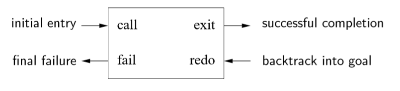

# Prolog Taolu

The workshop sample solutions are available [here](./ws.md)

## What is Prolog?
Prolog is shit.

## Why Prolog is shit?

### The Closed World Assumption
Prolog assumes all true things can be derived from the program. This is called the closed world assumtion. So use negation carefully when the predicates are not complete (The query might give False Positive results).

### Negation as failure
Prolog executes `\+ G` by first try to prove `G`. If it fails, then `\+ G` succeeds; If it succeeds then `\+ G` fails. This is called negation as failure. In prolog, failing goals never bind variables, so any variable bindings made in solving G are thrown away when `\+ G` fails. Therefore, `\+ G` cannot solve for any variables and gols such as these cannot work properly.

### Terms
In Prolog, all data structures are terms, which can be atomic or compound. Atomic terms include integer, float, and atoms. An atom begins with lower case letter or quoted with single quote, for example both `prolog_shit` and `'Prolog Shit\n'` are atoms. 

A compound term is a functor followed by zero or more arguments. Functors are Prolog's equivalent of data constructor, and have the same syntax as atoms, for example 
```prolog
node(leaf, 1, node(leaf, 2, leaf))
```
represents a tree.

A variable is a single unknown term. Variable names begin with uppercase letters or underscores.、

### Ground terms, Substitution, Unification

A term is  ground if it contains no variables. A ground term has only one instance, while a non-ground term has an infinite number of instances.

A substitution is a mapping from variables to terms. Applying a substitution to a term means consistently replacing all occurrences of each variable in the map with the term it is mapped to. Substitution only replaces variables.

A substitution unifies two terms if the terms are identical after the substitution.

### Prolog debugger, Infinite backtracing loop

Prolog has a shitty debugger. There's something called Byrd box, like following:



Unlike conventional languages which have only one way to enter and one way to exit, Prolog has two of each. Thing about the following code

```prolog
/*
    rev1/2
    rev1(A, B) holds if B is reversed version of A
*/
rev1([], []).
rev1([A|BC], CBA) :- 
    rev1(BC, CB),
    append(CB, [A], CBA).
```

Why the fuck does it enter infinite backtracking loop? for example we have a query 
```prolog
rev1(X, [a])
```
is was resolved to 
```prolog
rev1(BC, CB),
append(CB, [A], [a]).
```
The call rev1(BC, CB) produces an infinite backtracking sequesce of solutions, for wach one we call `append`. `append([],[A], [A])` succeeds but the following ones all fail.

In order to make it work in all modes, we need to add `samelength(ABC, CBA)` in the front. 

See? This is why Prolog is shit.

### Choicepoints

When a clause succeeds but there are later clauses that could possibly succeed, Prolog will leave a choicepoint so it can later backtrack and try the later clause. 

Think about following clauses which computes factorial
```prolog
fact(0, 1).
fact(N, F) :- 
    N > 0,
    N1 is N - 1,
    fact(N, F1),
    F is F1 * N.
```
After finding `0!=1`, prolog will continue trying `-1!, -2!, ...`, so we need to add `N > 0` at the beginning in order to ensure correctness. 


### Semantics of logic program

A logic program P consists of a set of predicate definitions. The semantic of this program is the set of its logical consequences as **ground atomic formulas**

**Ground atomic formula** is a logical consequence of program P if P makes a true.

How to find semantics? We're gonna work backwards. We can reason fro mthe program to figure out what ground queries makes it `true`. Immediate consequence operator `TP` takes a set of ground unit clauses C and produce the set of ground unit clauses implies by C and P.

For example:

```prolog

P = {q(X,Z) :- p(X,Y), p(Y,Z)}.
C = {p(a,b), p(b,c), p(c,d)}.

TP = {q(a,c), q(b,d)}.

```

### SLD Resolution
Consequences of logic program are determined through SLD resolution, which is simple? and powerful? and shitty (That's true). It all about: Given a program, show this goal is true. It works like following:

- Verify query with clause head, apply resulting substitution, yield resolvent
- Since the goal is identical to resolvent head, replace with resolvent body

### Backtracking
When there are multiple clauses matching a goal, Prolog remembers which one to go back to if necessary. It must be able to return the computation to the state it was in when the first matching clause was selected, so that it can return to that state and try next matching claise, which called choicepoint.

When a goal fails, Prolog backtracks to the most recent choicepoint, removing all variable bindings made since the choicepoint was created, returning those variables to their unbound state. Then prolog begins to resolution the next matching clause, repeating the process until Prolog detects no more matching clauses. It then removes the checkpoint. The subsequent failures still backtrack to nearest checkpoint.

### Index
Index improves Prolog performance because it allows the Prolog to jump to match clauses directly by creating indexes for clauses with distinct constant or functors. SWI Prolog makes indices for arguments other than the first one. For example, `parent/2`, SWIpl index on both args, so finding the children of a parent or parent of a child both speeds up.

### Tail Recursion, TRO and choicepoint
A predicate is tail recursive if and only if the recursive call on any execution of that predicate is the last code executed before returning to the caller. Prolog applied tail recursion optimization (TRO) to prevent recursions from eating up stack. For example, a called b, b called c, there will be three frames on stack storing all the variables so that the routine can be restored after the sub routine returned. TRO is made such that if returning the result of c is the last execution of b, then the variables in be can be released in advance, so the stack can be saved. But if there's a choice point in b, the program isn't tail recursive because Prolog need to backtrack to the choicepoint later on. 

### Write tail recursive code by adding accumulate
Look at this example.

```prolog
{-
    fact/2 
    fact(N, F) holds if F is the factorial of N
-}

fact(N, F) :- 
    (
        N =:= 0 -> 
        F=1;
        N>0,
        N1 is N - 1,
        fact(N1, F1),
        F is F1 * N
    ).

```
This is not tail recursive because the last excution is multiplication and substitution. But however we can make it tail recursive by introducing an accumulator, just like this

```prolog

fact(N, F, C) :- 
    (
        N =:= 0 -> 
        F = C;
        N > 0,
        N1 is N - 1,
        C1 is C * N,
        fact(N1, F, C1)
    ).

```
Then this is tail recursive.

### All solution
If we wanna bring together all solutions to a goal, Prolog's all solution predicates do exactly this. The definition is 
```prolog
setof(Template, Goal, List).
```

The `Template` is like how you wanna present the result. For example, if you wanna display the parent relation of two people, you could use
```prolog
setof(P-C, parent(P,C), List).
bagof(P-C, parent(P,C), List). % This is for unsorted solutions
```

Existential quantification can be used with `^`. Like following predicate
```prolog
setof(P, C^parent(P,C), Parents)
```
This predicate means, put all the solutions in list `Parents`. The solutions satisfy that "There exist C such that P is the parent of C", which means find parent of any children.
